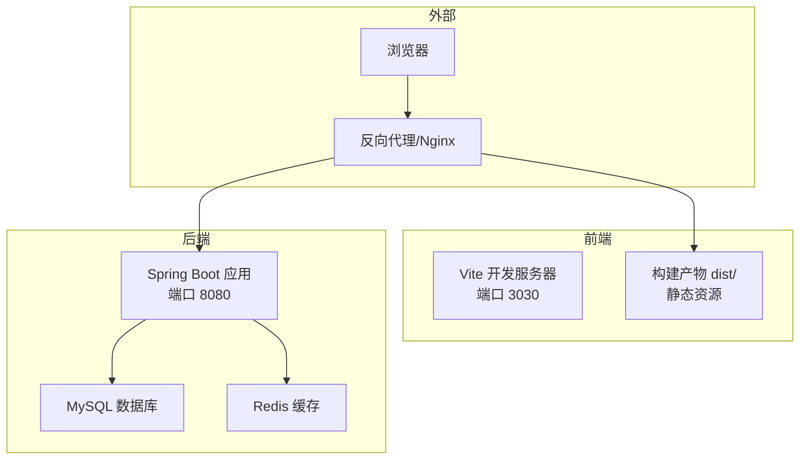
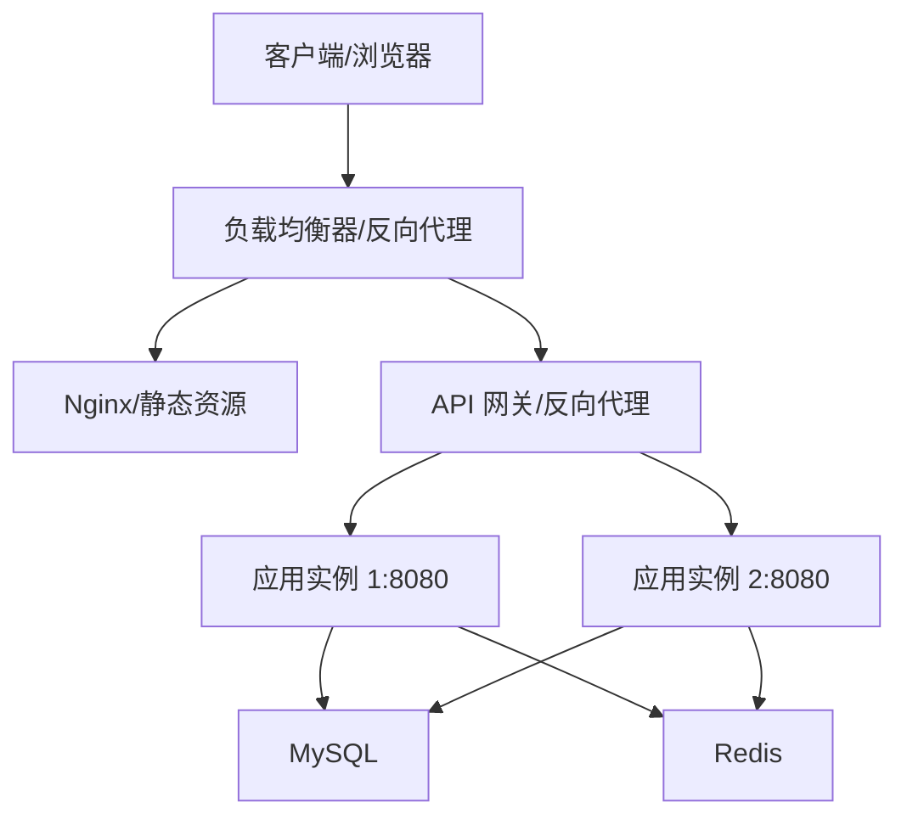
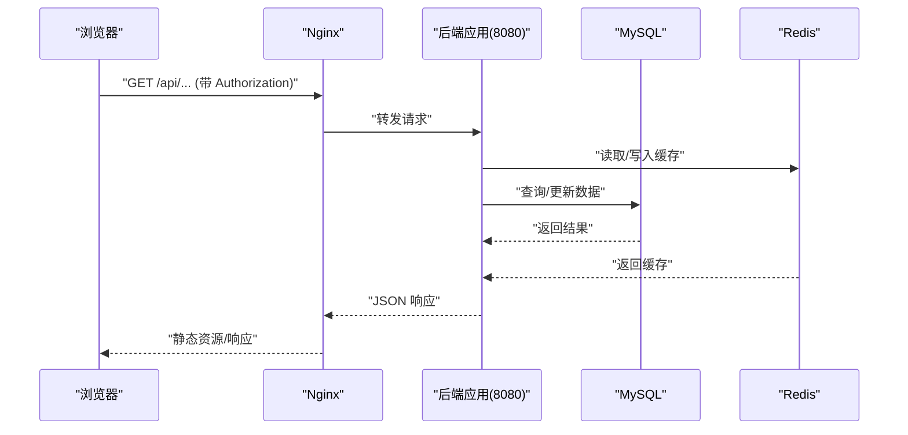
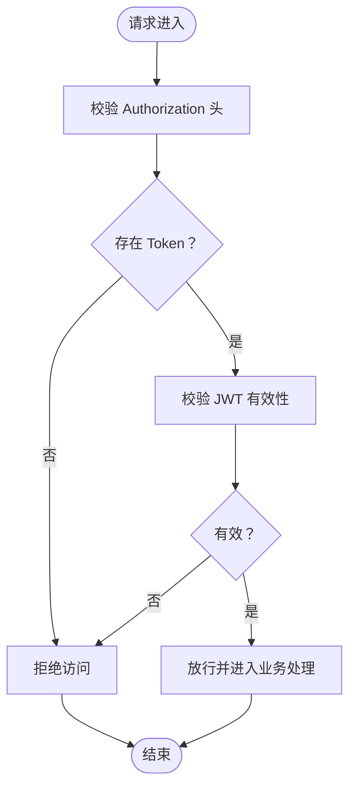
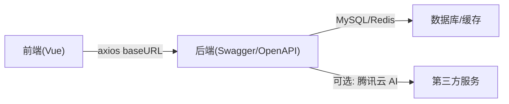

# 部署架构设计

<cite>
**本文引用的文件**
- [application.yml](file://backend/src/main/resources/application.yml)
- [SecurityConfig.java](file://backend/src/main/java/com/heritage/config/SecurityConfig.java)
- [CorsConfig.java](file://backend/src/main/java/com/heritage/config/CorsConfig.java)
- [WebConfig.java](file://backend/src/main/java/com/heritage/config/WebConfig.java)
- [pom.xml](file://backend/pom.xml)
- [vite.config.js](file://frontend/vite.config.js)
- [package.json](file://frontend/package.json)
- [request.js](file://frontend/src/utils/request.js)
- [index.js](file://frontend/src/router/index.js)
- [main.js](file://frontend/src/main.js)
- [setup-maven.ps1](file://setup-maven.ps1)
- [系统设计.md](file://TODO/系统设计.md)
- [数据库设计.md](file://TODO/数据库设计.md)
</cite>

## 目录
1. [简介](#简介)
2. [项目结构](#项目结构)
3. [核心组件](#核心组件)
4. [架构总览](#架构总览)
5. [详细组件分析](#详细组件分析)
6. [依赖分析](#依赖分析)
7. [性能考虑](#性能考虑)
8. [故障排查指南](#故障排查指南)
9. [结论](#结论)
10. [附录](#附录)

## 简介
本部署架构设计文档面向“非遗产品智能定制商城系统”，基于仓库现有代码与配置，给出开发、测试、生产的差异化环境配置建议，明确前后端分离部署策略（静态资源部署、API 代理与跨域、负载均衡）、容器化部署可能性与 Docker 配置要点、CI/CD 流程设计建议、服务器与网络配置要求、安全加固措施，以及部署检查清单与故障排查指南。文档同时提供多类可视化图示，帮助读者快速理解系统部署拓扑与数据流。

## 项目结构
系统采用前后端分离架构：前端使用 Vue 3 + Vite 构建，后端基于 Spring Boot，数据库为 MySQL，缓存为 Redis，文件上传使用本地目录映射。开发与测试环境默认使用本地服务组合，生产环境建议通过反向代理与容器编排实现高可用与弹性伸缩。

图表来源
- [vite.config.js](file://frontend/vite.config.js#L12-L20)
- [application.yml](file://backend/src/main/resources/application.yml#L1-L63)
- [pom.xml](file://backend/pom.xml#L30-L110)

章节来源
- [系统设计.md](file://TODO/系统设计.md#L23-L61)
- [package.json](file://frontend/package.json#L5-L9)
- [vite.config.js](file://frontend/vite.config.js#L12-L20)
- [application.yml](file://backend/src/main/resources/application.yml#L1-L63)

## 核心组件
- 前端应用
  - 开发服务器：Vite，默认监听 3030 端口，配置了 /api 前缀代理至后端 8080。
  - 构建产物：dist 目录，包含静态资源与入口 HTML，用于生产部署。
  - 请求封装：axios 实例默认 baseURL 指向后端 8080，自动注入 Authorization 头。
- 后端应用
  - Spring Boot 应用：监听 8080 端口，配置 MySQL 与 Redis 连接，启用 Knife4j 文档，支持文件上传与 /uploads/** 资源映射。
  - 安全配置：Spring Security + JWT，无状态会话，开放部分公开接口，其余均需认证。
  - 跨域配置：允许任意来源、方法与头部，支持凭据与预检缓存。
- 数据与缓存
  - MySQL：开发默认本地连接，生产建议独立实例或托管服务。
  - Redis：本地连接，生产建议独立实例或集群。
- 构建与工具
  - Maven：后端打包，Java 17，Spring Boot 3.x。
  - Node.js：前端开发与构建，Vite 5.x。

章节来源
- [package.json](file://frontend/package.json#L5-L9)
- [vite.config.js](file://frontend/vite.config.js#L12-L20)
- [request.js](file://frontend/src/utils/request.js#L4-L7)
- [application.yml](file://backend/src/main/resources/application.yml#L1-L63)
- [SecurityConfig.java](file://backend/src/main/java/com/heritage/config/SecurityConfig.java#L50-L65)
- [CorsConfig.java](file://backend/src/main/java/com/heritage/config/CorsConfig.java#L12-L25)
- [WebConfig.java](file://backend/src/main/java/com/heritage/config/WebConfig.java#L13-L21)
- [pom.xml](file://backend/pom.xml#L21-L28)

## 架构总览
系统部署拓扑建议如下：
- 开发环境：本地直连，前端 Vite 代理后端，后端直连本地 MySQL 与 Redis。
- 测试/生产环境：通过反向代理对外暴露，静态资源由 Nginx 提供，后端通过容器或裸机运行，数据库与缓存独立实例。
- 负载均衡：多实例后端横向扩展，配合健康检查与会话亲和策略（如需）。
- CI/CD：自动化构建、测试、镜像构建与部署流水线，支持蓝绿/滚动发布。

图表来源
- [application.yml](file://backend/src/main/resources/application.yml#L1-L63)
- [vite.config.js](file://frontend/vite.config.js#L12-L20)

## 详细组件分析

### 前后端分离部署策略
- 静态资源部署
  - 前端构建产物 dist 直接由 Nginx 提供，支持 gzip/HTTP2，开启缓存与 ETag。
  - 建议将 /uploads/** 映射到后端静态资源目录，确保历史 AI 图片与上传文件可访问。
- API 代理配置
  - 开发期：Vite 代理 /api 至后端 8080，解决跨域与本地联调问题。
  - 生产期：反向代理统一转发 /api/* 到后端集群，隐藏后端端口细节。
- 负载均衡方案
  - 反向代理层（Nginx/Haproxy/Tengine）实现健康检查与会话保持策略。
  - 后端多实例水平扩展，结合数据库读写分离与缓存集群。

图表来源
- [vite.config.js](file://frontend/vite.config.js#L14-L18)
- [request.js](file://frontend/src/utils/request.js#L4-L7)
- [application.yml](file://backend/src/main/resources/application.yml#L17-L35)

章节来源
- [vite.config.js](file://frontend/vite.config.js#L12-L20)
- [request.js](file://frontend/src/utils/request.js#L4-L7)
- [WebConfig.java](file://backend/src/main/java/com/heritage/config/WebConfig.java#L13-L21)

### 安全与认证
- 认证与授权
  - Spring Security + JWT：无状态会话，除公开接口外均需认证。
  - 前端在请求头注入 Bearer Token，后端通过过滤器解析与校验。
- 跨域与预检
  - CORS 允许任意来源、方法与头部，支持凭据，预检缓存 1 小时。
- 敏感信息
  - JWT 密钥与过期时间在配置文件中明文，生产环境建议通过环境变量注入与密钥管理服务。

图表来源
- [SecurityConfig.java](file://backend/src/main/java/com/heritage/config/SecurityConfig.java#L50-L65)
- [request.js](file://frontend/src/utils/request.js#L9-L16)

章节来源
- [SecurityConfig.java](file://backend/src/main/java/com/heritage/config/SecurityConfig.java#L50-L65)
- [CorsConfig.java](file://backend/src/main/java/com/heritage/config/CorsConfig.java#L12-L25)
- [request.js](file://frontend/src/utils/request.js#L9-L16)

### 文件上传与静态资源
- 上传路径与访问
  - 后端通过 WebMvcConfigurer 将 /uploads/** 映射到配置的本地目录，便于静态访问。
  - 建议生产环境将 uploads 目录挂载到对象存储或共享存储，确保多实例一致。
- 前端访问
  - 前端通过后端提供的资源 URL 访问图片与模型文件，避免直接暴露服务器路径。

章节来源
- [WebConfig.java](file://backend/src/main/java/com/heritage/config/WebConfig.java#L13-L21)
- [application.yml](file://backend/src/main/resources/application.yml#L59-L62)

### 数据库与缓存
- 数据库
  - 开发默认本地 MySQL，生产建议使用高可用主从/集群与只读副本。
- 缓存
  - Redis 本地连接，生产建议独立实例或集群，开启持久化与备份。

章节来源
- [application.yml](file://backend/src/main/resources/application.yml#L17-L35)
- [数据库设计.md](file://TODO/数据库设计.md#L1-L13)

### 容器化部署与 Docker 配置
- 容器化可行性
  - 后端为标准 Spring Boot 应用，可通过 JAR 包或 GraalVM native 方案容器化。
  - 前端构建产物可放入 Nginx 镜像，或通过多阶段构建产出最小镜像。
- Docker 配置要点
  - 环境变量覆盖敏感配置（数据库、Redis、JWT 密钥、AI 密钥）。
  - 挂载 uploads 目录到持久卷或对象存储网关。
  - 健康检查：后端提供 /actuator/health，Nginx 检查静态可达性。
  - 网络：后端容器与数据库/缓存容器在同一网络，限制暴露端口。
  - 资源限制：CPU/内存配额与 HPA 驱动的弹性伸缩。

[本节为概念性说明，不直接分析具体文件，故不附“章节来源”]

### CI/CD 流程设计
- 自动化构建
  - 后端：Maven 打包，生成可执行 JAR，构建 Docker 镜像。
  - 前端：Vite 构建 dist，上传制品库或对象存储。
- 测试集成
  - 单元测试与集成测试在流水线中执行，失败则阻断发布。
- 部署流水线
  - 蓝绿/滚动发布：先启动新版本实例，健康检查通过后切流量。
  - 配置热更新：敏感配置通过配置中心或环境变量注入。

[本节为概念性说明，不直接分析具体文件，故不附“章节来源”]

## 依赖分析
- 组件耦合
  - 前端依赖后端 REST API 与 /uploads/** 资源，耦合点集中在 baseURL 与鉴权头。
  - 后端依赖 MySQL 与 Redis，耦合点在数据一致性与缓存命中率。
- 外部依赖
  - 腾讯云 AI（可选），通过配置注入密钥与区域，生产建议使用密钥管理服务。
- 接口契约
  - 前端 axios baseURL 与后端 /api 前缀保持一致，避免跨域与路径错误。

图表来源
- [request.js](file://frontend/src/utils/request.js#L4-L7)
- [application.yml](file://backend/src/main/resources/application.yml#L43-L57)

章节来源
- [request.js](file://frontend/src/utils/request.js#L4-L7)
- [application.yml](file://backend/src/main/resources/application.yml#L43-L57)

## 性能考虑
- 前端
  - 构建产物启用压缩与缓存，路由懒加载与组件按需引入。
- 后端
  - Redis 缓存热点数据，数据库连接池与慢查询监控。
  - 合理设置文件上传大小与请求超时，避免资源耗尽。
- 网络
  - 反向代理开启 Gzip/HTTP2，CDN 加速静态资源。
- 容器
  - 设置 CPU/内存配额，HPA 与 Pod 拓扑亲和，避免热点集中。

[本节提供通用建议，不直接分析具体文件，故不附“章节来源”]

## 故障排查指南
- 常见问题定位
  - 403/401：检查前端是否正确注入 Authorization 头，后端 JWT 校验是否通过。
  - CORS 失败：确认后端 CORS 配置是否允许来源与凭据。
  - 404/静态资源不可达：确认 Nginx 是否正确映射 dist 与 /uploads/**。
  - 文件无法上传/访问：检查后端文件上传路径与权限，Nginx 是否映射到 uploads 目录。
  - 数据库/缓存连接失败：核对连接串、账号密码与网络连通性。
- 日志与监控
  - 后端开启访问日志与错误日志，结合 APM 工具定位慢请求。
  - 前端错误提示与网络拦截器输出，辅助定位接口异常。

章节来源
- [SecurityConfig.java](file://backend/src/main/java/com/heritage/config/SecurityConfig.java#L50-L65)
- [CorsConfig.java](file://backend/src/main/java/com/heritage/config/CorsConfig.java#L12-L25)
- [WebConfig.java](file://backend/src/main/java/com/heritage/config/WebConfig.java#L13-L21)
- [request.js](file://frontend/src/utils/request.js#L22-L42)

## 结论
本部署架构以“前后端分离 + 反向代理 + 容器化 + CI/CD”为核心，兼顾开发效率与生产稳定性。通过明确的环境差异配置、安全加固与性能优化策略，可实现系统的高可用与可扩展性。建议尽快落地容器化与自动化流水线，持续完善监控与告警体系。

[本节为总结性内容，不直接分析具体文件，故不附“章节来源”]

## 附录

### 开发/测试/生产环境差异化配置
- 开发环境
  - 后端：本地 MySQL 与 Redis，Knife4j 开启，JWT 密钥短生命周期。
  - 前端：Vite 代理 /api 至 8080，baseURL 指向本地后端。
- 测试环境
  - 后端：独立 MySQL 与 Redis，关闭 Knife4j，启用日志与健康检查。
  - 前端：代理指向测试后端域名，baseURL 与测试域名一致。
- 生产环境
  - 后端：容器化部署，环境变量注入数据库/缓存/JWT/AI 密钥，启用 HTTPS 与 WAF。
  - 前端：静态资源由 Nginx 提供，反向代理统一入口，CDN 加速。

章节来源
- [application.yml](file://backend/src/main/resources/application.yml#L1-L63)
- [vite.config.js](file://frontend/vite.config.js#L12-L20)
- [request.js](file://frontend/src/utils/request.js#L4-L7)

### 服务器与网络配置要求
- 服务器
  - 后端：JDK 17+，足够 CPU/内存，磁盘容量满足 uploads 与日志。
  - 前端：Nginx 服务器，支持 gzip/HTTP2，静态资源缓存。
  - 数据库/缓存：独立实例，备份与监控。
- 网络
  - 反向代理暴露 80/443，后端仅内网访问数据库与缓存。
  - 域名与证书：HTTPS 证书与域名解析。

[本节为通用配置建议，不直接分析具体文件，故不附“章节来源”]

### 安全加固措施
- 认证与授权
  - JWT 密钥定期轮换，过期时间合理设置。
  - Spring Security 严格路径匹配，仅开放必要公开接口。
- 传输与存储
  - 全站 HTTPS，强制 HSTS。
  - 上传文件类型与大小限制，敏感文件隔离。
- 配置与密钥
  - 生产环境使用环境变量与密钥管理服务，避免硬编码。

章节来源
- [SecurityConfig.java](file://backend/src/main/java/com/heritage/config/SecurityConfig.java#L50-L65)
- [application.yml](file://backend/src/main/resources/application.yml#L39-L41)

### 部署检查清单
- 前端
  - 构建产物上传至 Nginx，/uploads/** 映射生效。
  - 代理配置正确，baseURL 与域名一致。
- 后端
  - 环境变量覆盖数据库/缓存/JWT/AI 密钥。
  - 健康检查与日志输出正常。
- 基础设施
  - 反向代理、负载均衡、CDN、WAF 配置完成。
  - 数据库/缓存高可用与备份策略已实施。

[本节为通用检查项，不直接分析具体文件，故不附“章节来源”]