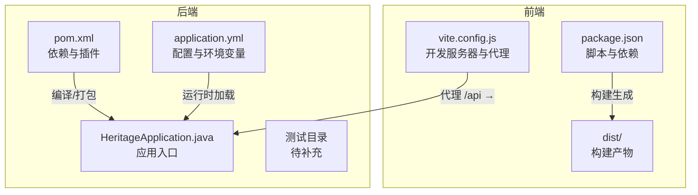
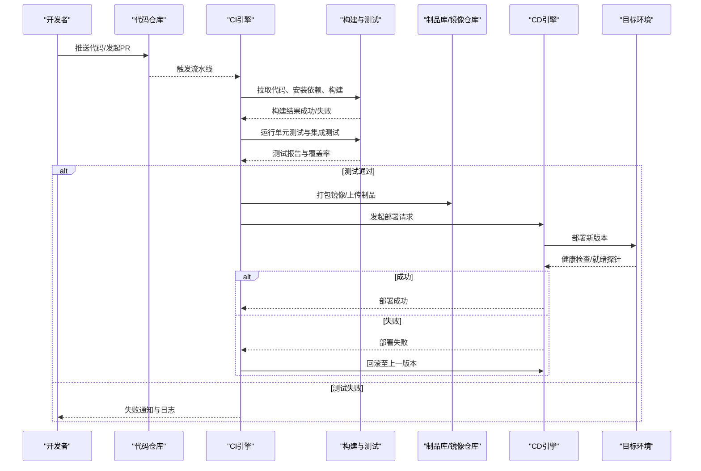
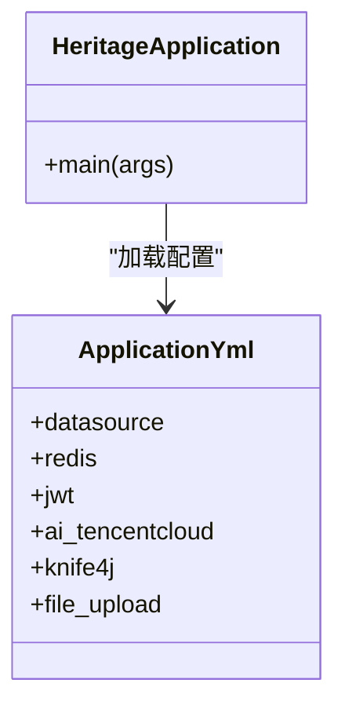

# CI/CD流程

<cite>
**本文引用的文件**
- [pom.xml](file://backend/pom.xml)
- [application.yml](file://backend/src/main/resources/application.yml)
- [HeritageApplication.java](file://backend/src/main/java/com/heritage/HeritageApplication.java)
- [package.json](file://frontend/package.json)
- [vite.config.js](file://frontend/vite.config.js)
- [setup-maven.ps1](file://setup-maven.ps1)
- [UserController.java](file://backend/src/main/java/com/heritage/controller/UserController.java)
- [UserService.java](file://backend/src/main/java/com/heritage/service/UserService.java)
</cite>

## 目录
1. [简介](#简介)
2. [项目结构](#项目结构)
3. [核心组件](#核心组件)
4. [架构总览](#架构总览)
5. [详细组件分析](#详细组件分析)
6. [依赖关系分析](#依赖关系分析)
7. [性能考虑](#性能考虑)
8. [故障排查指南](#故障排查指南)
9. [结论](#结论)
10. [附录](#附录)

## 简介
本文件面向“非遗产品智能定制商城系统”，提供从代码提交到生产部署的完整CI/CD流程设计与实施建议。内容覆盖：
- 持续集成：代码提交触发机制、自动化构建、单元测试与集成测试执行
- 持续部署：环境分支管理、自动化部署策略与回滚机制
- 质量与安全：代码质量检查、安全扫描、依赖更新管理
- 工具配置：Jenkins/GitHub Actions的可落地配置要点
- 检查清单与验证：部署前后检查项、异常处理流程

## 项目结构
系统采用前后端分离架构：
- 后端基于 Spring Boot 3.x（Java 17），使用 Maven 构建
- 前端基于 Vue 3 + Vite，通过代理访问后端服务
- 配置文件集中于后端 resources 目录，包含数据库、Redis、JWT、AI 云服务等参数
- 开发环境默认启用 mock profile，便于本地快速启动

图表来源
- [package.json](file://frontend/package.json#L1-L28)
- [vite.config.js](file://frontend/vite.config.js#L1-L22)
- [pom.xml](file://backend/pom.xml#L1-L129)
- [HeritageApplication.java](file://backend/src/main/java/com/heritage/HeritageApplication.java#L1-L13)
- [application.yml](file://backend/src/main/resources/application.yml#L1-L63)

章节来源
- [package.json](file://frontend/package.json#L1-L28)
- [vite.config.js](file://frontend/vite.config.js#L1-L22)
- [pom.xml](file://backend/pom.xml#L1-L129)
- [HeritageApplication.java](file://backend/src/main/java/com/heritage/HeritageApplication.java#L1-L13)
- [application.yml](file://backend/src/main/resources/application.yml#L1-L63)

## 核心组件
- 后端构建与打包
  - 使用 Maven 插件进行 Spring Boot 应用打包，排除 Lombok 注解处理器
  - 可在 CI 中复用该插件完成镜像或可执行包产出
- 前端构建与预览
  - 使用 Vite 进行开发与生产构建，支持本地预览
- 应用启动与配置
  - Spring Boot 入口类负责启动
  - application.yml 提供数据库、Redis、JWT、AI 云服务等配置项
- 开发环境代理
  - 前端开发服务器通过代理将 /api 请求转发至后端 8080 端口

章节来源
- [pom.xml](file://backend/pom.xml#L112-L127)
- [package.json](file://frontend/package.json#L5-L9)
- [HeritageApplication.java](file://backend/src/main/java/com/heritage/HeritageApplication.java#L6-L11)
- [application.yml](file://backend/src/main/resources/application.yml#L1-L63)
- [vite.config.js](file://frontend/vite.config.js#L12-L20)

## 架构总览
下图展示从代码提交到部署的关键路径与决策点，适用于 Jenkins 或 GitHub Actions 的流水线设计。

## 详细组件分析

### 持续集成流程设计
- 代码提交触发机制
  - 分支策略：主干保护、PR 必须通过 CI；feature/* 用于功能开发，release/* 用于发布准备
  - 触发条件：push 到 feature、release、main；PR 打开/更新时触发
- 自动化构建流程
  - 后端：使用 Maven 安装依赖、编译、打包；可选生成可执行 jar 或容器镜像
  - 前端：安装依赖、构建静态资源、生成 dist 目录
- 单元测试与集成测试
  - 后端：执行 JUnit 测试，建议输出测试报告与覆盖率
  - 前端：执行单元测试与 E2E 测试（如 Vitest/Cypress），输出报告
- 质量门禁
  - 代码质量阈值（如覆盖率、规则违例数）、测试通过率作为准入标准

章节来源
- [pom.xml](file://backend/pom.xml#L112-L127)
- [package.json](file://frontend/package.json#L5-L9)
- [setup-maven.ps1](file://setup-maven.ps1#L1-L3)

### 持续部署流水线
- 环境分支管理
  - develop：开发集成环境
  - staging：预生产/灰度环境
  - main：生产环境
- 自动化部署策略
  - 镜像/制品：构建完成后推送至镜像仓库或制品库
  - 部署方式：容器编排（Kubernetes/Helm）、虚拟机部署脚本、云平台托管服务
  - 蓝绿/金丝雀：推荐蓝绿部署，降低停机与风险
- 回滚机制
  - 记录版本标签与部署时间戳
  - 失败自动回滚至上一稳定版本；人工确认后可回滚至任意历史版本

章节来源
- [application.yml](file://backend/src/main/resources/application.yml#L36-L37)

### 代码质量检查、安全扫描与依赖更新
- 代码质量
  - 后端：静态分析（如 SpotBugs/Checkstyle/PMD）、覆盖率（JaCoCo）
  - 前端：ESLint、Stylelint、Vitest 覆盖率
- 安全扫描
  - 依赖漏洞扫描：OWASP Dependency-Check、Snyk、GitHub Dependabot
  - 代码扫描：SonarQube（静态分析+规则基线）
- 依赖更新管理
  - 自动化 PR：依赖更新机器人（如 Renovate、Dependabot）
  - 版本策略：语义化版本、锁定关键依赖范围

章节来源
- [pom.xml](file://backend/pom.xml#L30-L110)
- [package.json](file://frontend/package.json#L10-L26)

### CI/CD 工具配置示例（Jenkins/GitHub Actions）

- Jenkins 示例要点
  - 阶段划分：检出代码、安装 JDK/Maven、安装 Node、构建后端、构建前端、测试、打包镜像/制品、部署、回滚（可选）
  - 参数化流水线：选择环境（staging/prod）、是否跳过测试
  - Slack/邮件通知：失败/回滚提醒
  - 凭据管理：数据库、Redis、AI 云服务密钥、镜像仓库凭据
  - 健康检查：调用 /actuator/health 或自定义探针
- GitHub Actions 示例要点
  - 工作流触发：push、pull_request、schedule（安全扫描）
  - 缓存：Maven/Gradle、npm/yarn
  - 并行作业：构建、测试、安全扫描、构建镜像
  - 依赖更新：dependabot.yml 配置
  - 部署：使用 secrets 注入环境变量，结合 kubectl 或云平台部署 action

章节来源
- [application.yml](file://backend/src/main/resources/application.yml#L17-L21)
- [application.yml](file://backend/src/main/resources/application.yml#L24-L35)
- [application.yml](file://backend/src/main/resources/application.yml#L39-L41)
- [application.yml](file://backend/src/main/resources/application.yml#L44-L53)

### 部署前检查清单
- 代码与配置
  - 代码已通过 CI，无阻断性缺陷
  - application.yml 中数据库、Redis、AI 云服务密钥正确
- 构建产物
  - 后端 jar 包/镜像、前端 dist 已上传制品库
- 环境准备
  - 目标环境资源充足（CPU/内存/磁盘/网络）
  - 数据库迁移脚本已执行（如需）
- 部署策略
  - 蓝绿/金丝雀配置已就绪
  - 负载均衡与域名解析已指向新实例
- 安全与合规
  - 依赖漏洞扫描通过
  - 最小权限原则（RBAC、密钥轮换）

章节来源
- [application.yml](file://backend/src/main/resources/application.yml#L17-L21)
- [application.yml](file://backend/src/main/resources/application.yml#L24-L35)
- [application.yml](file://backend/src/main/resources/application.yml#L39-L41)
- [application.yml](file://backend/src/main/resources/application.yml#L44-L53)

### 部署后验证步骤
- 健康检查
  - 调用健康端点（如 /actuator/health），确认服务可用
- 功能验证
  - 关键接口：登录、商品查询、下单、支付回调（如适用）
  - 前端页面：首页、详情页、购物车、订单页
- 性能与监控
  - 观察 CPU/内存/IO、错误率、响应时间
  - 日志告警：异常堆栈、数据库连接失败、Redis 连接超时
- 回滚确认
  - 若发现严重问题，立即回滚至上一版本并发布修复

章节来源
- [HeritageApplication.java](file://backend/src/main/java/com/heritage/HeritageApplication.java#L6-L11)
- [UserController.java](file://backend/src/main/java/com/heritage/controller/UserController.java#L28-L35)
- [UserService.java](file://backend/src/main/java/com/heritage/service/UserService.java#L8-L21)

### 异常处理流程
- 构建失败
  - 检查日志定位依赖冲突、编译错误、测试失败
  - 修复后重新触发流水线
- 部署失败
  - 查看部署日志与容器状态
  - 回滚至上一版本，修复后再试
- 运行期异常
  - 查看应用日志与错误堆栈
  - 校验数据库/Redis连通性、AI 云服务密钥
  - 必要时临时降级或限流

章节来源
- [application.yml](file://backend/src/main/resources/application.yml#L17-L21)
- [application.yml](file://backend/src/main/resources/application.yml#L24-L35)
- [application.yml](file://backend/src/main/resources/application.yml#L39-L41)
- [application.yml](file://backend/src/main/resources/application.yml#L44-L53)

## 依赖关系分析
后端应用启动与配置加载关系如下：

图表来源
- [HeritageApplication.java](file://backend/src/main/java/com/heritage/HeritageApplication.java#L6-L11)
- [application.yml](file://backend/src/main/resources/application.yml#L1-L63)

章节来源
- [HeritageApplication.java](file://backend/src/main/java/com/heritage/HeritageApplication.java#L1-L13)
- [application.yml](file://backend/src/main/resources/application.yml#L1-L63)

## 性能考虑
- 构建阶段
  - 启用 Maven/Gradle 缓存、npm/yarn 缓存，减少重复下载
  - 并行构建与测试，缩短流水线时长
- 运行阶段
  - 合理设置 JVM 堆大小与 GC 参数
  - Redis 连接池参数与超时配置
  - 数据库连接池与慢查询监控
- 前端
  - 代码分割、懒加载、压缩与缓存策略
  - CDN 加速静态资源

## 故障排查指南
- 启动失败
  - 检查 application.yml 中数据库与 Redis 地址、端口、认证信息
  - 确认 Java 版本与依赖兼容性
- 接口异常
  - 核对 JWT 密钥与过期时间
  - 检查 AI 云服务密钥与区域配置
- 前端无法访问后端
  - 确认 vite 代理配置与后端端口一致
  - 检查跨域配置（CORS）

章节来源
- [application.yml](file://backend/src/main/resources/application.yml#L17-L21)
- [application.yml](file://backend/src/main/resources/application.yml#L24-L35)
- [application.yml](file://backend/src/main/resources/application.yml#L39-L41)
- [application.yml](file://backend/src/main/resources/application.yml#L44-L53)
- [vite.config.js](file://frontend/vite.config.js#L12-L20)

## 结论
本 CI/CD 流程以“质量优先、风险可控”为核心，结合自动化构建、测试、安全扫描与灰度发布，确保系统在多环境中稳定交付。建议在团队内固化流程规范与检查清单，持续优化构建与部署效率。

## 附录
- 常用命令参考
  - 后端构建：使用 Maven 插件进行打包（见后端 pom.xml）
  - 前端构建：使用 Vite 生产构建（见前端 package.json）
  - 环境变量注入：通过 CI 凭据与 secrets 注入敏感配置
- 参考文件路径
  - 后端 POM：[pom.xml](file://backend/pom.xml#L1-L129)
  - 前端包管理：[package.json](file://frontend/package.json#L1-L28)
  - 应用入口：[HeritageApplication.java](file://backend/src/main/java/com/heritage/HeritageApplication.java#L1-L13)
  - 配置文件：[application.yml](file://backend/src/main/resources/application.yml#L1-L63)
  - 前端开发服务器：[vite.config.js](file://frontend/vite.config.js#L1-L22)
  - Maven 环境准备：[setup-maven.ps1](file://setup-maven.ps1#L1-L3)