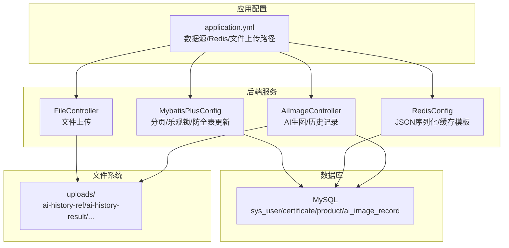
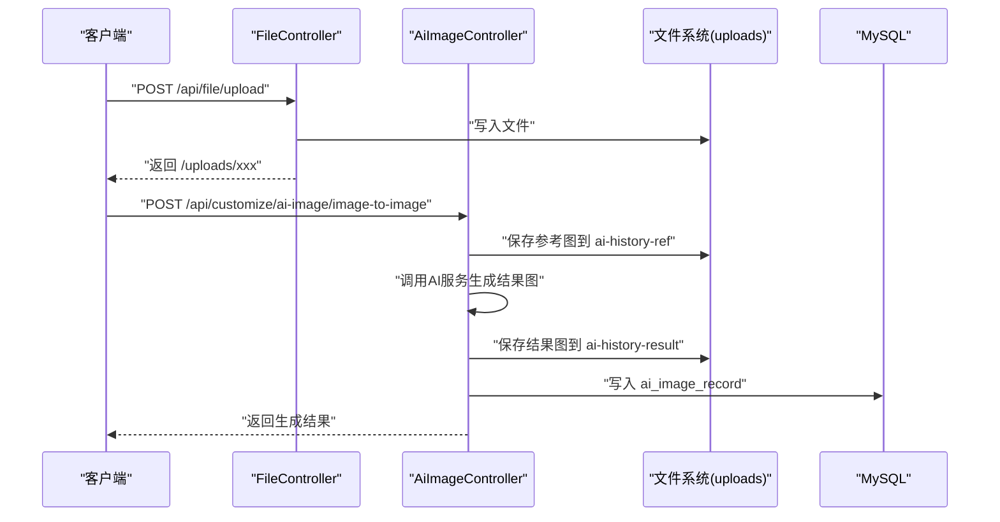
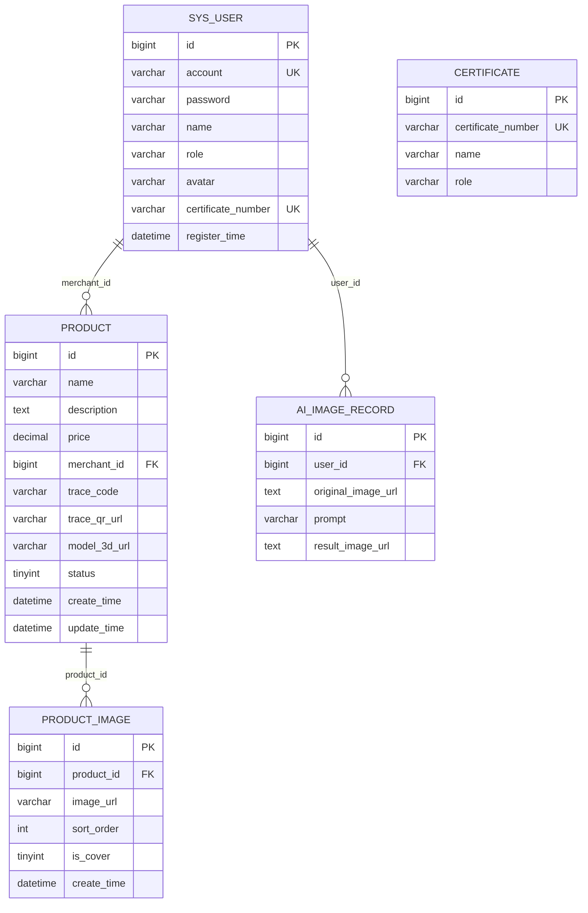
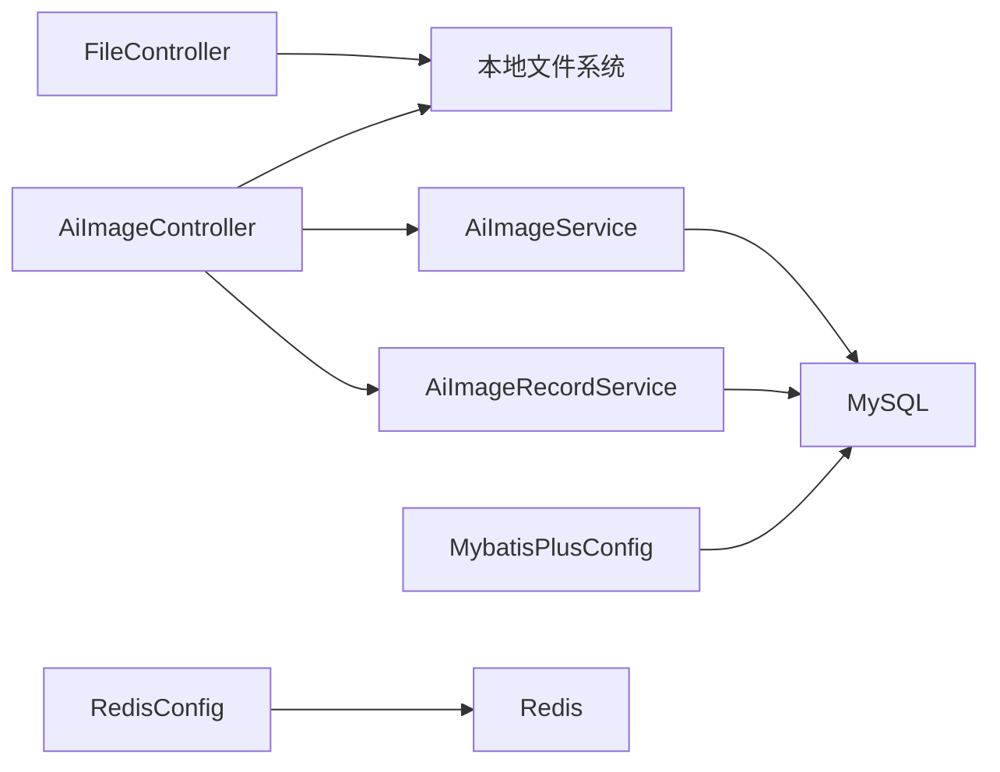

# 数据库与文件管理

<cite>
**本文引用的文件**
- [application.yml](file://backend/src/main/resources/application.yml)
- [数据库设计.md](file://TODO/数据库设计.md)
- [MybatisPlusConfig.java](file://backend/src/main/java/com/heritage/config/MybatisPlusConfig.java)
- [RedisConfig.java](file://backend/src/main/java/com/heritage/config/RedisConfig.java)
- [FileController.java](file://backend/src/main/java/com/heritage/controller/FileController.java)
- [AiImageController.java](file://backend/src/main/java/com/heritage/controller/AiImageController.java)
- [AiImageService.java](file://backend/src/main/java/com/heritage/service/AiImageService.java)
- [AiImageRecordService.java](file://backend/src/main/java/com/heritage/service/AiImageRecordService.java)
- [AiImageRecord.java](file://backend/src/main/java/com/heritage/entity/AiImageRecord.java)
- [AiImageRecordMapper.java](file://backend/src/main/java/com/heritage/mapper/AiImageRecordMapper.java)
- [user.sql](file://backend/src/main/resources/sql/user.sql)
- [product.sql](file://backend/src/main/resources/sql/product.sql)
- [ai_image_record.sql](file://backend/src/main/resources/sql/ai_image_record.sql)
- [冗余文件处理计划.md](file://TODO/冗余文件处理计划.md)
</cite>

## 目录
1. [简介](#简介)
2. [项目结构](#项目结构)
3. [核心组件](#核心组件)
4. [架构总览](#架构总览)
5. [详细组件分析](#详细组件分析)
6. [依赖分析](#依赖分析)
7. [性能考虑](#性能考虑)
8. [故障排查指南](#故障排查指南)
9. [结论](#结论)
10. [附录](#附录)

## 简介
本文件聚焦非遗产品智能定制商城系统的数据库与文件管理，覆盖数据库备份与恢复策略、性能优化、文件存储与清理、数据迁移与版本升级、一致性保障及运维脚本建议。系统采用 MySQL 关系型数据库与本地文件存储，结合 MyBatis-Plus 分页与乐观锁拦截器、Redis 缓存序列化配置，以及 AI 生图历史记录的数据化管理。

## 项目结构
- 数据库配置与连接池：通过 Spring Boot 的数据源配置连接 MySQL，启用 Redis 连接与序列化。
- ORM 与分页：MyBatis-Plus 提供分页、乐观锁与防全表更新拦截。
- 文件上传：统一通过控制器将文件写入本地 uploads 目录，支持静态资源访问。
- AI 生图：控制器负责接收请求、持久化参考图与结果图、记录历史，服务层对接外部 AI 平台。

图表来源
- [application.yml](file://backend/src/main/resources/application.yml#L17-L35)
- [MybatisPlusConfig.java](file://backend/src/main/java/com/heritage/config/MybatisPlusConfig.java#L16-L29)
- [RedisConfig.java](file://backend/src/main/java/com/heritage/config/RedisConfig.java#L20-L44)
- [FileController.java](file://backend/src/main/java/com/heritage/controller/FileController.java#L26-L55)
- [AiImageController.java](file://backend/src/main/java/com/heritage/controller/AiImageController.java#L55-L96)

章节来源
- [application.yml](file://backend/src/main/resources/application.yml#L1-L63)
- [MybatisPlusConfig.java](file://backend/src/main/java/com/heritage/config/MybatisPlusConfig.java#L1-L31)
- [RedisConfig.java](file://backend/src/main/java/com/heritage/config/RedisConfig.java#L1-L46)
- [FileController.java](file://backend/src/main/java/com/heritage/controller/FileController.java#L1-L62)
- [AiImageController.java](file://backend/src/main/java/com/heritage/controller/AiImageController.java#L1-L320)

## 核心组件
- 数据库与ORM
  - 数据源：MySQL，驱动、URL、账号密码在配置文件中定义。
  - MyBatis-Plus：启用分页拦截器（限制最大每页）、乐观锁拦截器、防全表更新拦截器。
- 缓存与连接池
  - Redis：连接工厂、序列化策略（字符串键/哈希键 JSON 序列化对象值）。
- 文件管理
  - FileController：接收上传文件，写入 uploads 目录，返回相对 URL。
  - AiImageController：保存参考图与结果图至 uploads 子目录，支持远程 URL、data URL、Base64 三种来源解析。
- 数据模型与索引
  - 用户与实名认证、商品与图片、AI 历史记录等表结构与索引见数据库设计文档与 SQL 脚本。

章节来源
- [application.yml](file://backend/src/main/resources/application.yml#L17-L35)
- [MybatisPlusConfig.java](file://backend/src/main/java/com/heritage/config/MybatisPlusConfig.java#L16-L29)
- [RedisConfig.java](file://backend/src/main/java/com/heritage/config/RedisConfig.java#L20-L44)
- [FileController.java](file://backend/src/main/java/com/heritage/controller/FileController.java#L29-L60)
- [AiImageController.java](file://backend/src/main/java/com/heritage/controller/AiImageController.java#L134-L159)
- [数据库设计.md](file://TODO/数据库设计.md#L31-L322)
- [user.sql](file://backend/src/main/resources/sql/user.sql#L7-L31)
- [product.sql](file://backend/src/main/resources/sql/product.sql#L1-L45)
- [ai_image_record.sql](file://backend/src/main/resources/sql/ai_image_record.sql#L1-L9)

## 架构总览
系统采用“配置驱动 + ORM + 控制器 + 文件系统”的分层架构。数据库层面通过索引与约束保证一致性；文件层面通过统一上传目录与 URL 规范化管理静态资源；AI 生图模块将历史记录落库，便于审计与复现。

图表来源
- [FileController.java](file://backend/src/main/java/com/heritage/controller/FileController.java#L29-L60)
- [AiImageController.java](file://backend/src/main/java/com/heritage/controller/AiImageController.java#L74-L97)
- [ai_image_record.sql](file://backend/src/main/resources/sql/ai_image_record.sql#L1-L9)

## 详细组件分析

### 数据库备份与恢复策略
- 全量备份
  - 使用数据库管理工具或命令行导出完整结构与数据，确保包含用户、商品、图片、AI 历史记录等核心表。
  - 建议在业务低峰期执行，导出后进行完整性校验与异地存储。
- 增量备份
  - 基于数据库的二进制日志（binlog）进行增量备份，结合时间点恢复（PITR）能力，实现细粒度恢复。
  - 需要开启 binlog 并定期归档，配合备份工具（如 Percona XtraBackup）实现在线增量备份。
- 时间点恢复（PITR）
  - 在全量备份基础上，结合增量备份与 binlog，定位到目标时间点进行恢复。
  - 恢复前需验证目标时间点的事务一致性，必要时回滚部分事务。
- 备份验证与演练
  - 定期进行备份恢复演练，验证备份文件可用性与恢复速度，确保 RPO/RTO 满足业务要求。

[本节为通用策略说明，不直接分析具体文件，故无章节来源]

### 数据库性能优化
- 索引优化
  - 用户表：唯一索引（账号、证件号）、角色索引；商品表：商家索引、状态索引；商品图片表：商品索引、封面组合索引；AI 历史记录表：用户索引。
  - 建议定期评估热点查询与慢查询日志，针对性增加复合索引或调整现有索引。
- 查询优化
  - 使用分页拦截器限制最大页大小，避免超大分页导致性能问题。
  - 启用乐观锁拦截器，避免并发更新冲突；启用防全表更新拦截器，防止误操作。
- 连接池配置
  - 数据源连接池参数应在生产环境根据 QPS 与事务特性调优，确保连接数、等待时间与空闲上限合理。
  - Redis 连接池：根据缓存命中率与延迟指标调整最大活跃数、最大空闲、最小空闲与等待时间。

章节来源
- [数据库设计.md](file://TODO/数据库设计.md#L46-L50)
- [数据库设计.md](file://TODO/数据库设计.md#L144-L147)
- [数据库设计.md](file://TODO/数据库设计.md#L167-L170)
- [数据库设计.md](file://TODO/数据库设计.md#L191-L193)
- [MybatisPlusConfig.java](file://backend/src/main/java/com/heritage/config/MybatisPlusConfig.java#L20-L26)
- [application.yml](file://backend/src/main/resources/application.yml#L17-L21)

### 文件存储管理
- 静态资源存储
  - FileController 将上传文件写入配置的上传目录，返回相对 URL，前端通过 /uploads/** 访问。
- AI 生成图片管理
  - 参考图与结果图分别保存在 ai-history-ref 与 ai-history-result 子目录，支持远程 URL、data URL、Base64 三种来源解析与落地。
- 3D 模型文件处理
  - 商品表包含 3D 模型地址字段，上传后将 URL 写入数据库；前端通过 URL 访问模型资源。
- 存储空间监控
  - 建议对 uploads 目录设置磁盘配额与告警阈值，定期统计目录大小与文件数量，识别异常增长。

章节来源
- [FileController.java](file://backend/src/main/java/com/heritage/controller/FileController.java#L29-L60)
- [AiImageController.java](file://backend/src/main/java/com/heritage/controller/AiImageController.java#L134-L159)
- [AiImageController.java](file://backend/src/main/java/com/heritage/controller/AiImageController.java#L161-L197)
- [product.sql](file://backend/src/main/resources/sql/product.sql#L9-L12)

### 数据迁移方案与版本升级
- 迁移策略
  - 基于 SQL 脚本的结构与初始数据定义，采用“结构先行、数据后补”的方式，确保外键与索引一致。
  - 对于大表，建议分批迁移与索引重建，避免阻塞业务。
- 版本升级
  - 通过版本号标识数据库版本，升级前先备份，执行变更脚本，最后回滚校验。
  - 对于 AI 历史记录等业务表，升级时需保证字段兼容与历史数据可读性。
- 一致性保障
  - 使用事务包裹关键写入流程，确保文件落地与数据库记录的一致性。
  - 对外链图片，升级时将 URL 转换为本地路径并更新数据库。

章节来源
- [user.sql](file://backend/src/main/resources/sql/user.sql#L1-L45)
- [product.sql](file://backend/src/main/resources/sql/product.sql#L1-L45)
- [ai_image_record.sql](file://backend/src/main/resources/sql/ai_image_record.sql#L1-L9)

### 数据一致性与审计
- AI 历史记录
  - 控制器在生成结果后，将参考图 URL、提示词与结果图 URL 写入 ai_image_record 表，支持分页查询与审计。
- 文件 URL 规范化
  - 统一返回 /uploads/ 前缀的 URL，避免跨域与路径不一致问题。
- 错误处理
  - 文件上传与 AI 生成失败时返回统一错误响应，便于前端与运维定位问题。

章节来源
- [AiImageController.java](file://backend/src/main/java/com/heritage/controller/AiImageController.java#L60-L64)
- [AiImageController.java](file://backend/src/main/java/com/heritage/controller/AiImageController.java#L94-L96)
- [AiImageRecord.java](file://backend/src/main/java/com/heritage/entity/AiImageRecord.java#L13-L26)
- [AiImageRecordMapper.java](file://backend/src/main/java/com/heritage/mapper/AiImageRecordMapper.java#L7-L9)

### 数据模型与索引

图表来源
- [数据库设计.md](file://TODO/数据库设计.md#L31-L322)
- [user.sql](file://backend/src/main/resources/sql/user.sql#L7-L31)
- [product.sql](file://backend/src/main/resources/sql/product.sql#L1-L28)
- [ai_image_record.sql](file://backend/src/main/resources/sql/ai_image_record.sql#L1-L9)

## 依赖分析
- 组件耦合
  - 控制器依赖服务层与安全上下文获取用户 ID；服务层依赖数据库映射与实体；文件上传依赖本地文件系统。
- 外部依赖
  - 数据库：MySQL 驱动与连接池。
  - 缓存：Redis 客户端与序列化配置。
- 潜在风险
  - 本地文件系统单点风险，建议引入对象存储或分布式文件系统以提升可用性与扩展性。

图表来源
- [FileController.java](file://backend/src/main/java/com/heritage/controller/FileController.java#L29-L60)
- [AiImageController.java](file://backend/src/main/java/com/heritage/controller/AiImageController.java#L51-L53)
- [AiImageService.java](file://backend/src/main/java/com/heritage/service/AiImageService.java#L6-L20)
- [AiImageRecordService.java](file://backend/src/main/java/com/heritage/service/AiImageRecordService.java#L11-L16)
- [MybatisPlusConfig.java](file://backend/src/main/java/com/heritage/config/MybatisPlusConfig.java#L16-L29)
- [RedisConfig.java](file://backend/src/main/java/com/heritage/config/RedisConfig.java#L20-L44)

章节来源
- [AiImageController.java](file://backend/src/main/java/com/heritage/controller/AiImageController.java#L1-L320)
- [AiImageService.java](file://backend/src/main/java/com/heritage/service/AiImageService.java#L1-L21)
- [AiImageRecordService.java](file://backend/src/main/java/com/heritage/service/AiImageRecordService.java#L1-L18)
- [MybatisPlusConfig.java](file://backend/src/main/java/com/heritage/config/MybatisPlusConfig.java#L1-L31)
- [RedisConfig.java](file://backend/src/main/java/com/heritage/config/RedisConfig.java#L1-L46)

## 性能考虑
- 数据库
  - 合理设置分页上限，避免超大页导致内存压力。
  - 使用乐观锁拦截器降低并发写冲突概率。
  - 定期分析慢查询与索引使用情况，优化热点表。
- 缓存
  - Redis 序列化采用 JSON，注意对象类型与字段兼容性；根据命中率调整连接池参数。
- 文件
  - 对大文件上传设置合理上限；对 AI 生成图片进行压缩与格式优化，降低存储与带宽成本。

[本节为通用指导，不直接分析具体文件，故无章节来源]

## 故障排查指南
- 文件上传失败
  - 检查上传目录是否存在与权限；确认文件大小与类型限制；查看控制器日志输出。
- AI 生成异常
  - 核查参考图保存路径与结果图持久化逻辑；确认外部 AI 服务可用性与网络连通性。
- 数据库写入异常
  - 查看事务边界与拦截器配置；核对索引与唯一约束冲突；检查分页与乐观锁参数。

章节来源
- [FileController.java](file://backend/src/main/java/com/heritage/controller/FileController.java#L36-L59)
- [AiImageController.java](file://backend/src/main/java/com/heritage/controller/AiImageController.java#L134-L159)
- [AiImageController.java](file://backend/src/main/java/com/heritage/controller/AiImageController.java#L161-L197)
- [MybatisPlusConfig.java](file://backend/src/main/java/com/heritage/config/MybatisPlusConfig.java#L20-L26)

## 结论
本系统通过明确的数据库设计与索引策略、MyBatis-Plus 的分页与锁机制、Redis 的序列化配置以及统一的文件上传与 AI 历史记录管理，实现了较好的可维护性与扩展性。建议在生产环境中完善备份与恢复策略、持续优化索引与查询、加强文件存储监控与清理，并逐步引入对象存储与分布式文件系统以提升可靠性与性能。

## 附录
- 数据库初始化脚本
  - 用户与实名认证表结构与测试数据：[user.sql](file://backend/src/main/resources/sql/user.sql#L1-L45)
  - 商品与图片表结构与示例数据：[product.sql](file://backend/src/main/resources/sql/product.sql#L1-L45)
  - AI 历史记录表结构：[ai_image_record.sql](file://backend/src/main/resources/sql/ai_image_record.sql#L1-L9)
- 配置与组件
  - 数据源与 Redis 配置：[application.yml](file://backend/src/main/resources/application.yml#L17-L35)
  - ORM 与拦截器配置：[MybatisPlusConfig.java](file://backend/src/main/java/com/heritage/config/MybatisPlusConfig.java#L16-L29)
  - Redis 序列化配置：[RedisConfig.java](file://backend/src/main/java/com/heritage/config/RedisConfig.java#L20-L44)
  - 文件上传控制器：[FileController.java](file://backend/src/main/java/com/heritage/controller/FileController.java#L29-L60)
  - AI 生图控制器与历史记录：[AiImageController.java](file://backend/src/main/java/com/heritage/controller/AiImageController.java#L58-L97)
  - AI 历史记录实体与映射：[AiImageRecord.java](file://backend/src/main/java/com/heritage/entity/AiImageRecord.java#L13-L26), [AiImageRecordMapper.java](file://backend/src/main/java/com/heritage/mapper/AiImageRecordMapper.java#L7-L9)
- 运维与清理
  - 冗余文件处理与上传目录清理建议：[冗余文件处理计划.md](file://TODO/冗余文件处理计划.md#L85-L104)