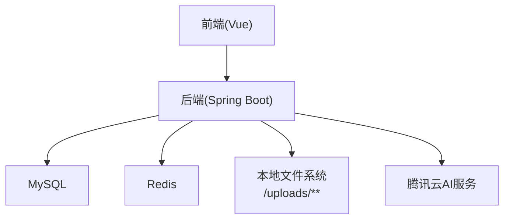
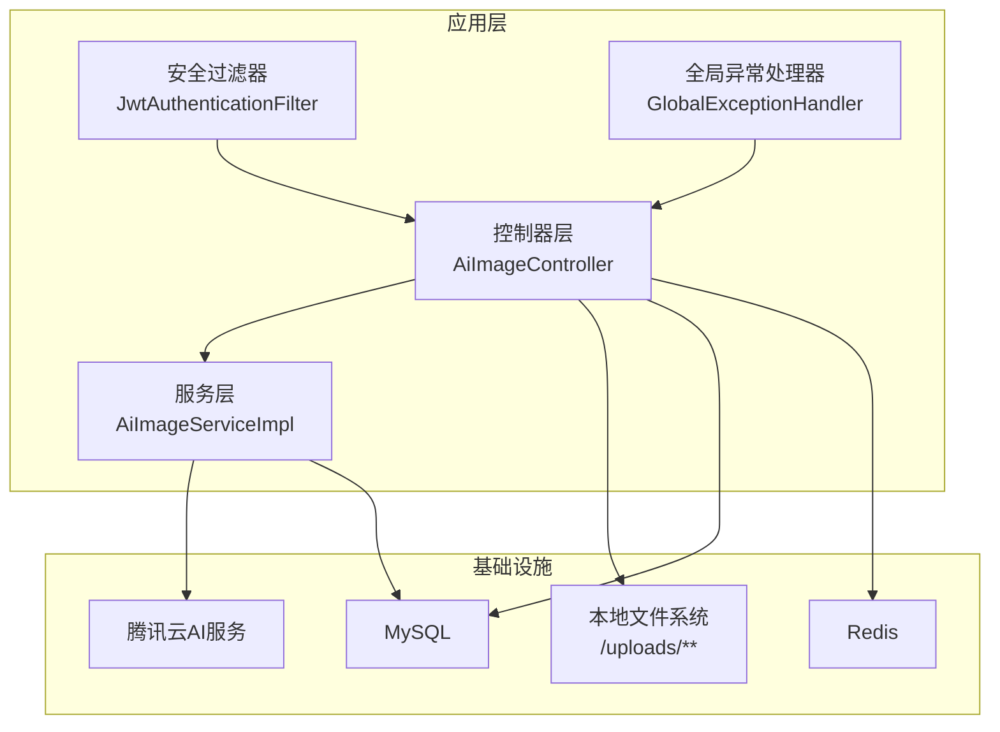
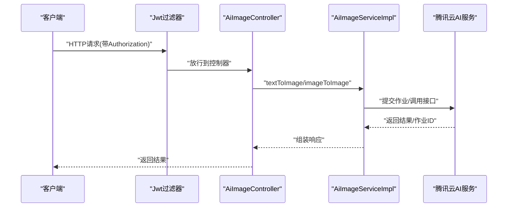
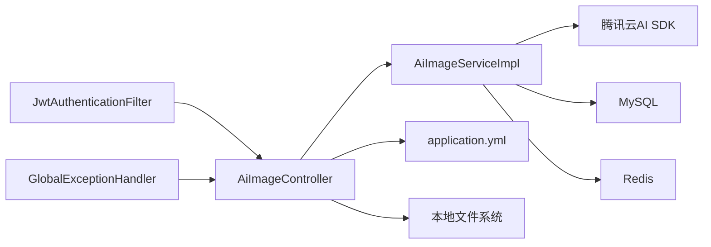

# 监控运维

<cite>
**本文引用的文件**
- [application.yml](file://backend/src/main/resources/application.yml)
- [pom.xml](file://backend/pom.xml)
- [系统设计.md](file://TODO/系统设计.md)
- [RedisConfig.java](file://backend/src/main/java/com/heritage/config/RedisConfig.java)
- [MybatisPlusConfig.java](file://backend/src/main/java/com/heritage/config/MybatisPlusConfig.java)
- [SecurityConfig.java](file://backend/src/main/java/com/heritage/config/SecurityConfig.java)
- [JwtAuthenticationFilter.java](file://backend/src/main/java/com/heritage/security/JwtAuthenticationFilter.java)
- [GlobalExceptionHandler.java](file://backend/src/main/java/com/heritage/common/GlobalExceptionHandler.java)
- [AiImageController.java](file://backend/src/main/java/com/heritage/controller/AiImageController.java)
- [AiImageService.java](file://backend/src/main/java/com/heritage/service/AiImageService.java)
- [AiImageServiceImpl.java](file://backend/src/main/java/com/heritage/service/impl/AiImageServiceImpl.java)
- [PaymentServiceImpl.java](file://backend/src/main/java/com/heritage/service/impl/PaymentServiceImpl.java)
</cite>

## 目录
1. [简介](#简介)
2. [项目结构](#项目结构)
3. [核心组件](#核心组件)
4. [架构总览](#架构总览)
5. [详细组件分析](#详细组件分析)
6. [依赖关系分析](#依赖关系分析)
7. [性能考量](#性能考量)
8. [故障排查指南](#故障排查指南)
9. [结论](#结论)
10. [附录](#附录)

## 简介
本监控运维文档面向“非遗产品智能定制商城系统”，聚焦于应用性能监控（APM）、数据库性能监控、Redis缓存监控、文件存储监控；同时给出日志收集与分析方案（结构化日志、聚合与告警）、健康检查机制、性能基准测试与容量规划策略、故障排查流程与应急响应预案、运维操作手册、监控仪表板与告警通知机制，以及运维自动化脚本示例。文档严格依据仓库现有代码与配置文件进行分析与建议。

## 项目结构
系统采用前后端分离架构，后端基于 Spring Boot，使用 Knife4j 提供 OpenAPI 文档，集成 Redis 缓存、MyBatis-Plus ORM、MySQL 数据库存储、JWT 认证与 Spring Security 权限控制，并内置文件上传与静态资源访问路径配置。智能定制模块通过腾讯云 AIART 接口实现文生图/图生图能力，配套本地文件持久化与历史记录管理。

图表来源
- [系统设计.md](file://TODO/系统设计.md#L23-L61)
- [application.yml](file://backend/src/main/resources/application.yml#L17-L62)

章节来源
- [系统设计.md](file://TODO/系统设计.md#L23-L61)
- [application.yml](file://backend/src/main/resources/application.yml#L1-L63)

## 核心组件
- 应用配置与启动
  - 服务器端口、数据库连接、Redis 连接、文件上传路径、JWT 秘钥与过期时间、Knife4j 开关等。
- 安全与认证
  - Spring Security + JWT，无状态会话，全局异常处理。
- 缓存与序列化
  - RedisTemplate 配置，JSON 序列化策略。
- 数据访问层
  - MyBatis-Plus 分页、乐观锁、SQL 注入防护拦截器。
- 智能定制模块
  - 控制器负责接收请求、落历史记录、持久化图片；服务层对接腾讯云 AIART SDK，封装异步作业轮询与参数归一化。
- 支付模块
  - 支付超时与通道失败率策略，事务一致性保障。

章节来源
- [application.yml](file://backend/src/main/resources/application.yml#L1-L63)
- [SecurityConfig.java](file://backend/src/main/java/com/heritage/config/SecurityConfig.java#L1-L67)
- [JwtAuthenticationFilter.java](file://backend/src/main/java/com/heritage/security/JwtAuthenticationFilter.java#L1-L36)
- [GlobalExceptionHandler.java](file://backend/src/main/java/com/heritage/common/GlobalExceptionHandler.java#L1-L62)
- [RedisConfig.java](file://backend/src/main/java/com/heritage/config/RedisConfig.java#L1-L46)
- [MybatisPlusConfig.java](file://backend/src/main/java/com/heritage/config/MybatisPlusConfig.java#L1-L31)
- [AiImageController.java](file://backend/src/main/java/com/heritage/controller/AiImageController.java#L1-L320)
- [AiImageService.java](file://backend/src/main/java/com/heritage/service/AiImageService.java#L1-L21)
- [AiImageServiceImpl.java](file://backend/src/main/java/com/heritage/service/impl/AiImageServiceImpl.java#L1-L430)
- [PaymentServiceImpl.java](file://backend/src/main/java/com/heritage/service/impl/PaymentServiceImpl.java#L1-L32)

## 架构总览
下图展示系统关键组件与外部依赖之间的交互关系，重点标注监控关注点：应用层、数据库、缓存、文件存储与第三方 AI 服务。

图表来源
- [AiImageController.java](file://backend/src/main/java/com/heritage/controller/AiImageController.java#L41-L56)
- [AiImageServiceImpl.java](file://backend/src/main/java/com/heritage/service/impl/AiImageServiceImpl.java#L35-L50)
- [application.yml](file://backend/src/main/resources/application.yml#L17-L62)
- [SecurityConfig.java](file://backend/src/main/java/com/heritage/config/SecurityConfig.java#L50-L62)
- [GlobalExceptionHandler.java](file://backend/src/main/java/com/heritage/common/GlobalExceptionHandler.java#L12-L14)

## 详细组件分析

### 应用性能监控（APM）
- 监控对象
  - HTTP 请求延迟、吞吐量、错误率、异常堆栈统计。
  - 关键业务方法耗时（如 AI 生成作业轮询、文件持久化）。
- 指标建议
  - P95/P99 延迟、每秒请求数（QPS）、错误率、慢查询阈值、线程池饱和度。
  - 自定义指标：AI 生成任务耗时、文件写入耗时、Redis 命中率。
- 实施建议
  - 使用 Micrometer + Spring Boot Actuator 暴露指标，Prometheus 抓取，Grafana 可视化。
  - 对控制器与服务层关键方法增加计时与计数注解，结合全局异常处理器输出错误指标。
- 关键调用链
  - 控制器接收请求 → 安全过滤器校验 → 业务服务处理 → 外部服务/存储 → 返回响应。

图表来源
- [JwtAuthenticationFilter.java](file://backend/src/main/java/com/heritage/security/JwtAuthenticationFilter.java#L29-L36)
- [AiImageController.java](file://backend/src/main/java/com/heritage/controller/AiImageController.java#L58-L97)
- [AiImageServiceImpl.java](file://backend/src/main/java/com/heritage/service/impl/AiImageServiceImpl.java#L52-L91)

章节来源
- [AiImageController.java](file://backend/src/main/java/com/heritage/controller/AiImageController.java#L41-L56)
- [AiImageServiceImpl.java](file://backend/src/main/java/com/heritage/service/impl/AiImageServiceImpl.java#L35-L50)
- [SecurityConfig.java](file://backend/src/main/java/com/heritage/config/SecurityConfig.java#L50-L62)
- [GlobalExceptionHandler.java](file://backend/src/main/java/com/heritage/common/GlobalExceptionHandler.java#L12-L14)

### 数据库性能监控
- 监控对象
  - 连接池使用情况、慢 SQL、事务冲突、锁等待。
  - MyBatis-Plus 分页上限、乐观锁冲突次数。
- 指标建议
  - 连接池活跃/空闲连接数、获取连接超时次数、SQL 执行时间分布、慢查询数量。
  - 业务维度：订单/支付/商品/用户相关表的热点查询与写入。
- 实施建议
  - 使用 Druid/Micrometer 监控连接池；开启慢 SQL 日志与采样；对高频表建立索引与分区策略。
  - 结合 MyBatis-Plus 拦截器输出 SQL 性能指标。

章节来源
- [MybatisPlusConfig.java](file://backend/src/main/java/com/heritage/config/MybatisPlusConfig.java#L14-L30)
- [application.yml](file://backend/src/main/resources/application.yml#L17-L21)

### Redis 缓存监控
- 监控对象
  - 连接数、命令响应时间、内存使用、命中率/未命中率、过期与驱逐事件。
- 指标建议
  - 连接池最大活跃/空闲、最大等待时间、序列化开销。
  - Key 命中分布、热 Key 识别、过期策略有效性。
- 实施建议
  - 使用 Redis INFO/CLUSTER/LASTSAVE 指标；对热点 Key 做多级缓存与预热；设置合理 TTL 与内存上限。

章节来源
- [application.yml](file://backend/src/main/resources/application.yml#L23-L35)
- [RedisConfig.java](file://backend/src/main/java/com/heritage/config/RedisConfig.java#L16-L44)

### 文件存储监控
- 监控对象
  - 上传目录磁盘使用率、IO 延迟、文件数量、访问量。
  - AI 历史图片写入成功率、URL 可达性。
- 指标建议
  - 磁盘容量、inode 使用率、写入失败次数、远程 URL 下载失败率。
  - 历史记录与文件 URL 的一致性校验。
- 实施建议
  - 对 uploads 目录设置磁盘配额与告警；定期清理过期历史；CDN 或对象存储替代本地直存以提升可用性。

章节来源
- [application.yml](file://backend/src/main/resources/application.yml#L59-L62)
- [AiImageController.java](file://backend/src/main/java/com/heritage/controller/AiImageController.java#L134-L159)
- [AiImageController.java](file://backend/src/main/java/com/heritage/controller/AiImageController.java#L161-L197)

### 日志收集与分析
- 结构化日志
  - 字段建议：时间戳、服务名、实例 ID、TraceId、SpanId、级别、模块、接口/方法、参数摘要、耗时、状态码、错误码/消息、用户标识。
- 日志聚合
  - 使用 ELK/EFK 或 Loki+Grafana 进行采集、索引与检索；按 TraceId 关联请求链路。
- 告警规则
  - 错误率突增、P95 延迟越线、慢查询占比、连接池耗尽、磁盘水位、AI 调用失败率。
- 代码侧输出
  - 全局异常处理器统一记录异常；控制器与服务层关键入口/出口打点；安全过滤器记录鉴权结果。

章节来源
- [GlobalExceptionHandler.java](file://backend/src/main/java/com/heritage/common/GlobalExceptionHandler.java#L16-L60)
- [AiImageController.java](file://backend/src/main/java/com/heritage/controller/AiImageController.java#L58-L97)
- [AiImageServiceImpl.java](file://backend/src/main/java/com/heritage/service/impl/AiImageServiceImpl.java#L76-L83)

### 健康检查机制
- 探针建议
  - HTTP GET /actuator/health（应用健康）、/actuator/health/db（数据库）、/actuator/health/redis（缓存）、/actuator/health/disk（磁盘）。
- 响应策略
  - 失败时返回详细原因并触发告警；对关键依赖设置探活间隔与超时。
- 集成部署
  - Kubernetes/容器编排中配置 readiness/liveness probes。

章节来源
- [application.yml](file://backend/src/main/resources/application.yml#L1-L63)
- [pom.xml](file://backend/pom.xml#L30-L103)

### 性能基准测试与容量规划
- 基准测试
  - 场景：并发用户数、峰值 QPS、AI 生成任务并发、文件上传并发、数据库写入压力。
  - 工具：JMeter/Gatling/Locust；压测脚本覆盖登录、浏览、下单、AI 生成、文件上传。
- 指标目标
  - P95 延迟、错误率、CPU/内存/IO 利用率、连接池饱和度、Redis 命中率。
- 容量规划
  - 以 P99 延迟为目标，结合 CPU/IO/网络瓶颈推导节点数与实例规格；对 AI 与文件 I/O 设备做专项扩容。

章节来源
- [AiImageServiceImpl.java](file://backend/src/main/java/com/heritage/service/impl/AiImageServiceImpl.java#L380-L418)
- [AiImageController.java](file://backend/src/main/java/com/heritage/controller/AiImageController.java#L161-L197)

### 故障排查流程
- 快速定位
  - 查看全局异常日志与错误码；核对鉴权过滤器是否放行；检查数据库/Redis 连接池状态。
- 常见问题
  - AI 生成超时：检查作业轮询间隔与最大等待时间；确认公网访问地址配置；验证凭证与区域设置。
  - 文件持久化失败：检查 uploads 目录权限与磁盘配额；校验远程 URL 可达性。
  - 支付超时：核对确认超时阈值与通道失败率策略。
- 诊断步骤
  - 采集 TraceId 关联日志；抓取慢 SQL 与慢请求；复现问题并录制压测脚本。

章节来源
- [AiImageServiceImpl.java](file://backend/src/main/java/com/heritage/service/impl/AiImageServiceImpl.java#L208-L227)
- [AiImageController.java](file://backend/src/main/java/com/heritage/controller/AiImageController.java#L134-L159)
- [PaymentServiceImpl.java](file://backend/src/main/java/com/heritage/service/impl/PaymentServiceImpl.java#L24-L32)

### 应急响应预案
- 降级策略
  - AI 生成降级为静态模板或提示；文件直存降级为只读或 CDN；数据库只读备份链路。
- 限流与熔断
  - 对外接口设置令牌桶限流；对第三方 AI 服务设置超时与熔断；快速回滚到稳定版本。
- 备份与恢复
  - 数据库定时备份与校验；Redis RDB/AOF；文件系统快照；灰度发布与回滚。

章节来源
- [AiImageServiceImpl.java](file://backend/src/main/java/com/heritage/service/impl/AiImageServiceImpl.java#L320-L330)
- [application.yml](file://backend/src/main/resources/application.yml#L39-L41)

### 运维操作手册
- 部署与启停
  - Maven 打包产物运行；配置文件环境变量覆盖；容器镜像化部署。
- 配置变更
  - 数据库/Redis/JWT/文件路径调整需滚动重启；AI 凭证变更需热加载或重启。
- 监控与告警
  - 设置阈值与通知渠道；定期评审告警有效性；优化误报与漏报。
- 日常巡检
  - 检查磁盘、连接池、慢查询、错误率、缓存命中率、AI 调用成功率。

章节来源
- [pom.xml](file://backend/pom.xml#L112-L127)
- [application.yml](file://backend/src/main/resources/application.yml#L1-L63)

### 监控仪表板设计
- 仪表板建议
  - 应用面板：QPS/错误率/延迟、GC/线程、JVM 内存、线程池。
  - 业务面板：AI 生成成功率/耗时、文件上传成功率、订单/支付指标。
  - 基础设施面板：数据库连接池、Redis、磁盘、网络。
- 图表类型
  - 折线图（趋势）、柱状图（错误分布）、热力图（响应时间）、表格（慢查询 TopN）。

章节来源
- [AiImageServiceImpl.java](file://backend/src/main/java/com/heritage/service/impl/AiImageServiceImpl.java#L380-L418)
- [application.yml](file://backend/src/main/resources/application.yml#L17-L62)

### 告警通知机制
- 告警分级
  - P0：服务不可用、数据库/缓存不可用、AI 调用大面积失败。
  - P1：延迟越线、错误率激增、连接池耗尽。
  - P2：慢查询增多、磁盘水位高、缓存命中率下降。
- 通知渠道
  - 钉钉/企业微信/Webhook/邮件；按级别与时间段抑制重复告警。

章节来源
- [GlobalExceptionHandler.java](file://backend/src/main/java/com/heritage/common/GlobalExceptionHandler.java#L16-L60)
- [AiImageServiceImpl.java](file://backend/src/main/java/com/heritage/service/impl/AiImageServiceImpl.java#L380-L418)

### 运维自动化脚本示例
- 健康检查脚本
  - curl /actuator/health 并解析响应；失败则告警。
- 压测脚本
  - JMX 脚本或 Locust 脚本，覆盖 AI 生成、文件上传、下单等关键路径。
- 备份脚本
  - mysqldump + Redis RDB/AOF + 文件系统快照；定时执行与校验。
- 部署脚本
  - Docker 镜像构建与推送；Kubernetes YAML 应用；滚动升级与回滚。

章节来源
- [pom.xml](file://backend/pom.xml#L112-L127)
- [application.yml](file://backend/src/main/resources/application.yml#L1-L63)

## 依赖关系分析
- 组件耦合
  - 控制器依赖服务层；服务层依赖 SDK 与配置；全局异常处理器贯穿所有层。
- 外部依赖
  - MySQL、Redis、本地文件系统、腾讯云 AI 服务。
- 潜在风险
  - AI 服务超时与失败；文件直存可靠性；数据库连接池与慢查询；Redis 内存与过期策略。

图表来源
- [AiImageController.java](file://backend/src/main/java/com/heritage/controller/AiImageController.java#L41-L56)
- [AiImageServiceImpl.java](file://backend/src/main/java/com/heritage/service/impl/AiImageServiceImpl.java#L35-L50)
- [application.yml](file://backend/src/main/resources/application.yml#L17-L62)
- [SecurityConfig.java](file://backend/src/main/java/com/heritage/config/SecurityConfig.java#L50-L62)
- [GlobalExceptionHandler.java](file://backend/src/main/java/com/heritage/common/GlobalExceptionHandler.java#L12-L14)

章节来源
- [AiImageController.java](file://backend/src/main/java/com/heritage/controller/AiImageController.java#L41-L56)
- [AiImageServiceImpl.java](file://backend/src/main/java/com/heritage/service/impl/AiImageServiceImpl.java#L35-L50)
- [application.yml](file://backend/src/main/resources/application.yml#L17-L62)
- [SecurityConfig.java](file://backend/src/main/java/com/heritage/config/SecurityConfig.java#L50-L62)
- [GlobalExceptionHandler.java](file://backend/src/main/java/com/heritage/common/GlobalExceptionHandler.java#L12-L14)

## 性能考量
- 关键路径优化
  - AI 生成采用作业轮询与指数退避；文件持久化支持多种输入格式与远程下载；Redis 使用 JSON 序列化减少反序列化成本。
- 资源限制
  - 文件上传大小限制；数据库分页上限；连接池参数与超时配置。
- 可扩展性
  - 本地文件直存建议迁移至对象存储；数据库与 Redis 水平扩展；AI 服务限流与熔断。

章节来源
- [AiImageServiceImpl.java](file://backend/src/main/java/com/heritage/service/impl/AiImageServiceImpl.java#L380-L418)
- [AiImageController.java](file://backend/src/main/java/com/heritage/controller/AiImageController.java#L161-L197)
- [application.yml](file://backend/src/main/resources/application.yml#L12-L15)
- [MybatisPlusConfig.java](file://backend/src/main/java/com/heritage/config/MybatisPlusConfig.java#L20-L22)
- [RedisConfig.java](file://backend/src/main/java/com/heritage/config/RedisConfig.java#L25-L43)

## 故障排查指南
- 常见症状与定位
  - AI 生成失败：检查凭证、区域、公网地址、作业状态码；查看 SDK 异常与超时。
  - 文件上传失败：检查 uploads 目录权限、磁盘配额、远程 URL 可达性。
  - 认证失败：检查 Authorization 头、JWT 过期、用户状态。
  - 数据库异常：检查慢查询、连接池耗尽、锁冲突。
- 处置流程
  - 快速隔离问题域；临时降级或限流；修复后回归验证；复盘并完善监控与告警。

章节来源
- [AiImageServiceImpl.java](file://backend/src/main/java/com/heritage/service/impl/AiImageServiceImpl.java#L208-L227)
- [AiImageController.java](file://backend/src/main/java/com/heritage/controller/AiImageController.java#L134-L159)
- [GlobalExceptionHandler.java](file://backend/src/main/java/com/heritage/common/GlobalExceptionHandler.java#L16-L60)
- [SecurityConfig.java](file://backend/src/main/java/com/heritage/config/SecurityConfig.java#L50-L62)

## 结论
本系统监控运维方案围绕应用、数据库、缓存与文件存储四条主线，结合智能定制模块的外部依赖特点，提出指标体系、日志与告警、健康检查、性能基线与容量规划、故障处置与自动化运维建议。建议尽快引入 Micrometer/Actuator、Prometheus/Grafana、ELK/EFK/Loki 等工具链，形成闭环的可观测性体系，持续优化系统稳定性与用户体验。

## 附录
- 关键配置项
  - 服务器端口、数据库连接、Redis 连接、文件上传路径、JWT 秘钥与过期时间、Knife4j 开关。
- 依赖与版本
  - Spring Boot 3.x、MyBatis-Plus、Redis Starter、Knife4j、腾讯云 SDK。

章节来源
- [application.yml](file://backend/src/main/resources/application.yml#L1-L63)
- [pom.xml](file://backend/pom.xml#L21-L97)