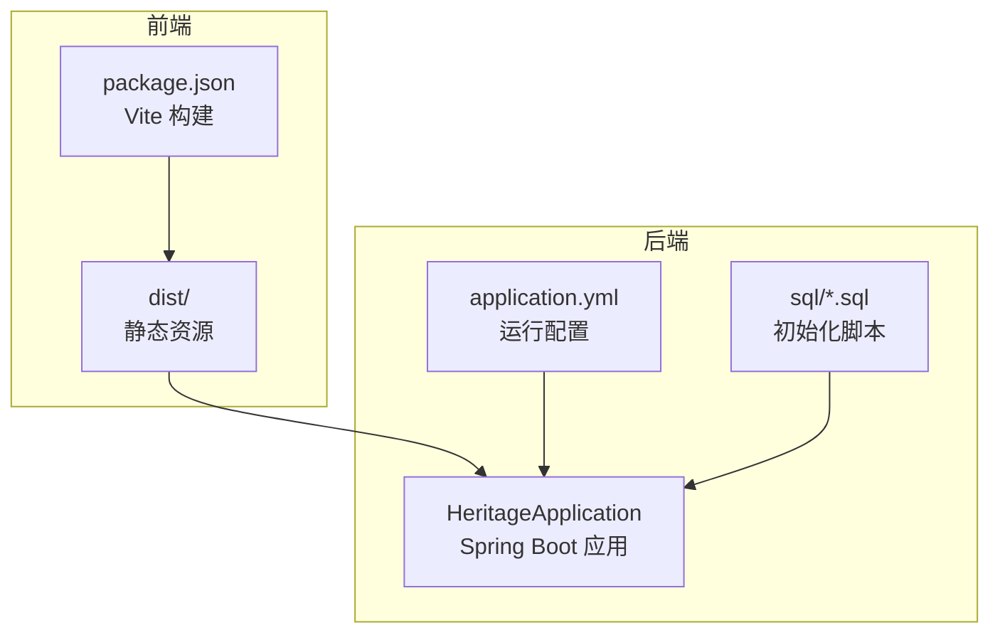
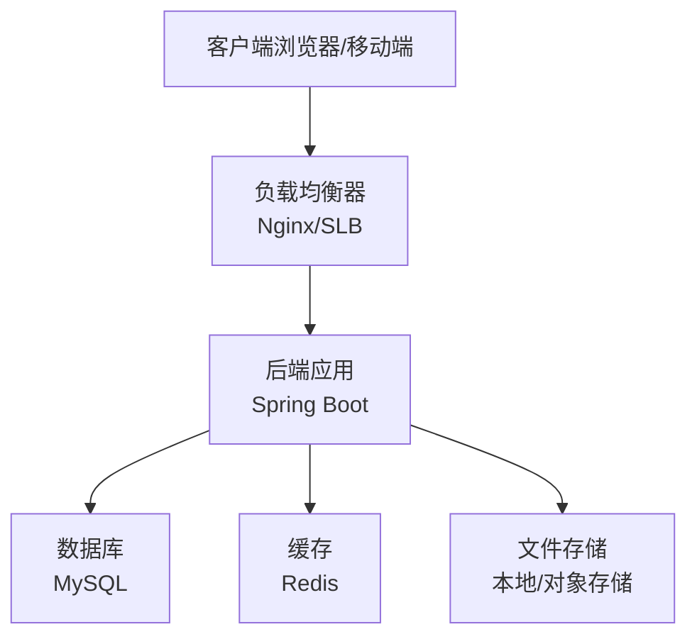
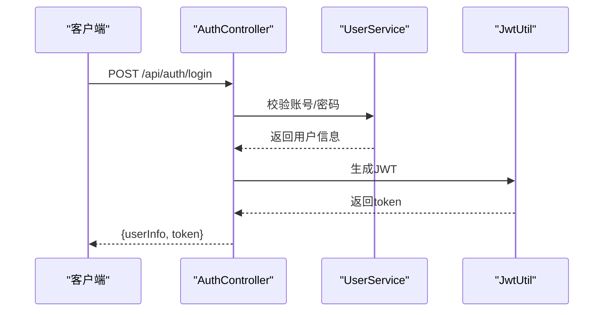
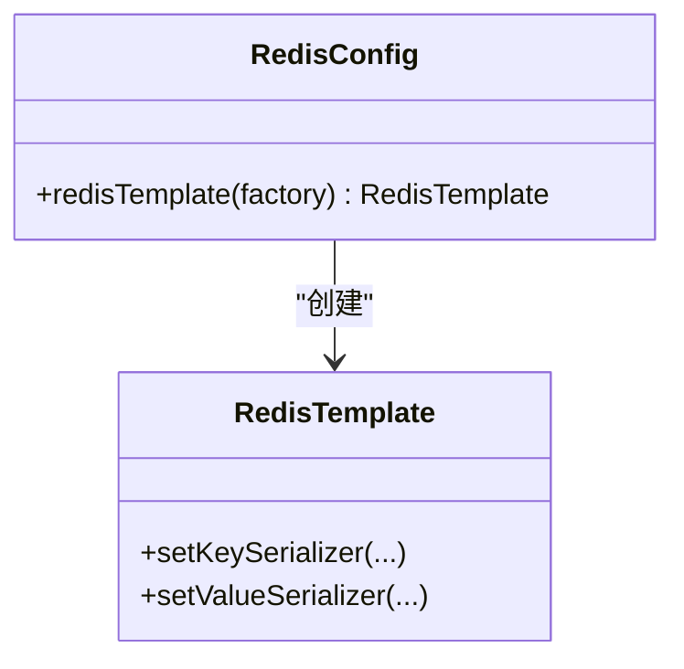
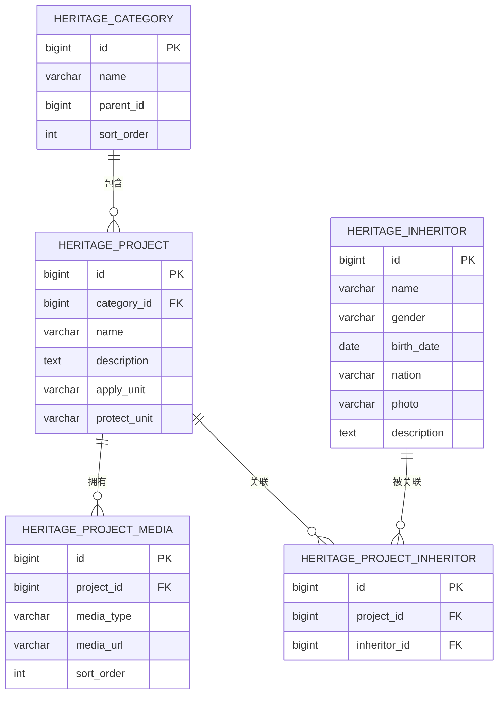
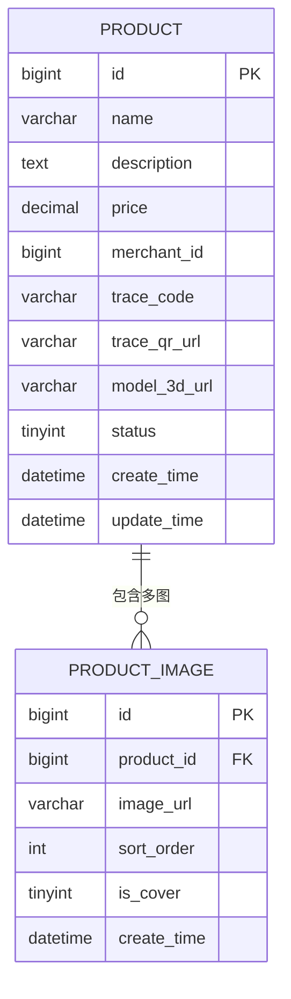
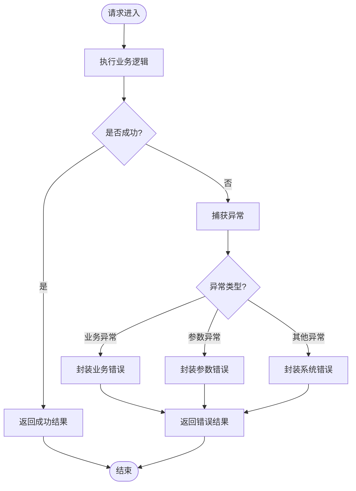
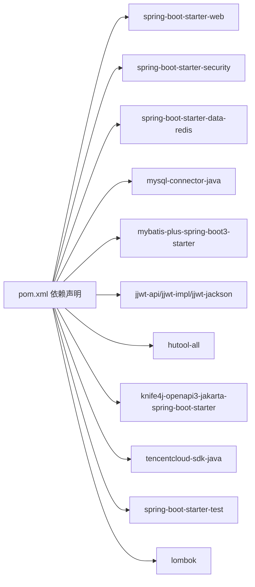

# 部署与运维

<cite>
**本文引用的文件**
- [application.yml](file://backend/src/main/resources/application.yml)
- [pom.xml](file://backend/pom.xml)
- [package.json](file://frontend/package.json)
- [setup-maven.ps1](file://setup-maven.ps1)
- [heritage.sql](file://backend/src/main/resources/sql/heritage.sql)
- [product.sql](file://backend/src/main/resources/sql/product.sql)
- [GlobalExceptionHandler.java](file://backend/src/main/java/com/heritage/common/GlobalExceptionHandler.java)
- [SecurityConfig.java](file://backend/src/main/java/com/heritage/config/SecurityConfig.java)
- [RedisConfig.java](file://backend/src/main/java/com/heritage/config/RedisConfig.java)
- [AuthController.java](file://backend/src/main/java/com/heritage/controller/AuthController.java)
- [UserServiceImpl.java](file://backend/src/main/java/com/heritage/service/impl/UserServiceImpl.java)
- [ProductServiceImpl.java](file://backend/src/main/java/com/heritage/service/impl/ProductServiceImpl.java)
- [HeritageApplication.java](file://backend/src/main/java/com/heritage/HeritageApplication.java)
</cite>

## 目录
1. [简介](#简介)
2. [项目结构](#项目结构)
3. [核心组件](#核心组件)
4. [架构总览](#架构总览)
5. [详细组件分析](#详细组件分析)
6. [依赖关系分析](#依赖关系分析)
7. [性能考虑](#性能考虑)
8. [故障排查指南](#故障排查指南)
9. [结论](#结论)
10. [附录](#附录)

## 简介
本文件面向非遗产品智能定制商城系统，提供从生产环境部署到运维保障的完整方案。内容涵盖服务器与网络配置、负载均衡与容器化部署、CI/CD流水线设计、监控告警与日志收集、数据库备份恢复与文件存储管理、版本升级策略以及运维最佳实践与应急响应预案，确保系统在生产环境中的稳定性、可维护性与可扩展性。

## 项目结构
系统采用前后端分离架构：
- 后端基于 Spring Boot 3.2.0（Java 17），使用 MySQL 与 Redis，提供 REST API 与安全控制。
- 前端基于 Vue 3 + Vite，构建静态资源，通过反向代理与后端协同工作。
- 配置与构建脚本位于根目录与各子工程中；数据库初始化 SQL 位于后端资源目录。

图表来源
- [HeritageApplication.java](file://backend/src/main/java/com/heritage/HeritageApplication.java#L1-L13)
- [application.yml](file://backend/src/main/resources/application.yml#L1-L63)
- [package.json](file://frontend/package.json#L1-L28)

章节来源
- [HeritageApplication.java](file://backend/src/main/java/com/heritage/HeritageApplication.java#L1-L13)
- [application.yml](file://backend/src/main/resources/application.yml#L1-L63)
- [pom.xml](file://backend/pom.xml#L1-L129)
- [package.json](file://frontend/package.json#L1-L28)

## 核心组件
- 运行时与依赖
  - Java 17、Spring Boot 3.2.0、MySQL Connector/J、MyBatis-Plus、Redis 客户端、Knife4j 文档、JWT 工具、腾讯云 AI SDK。
- 安全与认证
  - 基于 Spring Security 的无状态 JWT 过滤链，开放部分公开接口，其余接口需鉴权。
- 文件上传与存储
  - 本地文件上传路径与对外访问基础 URL 可配置；默认上传目录为 uploads。
- 数据库与缓存
  - 默认使用本地 MySQL 与 Redis；生产建议独立实例并通过环境变量注入连接信息。
- 异常处理
  - 全局异常处理器统一返回 Result 结构，便于前端统一处理。

章节来源
- [pom.xml](file://backend/pom.xml#L30-L110)
- [SecurityConfig.java](file://backend/src/main/java/com/heritage/config/SecurityConfig.java#L50-L65)
- [application.yml](file://backend/src/main/resources/application.yml#L17-L62)
- [GlobalExceptionHandler.java](file://backend/src/main/java/com/heritage/common/GlobalExceptionHandler.java#L14-L61)

## 架构总览
系统采用“前端静态 + 后端无状态服务 + 外部数据库/缓存”的三层架构。生产环境建议通过反向代理统一入口，结合负载均衡实现高可用。

## 详细组件分析

### 安全与认证组件
- 安全过滤链
  - 禁用 CSRF，会话策略为无状态；对公开接口放行，其余请求需鉴权。
  - 使用自定义 JWT 过滤器在用户名密码过滤器之前执行。
- 认证流程
  - 登录成功后生成 JWT 返回给客户端；后续请求携带 Token 访问受保护接口。

图表来源
- [AuthController.java](file://backend/src/main/java/com/heritage/controller/AuthController.java#L33-L46)
- [UserServiceImpl.java](file://backend/src/main/java/com/heritage/service/impl/UserServiceImpl.java#L48-L75)

章节来源
- [SecurityConfig.java](file://backend/src/main/java/com/heritage/config/SecurityConfig.java#L50-L65)
- [AuthController.java](file://backend/src/main/java/com/heritage/controller/AuthController.java#L1-L48)
- [UserServiceImpl.java](file://backend/src/main/java/com/heritage/service/impl/UserServiceImpl.java#L1-L181)

### 缓存组件
- RedisTemplate 序列化策略
  - Key 使用字符串序列化；Value 使用 JSON 序列化，支持泛型类型保留。
- 启用注解式缓存
  - 通过配置启用缓存能力，便于后续在服务层增加缓存注解提升性能。

图表来源
- [RedisConfig.java](file://backend/src/main/java/com/heritage/config/RedisConfig.java#L20-L44)

章节来源
- [RedisConfig.java](file://backend/src/main/java/com/heritage/config/RedisConfig.java#L1-L46)

### 数据模型与初始化
- 非遗项目与传承人
  - 分类、项目、媒体资源、传承人及关联关系。
- 商品与图片
  - 商品主表与图片表，支持封面与排序字段，支持随机查询与分页。
- 初始化数据
  - 提供分类、项目、媒体、传承人与关联的初始数据。

图表来源
- [heritage.sql](file://backend/src/main/resources/sql/heritage.sql#L7-L58)

图表来源
- [product.sql](file://backend/src/main/resources/sql/product.sql#L1-L28)

章节来源
- [heritage.sql](file://backend/src/main/resources/sql/heritage.sql#L1-L88)
- [product.sql](file://backend/src/main/resources/sql/product.sql#L1-L45)

### 异常处理与全局响应
- 全局异常处理器
  - 统一处理鉴权、业务、参数校验等异常，返回标准化结果结构。
- 业务异常
  - 通过抛出业务异常实现错误码与消息的规范化输出。

图表来源
- [GlobalExceptionHandler.java](file://backend/src/main/java/com/heritage/common/GlobalExceptionHandler.java#L16-L60)

章节来源
- [GlobalExceptionHandler.java](file://backend/src/main/java/com/heritage/common/GlobalExceptionHandler.java#L1-L62)

## 依赖关系分析
后端核心依赖与构建配置如下：
- 运行与框架：Spring Boot Starter Web、Validation、Security、Data Redis。
- 持久化：MySQL Driver、MyBatis-Plus Starter。
- 工具与文档：Hutool、Knife4j OpenAPI、JWT 实现。
- 测试与可选：JUnit、Lombok。

图表来源
- [pom.xml](file://backend/pom.xml#L30-L110)

章节来源
- [pom.xml](file://backend/pom.xml#L1-L129)

## 性能考虑
- 数据库层
  - 为热点字段建立索引（如分类、项目、商品、图片等），避免全表扫描。
  - 对随机查询与分页场景，评估 ORDER BY RAND() 的性能影响，必要时引入二级索引或预计算。
- 缓存层
  - 利用 Redis 缓存热点数据（如商品详情、分类树、用户会话），减少数据库压力。
- 应用层
  - 无状态设计便于横向扩展；合理设置线程池与连接池参数，避免阻塞。
- 文件存储
  - 图片与模型文件建议使用对象存储（CDN 加速），降低单机 IO 压力。
- 监控与压测
  - 建议接入 APM 与指标采集，定期进行容量与压力测试。

## 故障排查指南
- 认证与权限
  - 若出现 401/403，检查 Token 是否过期、签名是否正确、放行规则是否覆盖目标路径。
- 参数校验
  - 参数校验失败通常由 MethodArgumentNotValid 或 Bind 异常触发，查看日志定位字段。
- 业务异常
  - 业务异常会抛出统一错误，核对异常消息与边界条件（如商品状态、权限校验）。
- 数据库连接
  - 检查数据库连通性、驱动版本与字符集设置；确认初始化脚本已执行。
- 文件上传
  - 检查上传目录权限、大小限制与对外访问基础 URL 配置。

章节来源
- [SecurityConfig.java](file://backend/src/main/java/com/heritage/config/SecurityConfig.java#L50-L65)
- [GlobalExceptionHandler.java](file://backend/src/main/java/com/heritage/common/GlobalExceptionHandler.java#L40-L60)
- [application.yml](file://backend/src/main/resources/application.yml#L17-L62)

## 结论
通过明确的部署策略、完善的 CI/CD 流水线、健全的监控告警与日志体系、规范的数据库备份与文件存储管理，以及清晰的版本升级与应急响应流程，非遗产品智能定制商城系统可在生产环境中实现高可用、可维护与可扩展的目标。建议尽快落地容器化与自动化运维，持续优化性能与安全性。

## 附录

### 生产环境部署策略
- 服务器配置
  - CPU/内存按峰值 QPS 与并发连接数评估；建议至少 2C4G 起步，数据库与缓存独立实例。
  - 操作系统：Linux（CentOS/Ubuntu），内核参数优化（文件句柄、TIME_WAIT 等）。
- 网络与安全
  - 开启防火墙与 WAF；TLS 终止于反向代理；严格限制内网访问数据库与缓存。
- 负载均衡
  - 使用 Nginx/SLB 做七层负载均衡，健康检查与会话保持策略根据业务选择。
- 容器化部署
  - Docker 镜像包含 Java 17 与打包产物；使用 docker-compose 或 Kubernetes 编排；挂载日志与上传目录卷。
  - 环境变量注入数据库、Redis、AI 密钥与公共访问基址等敏感配置。

章节来源
- [application.yml](file://backend/src/main/resources/application.yml#L17-L62)
- [pom.xml](file://backend/pom.xml#L112-L127)

### CI/CD 流程设计
- 自动化构建
  - Maven 清理构建，跳过测试或仅运行单元测试；生成可执行 JAR；构建前端静态包。
- 测试集成
  - 单元测试与集成测试（含数据库与缓存），失败即阻断流水线。
- 部署流水线
  - 镜像构建 → 推送镜像仓库 → 发布到预发布环境验证 → 灰度发布 → 全量发布。
  - 支持回滚策略（镜像标签与滚动更新配置）。

章节来源
- [pom.xml](file://backend/pom.xml#L112-L127)
- [package.json](file://frontend/package.json#L5-L9)

### 监控告警机制、日志收集与性能监控
- 监控指标
  - 应用：请求量、响应时间、错误率、线程池与连接池使用率。
  - 数据库：慢查询、连接数、锁等待、缓冲池命中率。
  - 缓存：命中率、内存使用、命令耗时。
- 日志
  - 分层采集：应用日志、Nginx 访问日志、数据库审计日志；集中存储与检索。
- 告警
  - 基于阈值与趋势的多级告警；短信/邮件/IM 通知；自动工单与变更冻结。

### 数据库备份恢复与文件存储管理
- 备份策略
  - 全量+增量备份，保留至少 7 天全备；异地容灾；定期恢复演练。
- 恢复流程
  - 快速定位备份点、最小化停机窗口、数据一致性校验。
- 文件存储
  - 上传目录与静态资源迁移至对象存储；CDN 加速；定期清理与归档。

章节来源
- [product.sql](file://backend/src/main/resources/sql/product.sql#L30-L44)
- [heritage.sql](file://backend/src/main/resources/sql/heritage.sql#L60-L87)

### 版本升级策略
- 小版本平滑升级：灰度 10%-20%，观察指标与日志，逐步扩大流量。
- 大版本升级：预留回滚分支与配置开关；先升级数据库结构再升级应用。
- 配置外置化：通过环境变量与配置中心管理，避免硬编码。

章节来源
- [application.yml](file://backend/src/main/resources/application.yml#L36-L41)

### 运维最佳实践与应急响应预案
- 最佳实践
  - 变更评审与双人复核；发布窗口与变更公告；容量规划与压测。
- 应急响应
  - 明确角色职责与联系方式；快速隔离问题、回滚与修复；事后复盘与改进。