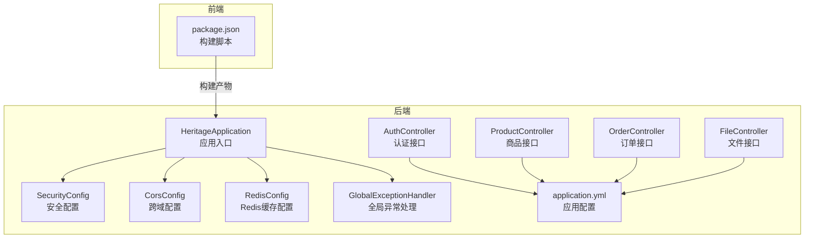
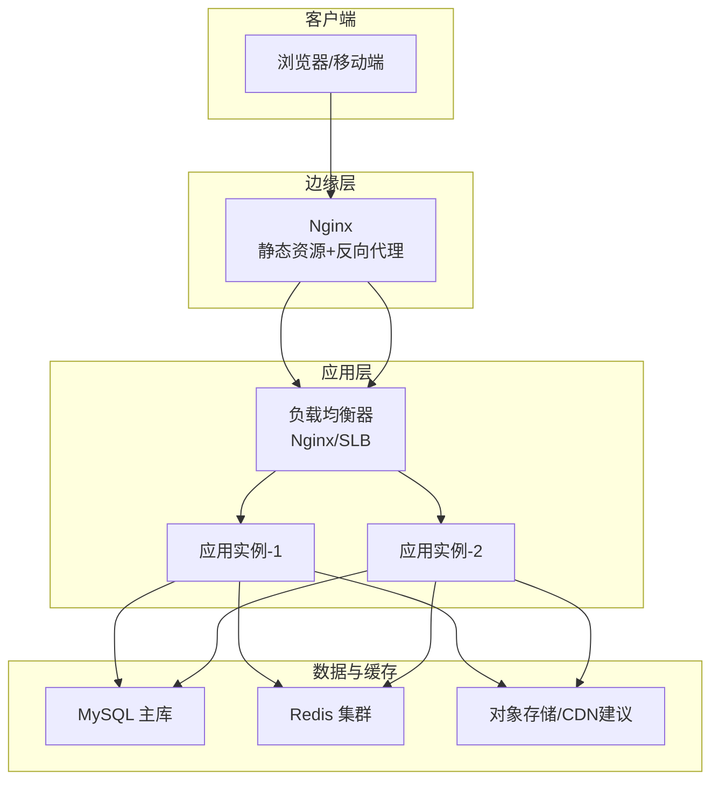
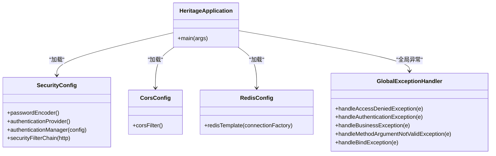
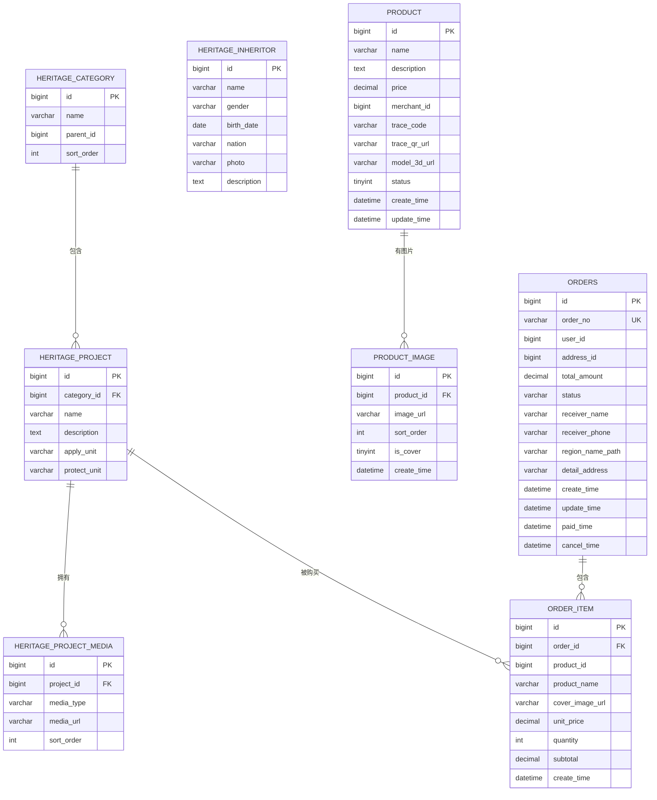
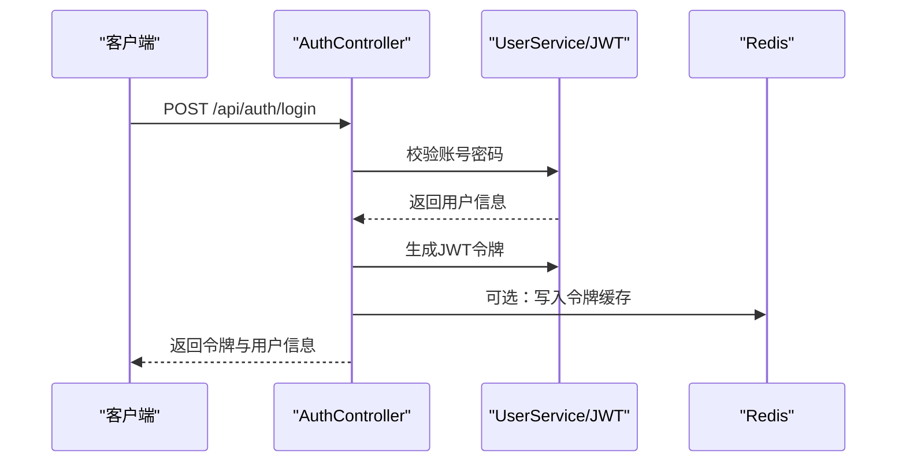
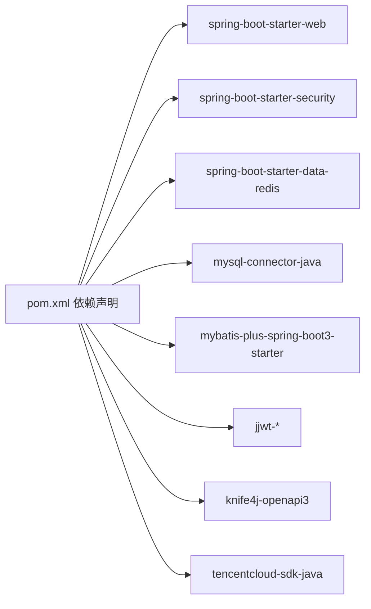

# 部署架构设计

<cite>
**本文引用的文件**
- [application.yml](file://backend/src/main/resources/application.yml)
- [pom.xml](file://backend/pom.xml)
- [package.json](file://frontend/package.json)
- [HeritageApplication.java](file://backend/src/main/java/com/heritage/HeritageApplication.java)
- [SecurityConfig.java](file://backend/src/main/java/com/heritage/config/SecurityConfig.java)
- [CorsConfig.java](file://backend/src/main/java/com/heritage/config/CorsConfig.java)
- [RedisConfig.java](file://backend/src/main/java/com/heritage/config/RedisConfig.java)
- [GlobalExceptionHandler.java](file://backend/src/main/java/com/heritage/common/GlobalExceptionHandler.java)
- [AuthController.java](file://backend/src/main/java/com/heritage/controller/AuthController.java)
- [ProductController.java](file://backend/src/main/java/com/heritage/controller/ProductController.java)
- [OrderController.java](file://backend/src/main/java/com/heritage/controller/OrderController.java)
- [FileController.java](file://backend/src/main/java/com/heritage/controller/FileController.java)
- [heritage.sql](file://backend/src/main/resources/sql/heritage.sql)
- [product.sql](file://backend/src/main/resources/sql/product.sql)
- [order.sql](file://backend/src/main/resources/sql/order.sql)
</cite>

## 目录
1. [引言](#引言)
2. [项目结构](#项目结构)
3. [核心组件](#核心组件)
4. [架构总览](#架构总览)
5. [详细组件分析](#详细组件分析)
6. [依赖关系分析](#依赖关系分析)
7. [性能考虑](#性能考虑)
8. [故障排查指南](#故障排查指南)
9. [结论](#结论)
10. [附录](#附录)

## 引言
本文件面向“非遗产品智能定制商城系统”的生产环境部署，提供从服务器角色划分、网络与负载均衡、容器化与编排到微服务拆分、高可用与弹性伸缩的完整架构设计。系统采用前后端分离，后端基于 Spring Boot，前端基于 Vue 3 + Vite，数据库使用 MySQL，缓存使用 Redis，文件上传采用本地目录映射。

## 项目结构
- 后端（Spring Boot）
  - 应用入口与配置：应用启动类、安全配置、跨域配置、Redis 缓存配置、全局异常处理
  - 控制器层：认证、商品、订单、文件上传等接口
  - 资源与脚本：数据库初始化 SQL、应用配置文件
- 前端（Vue 3 + Vite）
  - 开发与构建脚本、路由、状态管理、国际化、UI 组件与 API 封装
- 部署与打包
  - 后端通过 Maven 构建可执行 JAR；前端通过 Vite 构建静态资源

图表来源
- [HeritageApplication.java](file://backend/src/main/java/com/heritage/HeritageApplication.java#L1-L13)
- [SecurityConfig.java](file://backend/src/main/java/com/heritage/config/SecurityConfig.java#L1-L67)
- [CorsConfig.java](file://backend/src/main/java/com/heritage/config/CorsConfig.java#L1-L27)
- [RedisConfig.java](file://backend/src/main/java/com/heritage/config/RedisConfig.java#L1-L46)
- [GlobalExceptionHandler.java](file://backend/src/main/java/com/heritage/common/GlobalExceptionHandler.java#L1-L62)
- [AuthController.java](file://backend/src/main/java/com/heritage/controller/AuthController.java#L1-L48)
- [ProductController.java](file://backend/src/main/java/com/heritage/controller/ProductController.java#L1-L130)
- [OrderController.java](file://backend/src/main/java/com/heritage/controller/OrderController.java#L1-L67)
- [FileController.java](file://backend/src/main/java/com/heritage/controller/FileController.java#L1-L62)
- [application.yml](file://backend/src/main/resources/application.yml#L1-L63)
- [package.json](file://frontend/package.json#L1-L28)

章节来源
- [HeritageApplication.java](file://backend/src/main/java/com/heritage/HeritageApplication.java#L1-L13)
- [application.yml](file://backend/src/main/resources/application.yml#L1-L63)
- [package.json](file://frontend/package.json#L1-L28)

## 核心组件
- 应用服务器（后端）
  - Spring Boot 应用，暴露 REST API，内置 Web 容器
  - 安全与鉴权：基于 JWT 的无状态认证，细粒度接口授权
  - 缓存：Redis 用于会话、令牌、热点数据缓存
  - 文件上传：本地目录写入，支持多文件上传与 URL 暴露
- 数据库服务器（MySQL）
  - 初始化表结构与基础数据，支撑商品、订单、非遗项目与用户等业务
- 缓存服务器（Redis）
  - 提供高性能读写，配合 Spring Cache 使用
- 文件存储服务器
  - 本地目录映射，生产建议使用对象存储（如 OSS/COS）并结合 CDN
- 前端服务器（静态资源）
  - Vite 构建产物，Nginx 提供静态托管与反向代理

章节来源
- [application.yml](file://backend/src/main/resources/application.yml#L1-L63)
- [RedisConfig.java](file://backend/src/main/java/com/heritage/config/RedisConfig.java#L1-L46)
- [FileController.java](file://backend/src/main/java/com/heritage/controller/FileController.java#L1-L62)
- [heritage.sql](file://backend/src/main/resources/sql/heritage.sql#L1-L88)
- [product.sql](file://backend/src/main/resources/sql/product.sql#L1-L45)
- [order.sql](file://backend/src/main/resources/sql/order.sql#L1-L39)

## 架构总览
生产环境推荐采用“应用-数据库-缓存-文件”四层架构，前端通过 Nginx 反向代理后端 API，实现静态资源与动态请求分离。

说明
- 负载均衡：Nginx 或云厂商 SLB 实现健康检查与流量分发
- 应用实例：至少 2 个实例，支持滚动升级与故障切换
- 数据与缓存：数据库主从/高可用、Redis 集群
- 文件：生产建议迁移到对象存储并开启 CDN 加速

## 详细组件分析

### 应用服务器（后端）
- 启动与端口
  - 应用监听端口由配置文件定义，建议在容器中通过环境变量覆盖
- 安全与鉴权
  - 无状态会话：JWT 令牌生成与校验，接口按角色授权
  - 跨域：允许任意来源、方法与头，生产需收敛白名单
- 缓存
  - JSON 序列化配置，键值序列化策略，连接池参数可调优
- 全局异常处理
  - 统一返回结构，便于前端统一处理错误码与提示

图表来源
- [SecurityConfig.java](file://backend/src/main/java/com/heritage/config/SecurityConfig.java#L1-L67)
- [CorsConfig.java](file://backend/src/main/java/com/heritage/config/CorsConfig.java#L1-L27)
- [RedisConfig.java](file://backend/src/main/java/com/heritage/config/RedisConfig.java#L1-L46)
- [GlobalExceptionHandler.java](file://backend/src/main/java/com/heritage/common/GlobalExceptionHandler.java#L1-L62)
- [HeritageApplication.java](file://backend/src/main/java/com/heritage/HeritageApplication.java#L1-L13)

章节来源
- [SecurityConfig.java](file://backend/src/main/java/com/heritage/config/SecurityConfig.java#L1-L67)
- [CorsConfig.java](file://backend/src/main/java/com/heritage/config/CorsConfig.java#L1-L27)
- [RedisConfig.java](file://backend/src/main/java/com/heritage/config/RedisConfig.java#L1-L46)
- [GlobalExceptionHandler.java](file://backend/src/main/java/com/heritage/common/GlobalExceptionHandler.java#L1-L62)
- [HeritageApplication.java](file://backend/src/main/java/com/heritage/HeritageApplication.java#L1-L13)

### 数据库服务器（MySQL）
- 表结构概览
  - 非遗分类、项目、传承人、项目媒体
  - 商品与商品图片
  - 订单与订单项
- 初始化数据
  - 分类、项目、媒体、传承人、商品与图片、订单样例数据
- 建议
  - 生产使用主从复制、只读副本与连接池
  - 对高频查询字段建立合适索引

图表来源
- [heritage.sql](file://backend/src/main/resources/sql/heritage.sql#L1-L88)
- [product.sql](file://backend/src/main/resources/sql/product.sql#L1-L45)
- [order.sql](file://backend/src/main/resources/sql/order.sql#L1-L39)

章节来源
- [heritage.sql](file://backend/src/main/resources/sql/heritage.sql#L1-L88)
- [product.sql](file://backend/src/main/resources/sql/product.sql#L1-L45)
- [order.sql](file://backend/src/main/resources/sql/order.sql#L1-L39)

### 缓存服务器（Redis）
- 配置要点
  - 连接工厂、序列化策略、连接池参数
  - 建议启用持久化与哨兵/集群模式
- 使用场景
  - 令牌缓存、会话状态、热点商品与订单数据

章节来源
- [RedisConfig.java](file://backend/src/main/java/com/heritage/config/RedisConfig.java#L1-L46)
- [application.yml](file://backend/src/main/resources/application.yml#L23-L35)

### 文件存储与上传
- 本地上传
  - 通过控制器接收文件，写入配置路径，返回访问 URL
- 生产建议
  - 使用对象存储（OSS/COS）+ CDN，提升并发与可用性
  - 配置域名与 HTTPS，限制上传类型与大小

章节来源
- [FileController.java](file://backend/src/main/java/com/heritage/controller/FileController.java#L1-L62)
- [application.yml](file://backend/src/main/resources/application.yml#L59-L62)

### API 流程示例（登录）

图表来源
- [AuthController.java](file://backend/src/main/java/com/heritage/controller/AuthController.java#L1-L48)
- [SecurityConfig.java](file://backend/src/main/java/com/heritage/config/SecurityConfig.java#L1-L67)

## 依赖关系分析
- 技术栈
  - 后端：Spring Boot、Spring Security、Spring Data Redis、MyBatis-Plus、JWT、Knife4j
  - 前端：Vue 3、Vite、Element Plus、Axios
- 关键依赖
  - Web 与安全：spring-boot-starter-web、spring-boot-starter-security
  - 缓存：spring-boot-starter-data-redis
  - 数据库驱动与 ORM：mysql-connector-java、mybatis-plus-spring-boot3-starter
  - 工具与文档：hutool、knife4j-openapi3、腾讯云 SDK

图表来源
- [pom.xml](file://backend/pom.xml#L1-L129)

章节来源
- [pom.xml](file://backend/pom.xml#L1-L129)

## 性能考虑
- 连接池与线程
  - 合理设置数据库与 Redis 连接池大小，避免阻塞
- 缓存策略
  - 对热点数据加缓存，设置合理 TTL；对写多读少场景采用写穿透/失效策略
- 文件访问
  - 生产使用对象存储与 CDN，减少应用服务器 IO 压力
- 接口限流
  - 在网关或应用层增加限流与熔断，防止雪崩

## 故障排查指南
- 认证与权限
  - 401/403 错误通常由令牌缺失或过期导致，检查前端是否携带令牌与后端密钥配置
- 参数校验
  - 参数校验失败会触发统一异常处理，查看日志定位具体字段
- 文件上传
  - 上传失败多因目录不可写或磁盘空间不足，检查上传路径与权限
- 数据库连接
  - 连接超时或拒绝多与连接池耗尽有关，调整最大连接数与超时时间

章节来源
- [GlobalExceptionHandler.java](file://backend/src/main/java/com/heritage/common/GlobalExceptionHandler.java#L1-L62)
- [FileController.java](file://backend/src/main/java/com/heritage/controller/FileController.java#L1-L62)
- [application.yml](file://backend/src/main/resources/application.yml#L17-L21)

## 结论
本部署架构以“应用-数据库-缓存-文件”为核心，结合 Nginx 负载均衡与对象存储/CDN，满足高可用与可扩展需求。建议在生产中进一步完善监控、日志、备份与灰度发布流程，确保系统稳定运行。

## 附录

### 生产环境部署拓扑与角色划分
- 应用服务器（2+ 实例）
  - 承载业务逻辑与 API，支持水平扩展
- 数据库服务器（主从/高可用）
  - 支持读写分离与备份恢复
- 缓存服务器（Redis 集群）
  - 提供高性能缓存与会话存储
- 文件存储服务器（对象存储+CDN）
  - 替代本地上传，提升并发与可用性
- 负载均衡与反向代理
  - Nginx 或云 SLB，健康检查与自动摘除故障节点

### 容器化与编排（Docker/Kubernetes）
- 镜像构建
  - 后端：基于 Maven 构建 JAR，使用精简镜像运行 Java 应用
  - 前端：构建静态资源，使用 Nginx 镜像提供静态托管
- Kubernetes 编排
  - Deployment：应用副本与滚动升级
  - Service：ClusterIP 暴露服务
  - ConfigMap/Secret：注入环境变量与敏感配置
  - Ingress：对外暴露域名与 TLS
  - PVC：持久化日志与上传目录（建议迁移到对象存储）

### 服务拆分与部署单元
- 当前单体应用
  - 认证、商品、订单、文件等模块集中在一个应用中
- 建议的微服务拆分
  - 用户服务（认证与资料）
  - 商品服务（商品与图片）
  - 订单服务（订单与支付）
  - 文件服务（上传与裁剪）
  - AI 服务（图像生成）
- 部署单元
  - 每个服务独立镜像与命名空间，通过 API 网关统一接入

### 高可用与容灾
- 多可用区部署
  - 应用与数据库跨可用区部署，实现故障隔离
- 自动扩缩容
  - 基于 CPU/内存与 QPS 设置 HPA，保障高峰期性能
- 备份与回滚
  - 数据库定时备份与增量备份，应用蓝绿/金丝雀发布

### 环境变量与配置管理
- 关键配置项（示例）
  - 服务端口：SERVER_PORT
  - 数据库连接：SPRING_DATASOURCE_URL/USERNAME/PASSWORD
  - Redis 连接：SPRING_DATA_REDIS_HOST/PORT/DATABASE/TIMEOUT
  - JWT 密钥与过期：JWT_SECRET/JWT_EXPIRATION
  - 文件上传路径：FILE_UPLOAD_PATH/PUBLIC_BASE_URL
  - AI 服务密钥：TENCENTCLOUD_SECRET_ID/TENCENTCLOUD_SECRET_KEY
- 管理方式
  - 使用 Secret 管理密钥，ConfigMap 管理非敏感配置
  - 不同环境（dev/staging/prod）使用不同命名空间或配置集