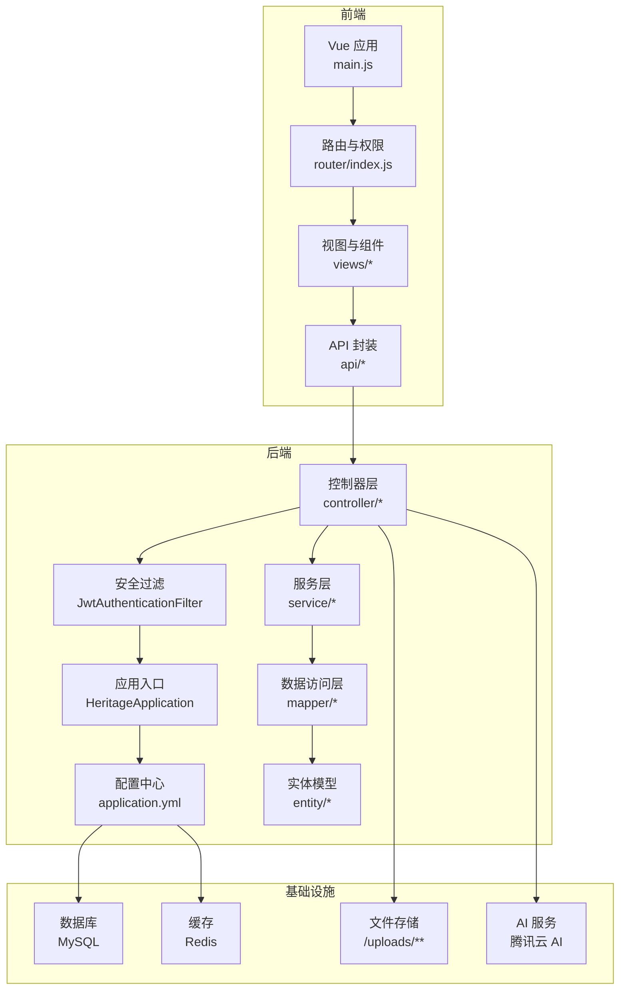
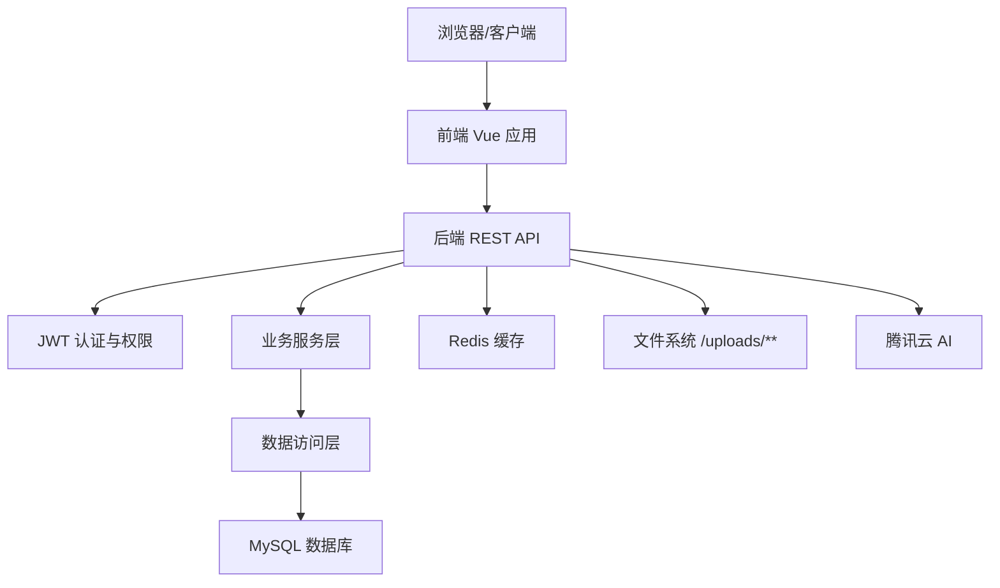
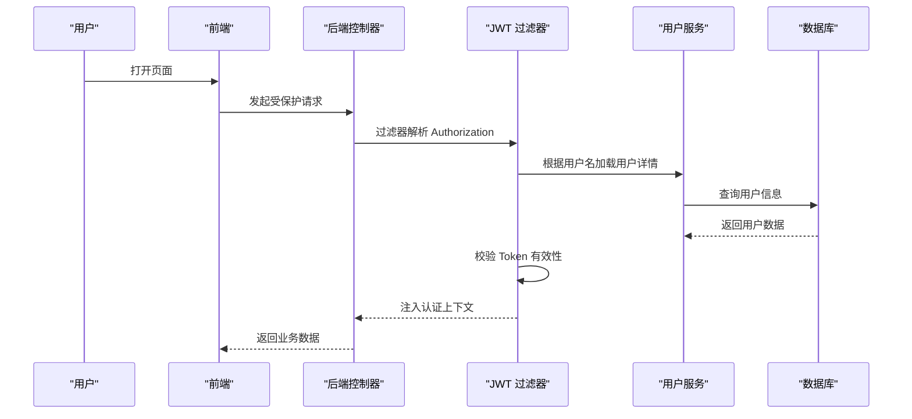
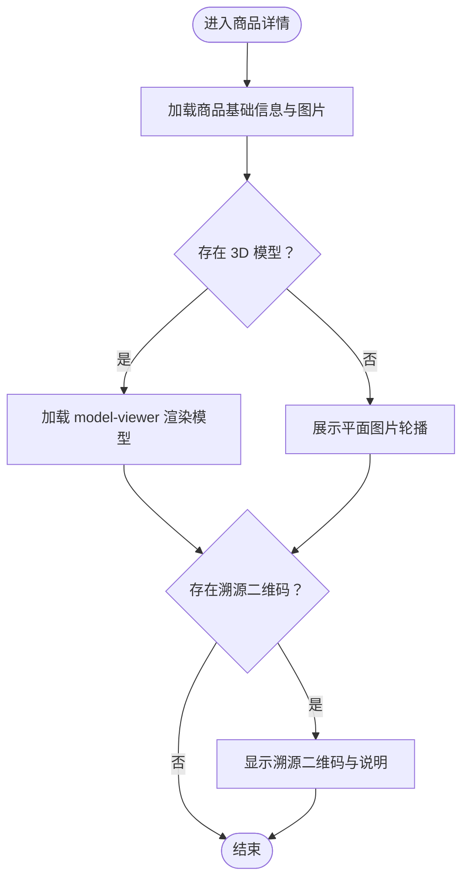
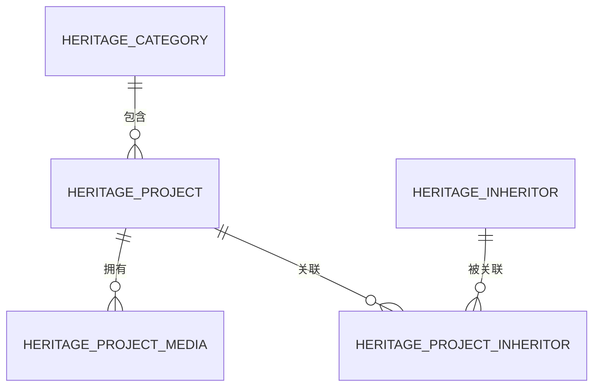
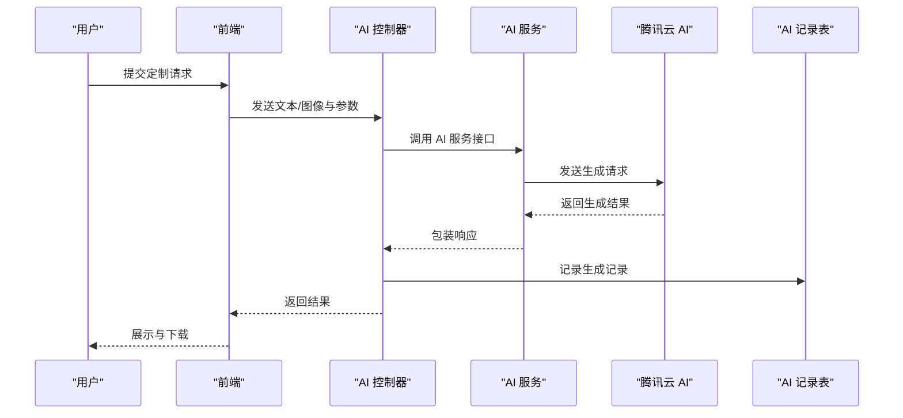
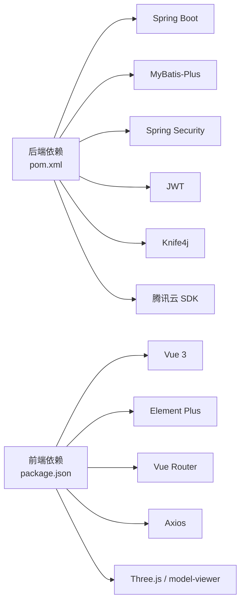

# 项目概述

<cite>
**本文引用的文件**
- [HeritageApplication.java](file://backend/src/main/java/com/heritage/HeritageApplication.java)
- [application.yml](file://backend/src/main/resources/application.yml)
- [pom.xml](file://backend/pom.xml)
- [系统设计.md](file://TODO/系统设计.md)
- [package.json](file://frontend/package.json)
- [main.js](file://frontend/src/main.js)
- [router/index.js](file://frontend/src/router/index.js)
- [Result.java](file://backend/src/main/java/com/heritage/common/Result.java)
- [JwtAuthenticationFilter.java](file://backend/src/main/java/com/heritage/security/JwtAuthenticationFilter.java)
- [AiImageService.java](file://backend/src/main/java/com/heritage/service/AiImageService.java)
- [user.sql](file://backend/src/main/resources/sql/user.sql)
- [product.sql](file://backend/src/main/resources/sql/product.sql)
- [heritage.sql](file://backend/src/main/resources/sql/heritage.sql)
</cite>

## 目录
1. [简介](#简介)
2. [项目结构](#项目结构)
3. [核心组件](#核心组件)
4. [架构总览](#架构总览)
5. [详细组件分析](#详细组件分析)
6. [依赖分析](#依赖分析)
7. [性能考虑](#性能考虑)
8. [故障排查指南](#故障排查指南)
9. [结论](#结论)
10. [附录](#附录)

## 简介
本项目是一个融合“非遗文化展示、商品交易与智能定制”的综合在线商城系统，旨在通过现代科技手段保护与传播中华优秀传统文化，为用户提供沉浸式的非遗产品浏览、购买与个性化定制体验。系统采用前后端分离架构，后端基于 Spring Boot，前端基于 Vue 3，集成 JWT 权限体系、MyBatis-Plus 数据访问层、MySQL 数据库存储、Redis 缓存、Knife4j 在线接口文档，并引入腾讯云 AI 能力实现“文生图/图生图”的智能定制功能。

项目创新价值与社会意义体现在：
- 文化保护：以数字化方式系统化呈现非遗项目、传承人与工艺流程，促进非遗知识的广泛传播。
- 智能体验：借助 AI 图像生成能力，降低用户定制门槛，提升个性化体验。
- 商业赋能：为非遗手艺人与商家提供电商化运营通道，推动传统工艺走向市场。
- 技术示范：以现代化技术栈实现传统文化与数字技术的深度融合，形成可复制的解决方案。

## 项目结构
系统由前后端两部分组成，配合数据库与文件存储，形成完整的电商与文化展示平台。

- 后端（Spring Boot）
  - 应用入口与配置：应用启动类、Spring 配置、数据库与缓存连接、JWT 参数、AI 云服务配置、Knife4j 文档开关等。
  - 控制器层：面向用户、管理员、商家的各类业务控制器，覆盖用户、商品、订单、支付、非遗文化、智能定制、文件上传等功能。
  - 服务层：封装业务逻辑，对接数据访问层与外部 AI 服务。
  - 数据访问层：MyBatis-Plus 映射器与实体，提供 CRUD 与分页能力。
  - 安全与工具：JWT 过滤器、全局异常处理、统一响应体、通用工具集等。
  - 资源脚本：SQL 初始化脚本，涵盖用户、商品、非遗项目与媒体、证书等核心数据模型。

- 前端（Vue 3 + Element Plus）
  - 应用入口：挂载 Pinia、路由、国际化、UI 主题与图标。
  - 路由与布局：主站、管理后台、商家后台三层路由与布局，支持登录拦截与角色权限控制。
  - 视图与组件：首页、非遗文化、商品列表与详情、智能定制、购物车、订单、个人中心等页面。
  - API 与工具：Axios 请求封装、i18n 国际化、主题与语言切换、3D 模型展示等。

图表来源
- [main.js](file://frontend/src/main.js#L1-L25)
- [router/index.js](file://frontend/src/router/index.js#L1-L176)
- [HeritageApplication.java](file://backend/src/main/java/com/heritage/HeritageApplication.java#L1-L13)
- [application.yml](file://backend/src/main/resources/application.yml#L1-L63)
- [JwtAuthenticationFilter.java](file://backend/src/main/java/com/heritage/security/JwtAuthenticationFilter.java#L1-L72)

章节来源
- [系统设计.md](file://TODO/系统设计.md#L23-L61)
- [application.yml](file://backend/src/main/resources/application.yml#L1-L63)
- [pom.xml](file://backend/pom.xml#L1-L129)
- [package.json](file://frontend/package.json#L1-L28)

## 核心组件
- 统一响应体与异常处理
  - 统一响应体封装，提供成功/错误返回格式，简化前后端交互。
  - 全局异常处理器，集中处理业务异常与系统异常，保障接口稳定性。
- 权限与认证
  - 基于 Spring Security + JWT 的无状态认证，支持管理员、商家、普通用户三类角色。
  - 请求拦截器解析 Authorization 头，校验 Token 并注入用户上下文。
- 数据访问与分页
  - MyBatis-Plus 提供通用 Mapper 与分页插件，减少重复 SQL，提升开发效率。
- 文件与静态资源
  - 本地文件上传目录与静态资源映射，支持 AI 生成历史与商品媒体资源长期可访问。
- 在线接口文档
  - Knife4j 开启 OpenAPI 文档，便于联调与二次开发。
- 智能定制服务
  - 对接腾讯云 AI（混元），提供文生图与图生图能力，支持风格、分辨率、增强等参数配置。

章节来源
- [Result.java](file://backend/src/main/java/com/heritage/common/Result.java#L1-L44)
- [JwtAuthenticationFilter.java](file://backend/src/main/java/com/heritage/security/JwtAuthenticationFilter.java#L1-L72)
- [AiImageService.java](file://backend/src/main/java/com/heritage/service/AiImageService.java#L1-L21)
- [application.yml](file://backend/src/main/resources/application.yml#L54-L62)
- [pom.xml](file://backend/pom.xml#L87-L97)

## 架构总览
系统采用前后端分离架构，通过 RESTful API 进行通信；后端提供统一的业务接口与权限控制，前端负责页面渲染与交互；数据库负责持久化，Redis 可选用于缓存与扩展，文件系统承载上传资源与 AI 历史结果。

图表来源
- [系统设计.md](file://TODO/系统设计.md#L23-L61)
- [application.yml](file://backend/src/main/resources/application.yml#L17-L35)
- [pom.xml](file://backend/pom.xml#L30-L97)

## 详细组件分析

### 用户与权限模块
- 角色与权限
  - 管理员：系统管理与内容审核。
  - 商家：发布与管理自有商品。
  - 普通用户：浏览、下单、定制与个人中心。
- 登录与 Token
  - 登录成功后颁发 JWT，后续请求在 Header 中携带 Authorization: Bearer <token>。
- 路由级权限
  - 前端路由通过 meta 字段声明所需角色，beforeEach 中进行鉴权跳转。

图表来源
- [JwtAuthenticationFilter.java](file://backend/src/main/java/com/heritage/security/JwtAuthenticationFilter.java#L29-L70)
- [router/index.js](file://frontend/src/router/index.js#L147-L173)
- [user.sql](file://backend/src/main/resources/sql/user.sql#L6-L20)

章节来源
- [router/index.js](file://frontend/src/router/index.js#L147-L173)
- [JwtAuthenticationFilter.java](file://backend/src/main/java/com/heritage/security/JwtAuthenticationFilter.java#L1-L72)
- [user.sql](file://backend/src/main/resources/sql/user.sql#L42-L45)

### 商品与商城模块
- 商品列表与详情
  - 支持按名称、商家、非遗类别筛选；详情页展示图片、3D 模型、溯源二维码等。
- 购物车与订单
  - 购物车聚合与结算；订单状态流转与支付对接预留。
- 3D 展示与溯源
  - 前端通过 model-viewer 加载 glb/gltf，支持拖拽旋转与缩放；商品绑定 trace_code 与 trace_qr_url。

图表来源
- [product.sql](file://backend/src/main/resources/sql/product.sql#L1-L16)
- [frontend/src/views/ProductDetail.vue](file://frontend/src/views/ProductDetail.vue)

章节来源
- [product.sql](file://backend/src/main/resources/sql/product.sql#L30-L45)
- [package.json](file://frontend/package.json#L12-L18)

### 非遗文化模块
- 分类、项目、传承人与媒体
  - 分类树形结构；项目详情与多类型媒体（展示图、工艺图、视频）；传承人信息与关联关系。
- 管理端与前台
  - 管理员维护内容；前台展示文化故事与工艺流程，增强用户对非遗的认知与兴趣。

图表来源
- [heritage.sql](file://backend/src/main/resources/sql/heritage.sql#L7-L58)

章节来源
- [heritage.sql](file://backend/src/main/resources/sql/heritage.sql#L60-L88)
- [系统设计.md](file://TODO/系统设计.md#L209-L244)

### 智能定制模块
- 能力与参数
  - 支持文生图与图生图，参数包括提示词、反向提示词、强度、分辨率、风格、数量、图像类型等。
- 流程与交互
  - 用户在前端提交定制需求，后端封装调用 AI 服务，返回生成结果并落库记录，支持历史回看。

图表来源
- [AiImageService.java](file://backend/src/main/java/com/heritage/service/AiImageService.java#L1-L21)
- [application.yml](file://backend/src/main/resources/application.yml#L49-L53)

章节来源
- [AiImageService.java](file://backend/src/main/java/com/heritage/service/AiImageService.java#L1-L21)
- [系统设计.md](file://TODO/系统设计.md#L246-L288)

### 文件管理模块
- 上传与访问
  - 限制单文件与请求大小；上传目录为 uploads；通过静态资源映射对外提供访问。
- AI 历史与商品媒体
  - AI 生成历史与商品媒体长期可访问，便于回看与二次使用。

章节来源
- [application.yml](file://backend/src/main/resources/application.yml#L59-L62)

## 依赖分析
- 技术栈与版本
  - 后端：Spring Boot 3.x、Spring Security、MyBatis-Plus、MySQL、Redis、JWT、Knife4j、腾讯云 SDK。
  - 前端：Vue 3、Element Plus、Vue Router、Pinia、Axios、Three.js 与 model-viewer。
- 依赖关系
  - 后端通过 Maven 管理依赖，明确版本与作用域；前端通过 npm 管理依赖，提供开发与生产脚本。
- 配置与环境
  - application.yml 配置数据库、Redis、JWT、AI 云服务与 Knife4j；前端 package.json 提供开发与构建命令。

图表来源
- [pom.xml](file://backend/pom.xml#L30-L97)
- [package.json](file://frontend/package.json#L10-L26)

章节来源
- [pom.xml](file://backend/pom.xml#L1-L129)
- [package.json](file://frontend/package.json#L1-L28)

## 性能考虑
- 数据库层面
  - 为高频查询字段建立索引（如 category_id、merchant_id、status、account、certificate_number 等），避免全表扫描。
  - 合理拆分表与关联查询，避免 N+1 查询；必要时引入缓存。
- 缓存策略
  - Redis 可用于热点数据缓存、会话存储与分布式锁；注意缓存一致性与过期策略。
- 文件与网络
  - 上传文件大小限制与路径规划，避免磁盘膨胀；CDN 或对象存储可替代本地文件服务。
- 接口与并发
  - 对高并发接口进行限流与降级；分页查询避免一次性返回大量数据；合理使用异步任务处理耗时操作。
- 前端体验
  - 路由懒加载与组件按需加载；3D 模型资源压缩与延迟加载；国际化与主题切换避免重复渲染。

## 故障排查指南
- 认证失败
  - 检查 Authorization 头是否正确携带 Bearer Token；确认 Token 未过期；核对用户名是否存在且被正确加载。
- 数据库连接
  - 核对 application.yml 中的数据库 URL、用户名、密码与字符集；确保数据库服务可用。
- Redis 连接
  - 核对 host、port、database、超时与连接池配置；检查 Redis 服务状态。
- 文件上传
  - 检查 multipart 是否启用、最大文件与请求大小是否合理；确认 uploads 目录可写且路径正确。
- AI 服务
  - 核对腾讯云 SecretId/SecretKey 与区域配置；确认网络可达与额度充足；查看日志定位异常。
- 接口文档
  - 确认 Knife4j 已开启，访问 /doc.html 查看接口说明与调试。

章节来源
- [JwtAuthenticationFilter.java](file://backend/src/main/java/com/heritage/security/JwtAuthenticationFilter.java#L33-L66)
- [application.yml](file://backend/src/main/resources/application.yml#L17-L35)
- [application.yml](file://backend/src/main/resources/application.yml#L59-L62)

## 结论
本项目以“文化+科技+商业”为核心理念，构建了非遗产品智能定制与电商运营的一体化平台。通过清晰的模块划分、完善的权限体系、可扩展的技术架构与丰富的文化内容展示，系统既满足了用户对个性化体验的需求，也为非遗文化的保护与传播提供了可持续的发展路径。建议在后续迭代中持续完善 AI 定制参数体系、订单与支付闭环、国际化与多端适配，以及数据埋点与运营分析能力，进一步提升平台的商业价值与社会影响力。

## 附录
- 快速启动
  - 后端：使用 Maven 启动 Spring Boot 应用，确保数据库与 Redis 可用。
  - 前端：安装依赖后运行开发服务器，访问指定端口。
- 关键配置
  - application.yml：数据库、Redis、JWT、AI 云服务、Knife4j、文件上传路径。
  - package.json：开发与构建脚本、依赖版本与工具链。
- 数据模型
  - 用户、商品、非遗项目与媒体、证书等核心表结构，初始化数据便于快速验证。

章节来源
- [HeritageApplication.java](file://backend/src/main/java/com/heritage/HeritageApplication.java#L1-L13)
- [main.js](file://frontend/src/main.js#L1-L25)
- [router/index.js](file://frontend/src/router/index.js#L1-L176)
- [user.sql](file://backend/src/main/resources/sql/user.sql#L6-L45)
- [product.sql](file://backend/src/main/resources/sql/product.sql#L1-L45)
- [heritage.sql](file://backend/src/main/resources/sql/heritage.sql#L1-L88)