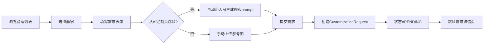
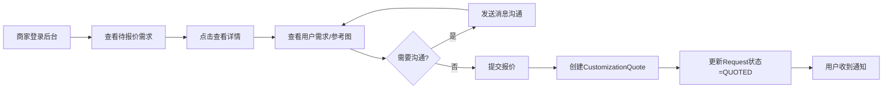
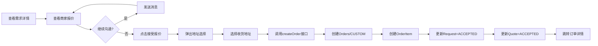

# 智能定制沟通模块设计方案

最后更新:2026-04-14

## 一、模块概述

### 1.1 功能定位

智能定制沟通模块是在现有AI智能定制功能基础上的延伸,为"AI生成设计"与"实物定制生产"之间搭建桥梁。用户可以将AI生成的设计图作为参考,选择合适的非遗商家进行深度定制沟通,商家报价后用户确认并创建订单。

### 1.2 核心价值

- **用户侧**: 从AI灵感快速过渡到实物定制,降低沟通成本
- **商家侧**: 获得精准定制需求,提高成交转化率
- **平台侧**: 形成"AI设计→商家沟通→订单交易"完整闭环

### 1.3 核心流程

```
AI生成设计图 → 浏览商家列表 → 选择商家 → 提交定制需求 → 双方沟通 → 商家报价 → 用户确认 → 创建订单 → 支付发货
```

---

## 二、数据库设计

### 2.1 新增表清单

| 表名 | 说明 | 核心字段数 |
|------|------|-----------|
| `merchant_profile` | 商家档案表 | 13 |
| `customization_request` | 定制需求表 | 12 |
| `customization_message` | 定制沟通消息表 | 7 |
| `customization_quote` | 商家报价表 | 9 |

### 2.2 扩展现有表

| 表名 | 新增字段 | 说明 |
|------|---------|------|
| `orders` | `request_id`, `order_type` | 关联定制需求,区分订单类型 |
| `order_item` | `request_id`, `customization_desc` | 记录定制需求快照 |

### 2.3 核心表结构

#### 2.3.1 商家档案表 `merchant_profile`

**设计思路**: 扩展sys_user表中MERCHANT角色的商家信息,提供展示和筛选能力

| 字段名 | 类型 | 允许空 | 说明 |
|--------|------|--------|------|
| id | BIGINT PK | 否 | 主键 |
| user_id | BIGINT | 否 | 关联sys_user表(唯一) |
| shop_name | VARCHAR(100) | 否 | 店铺名称 |
| avatar | VARCHAR(255) | 是 | 商家头像 |
| description | TEXT | 是 | 商家简介 |
| expertise_categories | VARCHAR(500) | 是 | 擅长非遗类别(逗号分隔) |
| min_price | DECIMAL(10,2) | 是 | 服务最低价 |
| max_price | DECIMAL(10,2) | 是 | 服务最高价 |
| rating | DECIMAL(3,2) | 是 | 评分(0-5) |
| completed_orders | INT | 是 | 完成订单数 |
| status | INT | 否 | 状态:1-营业中,0-暂停接单 |
| create_time | DATETIME | 否 | 创建时间 |
| update_time | DATETIME | 否 | 更新时间 |

**索引设计**:
- `uk_user_id(user_id)` - 唯一索引,一个用户只能有一个商家档案
- `idx_status(status)` - 用于筛选营业中商家

#### 2.3.2 定制需求表 `customization_request`

**设计思路**: 记录用户提交的定制需求,关联AI生成记录和商家

| 字段名 | 类型 | 允许空 | 说明 |
|--------|------|--------|------|
| id | BIGINT PK | 否 | 主键 |
| request_no | VARCHAR(50) | 否 | 需求编号(唯一,如CR202604140001) |
| user_id | BIGINT | 否 | 用户ID |
| merchant_id | BIGINT | 否 | 商家ID(关联sys_user) |
| ai_record_id | BIGINT | 是 | 关联AI生成记录ID(可选) |
| reference_image_url | TEXT | 是 | 参考图URL |
| requirement_desc | TEXT | 否 | 定制需求描述 |
| budget_min | DECIMAL(10,2) | 是 | 预算最低 |
| budget_max | DECIMAL(10,2) | 是 | 预算最高 |
| status | VARCHAR(20) | 否 | 状态:PENDING/QUOTED/ACCEPTED/REJECTED/CANCELLED |
| create_time | DATETIME | 否 | 创建时间 |
| update_time | DATETIME | 否 | 更新时间 |

**状态流转**:
```
PENDING(待报价) → QUOTED(已报价) → ACCEPTED(已接受) → 创建订单
                               ↘ REJECTED(已拒绝)
                ↘ CANCELLED(已取消)
```

**索引设计**:
- `uk_request_no(request_no)` - 唯一索引
- `idx_user_id(user_id)` - 用户查询自己的需求
- `idx_merchant_id(merchant_id)` - 商家查询收到的需求
- `idx_status(status)` - 按状态筛选

#### 2.3.3 定制沟通消息表 `customization_message`

**设计思路**: 支持用户和商家就定制需求进行沟通,支持文本和图片

| 字段名 | 类型 | 允许空 | 说明 |
|--------|------|--------|------|
| id | BIGINT PK | 否 | 主键 |
| request_id | BIGINT | 否 | 关联定制需求ID |
| sender_id | BIGINT | 否 | 发送者ID |
| sender_role | VARCHAR(20) | 否 | 发送者角色:USER/MERCHANT |
| message_type | VARCHAR(20) | 否 | 消息类型:TEXT/IMAGE |
| content | TEXT | 否 | 消息内容(文本或图片URL) |
| create_time | DATETIME | 否 | 创建时间 |

**索引设计**:
- `idx_request_id(request_id)` - 查询某个需求的所有消息
- `idx_create_time(create_time)` - 按时间排序

#### 2.3.4 商家报价表 `customization_quote`

**设计思路**: 一个需求对应一个报价,报价后用户可接受或拒绝

| 字段名 | 类型 | 允许空 | 说明 |
|--------|------|--------|------|
| id | BIGINT PK | 否 | 主键 |
| request_id | BIGINT | 否 | 关联定制需求ID(唯一) |
| merchant_id | BIGINT | 否 | 商家ID |
| quoted_price | DECIMAL(10,2) | 否 | 报价金额 |
| estimated_days | INT | 是 | 预计完成天数 |
| quote_desc | TEXT | 是 | 报价说明 |
| status | VARCHAR(20) | 否 | 状态:PENDING/ACCEPTED/REJECTED |
| create_time | DATETIME | 否 | 创建时间 |
| update_time | DATETIME | 否 | 更新时间 |

**索引设计**:
- `uk_request_id(request_id)` - 唯一索引,一个需求只能有一个报价
- `idx_merchant_id(merchant_id)` - 商家查询自己的报价

---

## 三、后端接口设计

### 3.1 商家相关接口(公开)

#### 3.1.1 获取商家列表

```
GET /api/customize/merchants
```

**请求参数**:
| 参数 | 类型 | 必填 | 说明 |
|------|------|------|------|
| page | int | 否 | 页码,默认1 |
| size | int | 否 | 每页数量,默认10 |
| keyword | String | 否 | 搜索关键词(店铺名称/简介) |
| category | String | 否 | 非遗类别筛选 |
| priceRange | String | 否 | 价格区间,如"0-500" |
| sortBy | String | 否 | 排序:rating/completedOrders |

**返回示例**:
```json
{
  "code": 200,
  "data": {
    "records": [
      {
        "id": 1,
        "shopName": "张三的店铺",
        "avatar": "http://...",
        "rating": 4.5,
        "completedOrders": 12,
        "minPrice": 100.00,
        "maxPrice": 5000.00,
        "expertiseCategories": "刺绣,陶瓷,木雕"
      }
    ],
    "total": 50
  }
}
```

#### 3.1.2 获取商家详情

```
GET /api/customize/merchants/{id}
```

**返回**: 商家详细信息(包含用户名称、账号等)

### 3.2 定制需求接口

#### 3.2.1 提交定制需求

```
POST /api/customize/requests
```

**请求体**:
```json
{
  "merchantId": 2,
  "aiRecordId": 123,
  "referenceImageUrl": "http://...",
  "requirementDesc": "我希望将这个图案刺绣在丝绸围巾上...",
  "budgetMin": 200.00,
  "budgetMax": 500.00
}
```

**权限**: 需登录(USER/MERCHANT/ADMIN)

#### 3.2.2 获取我的定制需求列表

```
GET /api/customize/requests
```

**请求参数**:
| 参数 | 类型 | 必填 | 说明 |
|------|------|------|------|
| page | int | 否 | 页码 |
| size | int | 否 | 每页数量 |
| status | String | 否 | 筛选状态 |

**权限**: 用户查看自己的,商家查看发给自己的

#### 3.2.3 获取需求详情

```
GET /api/customize/requests/{id}
```

**返回**: 需求详情(包含消息列表和报价信息)

### 3.3 沟通消息接口

#### 3.3.1 发送消息

```
POST /api/customize/requests/{requestId}/messages
```

**请求体**:
```json
{
  "messageType": "TEXT",
  "content": "请问这个图案可以做多大尺寸?"
}
```

**messageType**: TEXT(文本) / IMAGE(图片)

#### 3.3.2 获取消息列表

```
GET /api/customize/requests/{requestId}/messages
```

**返回**: 分页消息列表(按时间升序)

### 3.4 报价接口

#### 3.4.1 商家提交报价

```
POST /api/customize/requests/{requestId}/quote
```

**请求体**:
```json
{
  "quotedPrice": 380.00,
  "estimatedDays": 7,
  "quoteDesc": "采用苏绣工艺,真丝材质,预计7天完成"
}
```

**权限**: 仅商家(且是该需求的接收方)

#### 3.4.2 用户接受报价

```
PUT /api/customize/requests/{requestId}/quote/accept
```

**说明**: 接受报价后进入订单创建流程

#### 3.4.3 用户拒绝报价

```
PUT /api/customize/requests/{requestId}/quote/reject
```

### 3.5 订单创建接口

#### 3.5.1 从定制需求创建订单

```
POST /api/customize/requests/{requestId}/create-order
```

**请求体**:
```json
{
  "addressId": 5
}
```

**业务逻辑**:
1. 验证需求状态为ACCEPTED
2. 创建Orders记录(order_type=CUSTOM, request_id=需求ID)
3. 创建OrderItem记录(关联request_id,记录定制描述)
4. 订单金额=报价金额
5. 返回订单ID

---

## 四、前端页面设计

### 4.1 页面清单

| 页面 | 路由 | 角色 | 说明 |
|------|------|------|------|
| 商家列表 | `/customize/merchants` | 所有 | 浏览和筛选商家 |
| 提交需求 | `/customize/requests/create` | 用户 | 填写定制需求 |
| 我的定制 | `/customize/my-requests` | 用户 | 查看我的需求 |
| 需求详情 | `/customize/requests/:id` | 用户/商家 | 沟通+报价 |
| 需求管理 | `/merchant/customization-requests` | 商家 | 管理收到的需求 |

### 4.2 商家列表页

**布局结构**:
```
┌─────────────────────────────────────┐
│  [搜索框]  [类别筛选] [价格区间] [排序] │
├─────────────────────────────────────┤
│  ┌──────────┐  ┌──────────┐         │
│  │ 商家卡片  │  │ 商家卡片  │         │
│  │ 头像/名称 │  │ 头像/名称 │         │
│  │ 评分/订单 │  │ 评分/订单 │         │
│  │ 擅长标签  │  │ 擅长标签  │         │
│  │ 价格区间  │  │ 价格区间  │         │
│  │ [发起定制]│  │ [发起定制]│         │
│  └──────────┘  └──────────┘         │
└─────────────────────────────────────┘
```

**核心交互**:
- 点击"发起定制"跳转需求提交页,自动填充商家ID
- 支持分页加载
- 支持按类别、价格、评分筛选

### 4.3 需求提交页

**布局结构**:
```
┌─────────────────────────────────────┐
│  步骤条: 选择商家 → 填写需求 → 提交成功 │
├─────────────────────────────────────┤
│  商家信息卡片(只读)                    │
├─────────────────────────────────────┤
│  参考图展示(AI生成图自动带入)          │
│  定制需求描述(必填)                    │
│  预算范围(可选)                        │
│                                      │
│          [提交需求]                    │
└─────────────────────────────────────┘
```

**核心交互**:
- 从AI定制页跳转时自动带入AI生成图和prompt
- 支持上传额外参考图
- 提交成功后跳转需求详情页

### 4.4 需求详情页

**布局结构**:
```
┌─────────────────────────────────────┐
│  左侧: 需求信息                      │
│  - 需求编号、状态                     │
│  - 参考图展示                        │
│  - 需求描述                          │
│  - 预算范围                          │
├─────────────────────────────────────┤
│  右侧: 沟通区域                      │
│  ┌───────────────────────────────┐  │
│  │ 消息列表(聊天界面)              │  │
│  │ 用户消息靠右,商家消息靠左       │  │
│  │ 支持文本和图片                  │  │
│  └───────────────────────────────┘  │
│  [输入框] [发送按钮]                 │
├─────────────────────────────────────┤
│  报价区域(如有)                      │
│  金额: ¥380  预计: 7天              │
│  [接受报价] [拒绝报价]               │
└─────────────────────────────────────┘
```

**核心交互**:
- 消息实时刷新(轮询,每5秒)
- 接受报价后弹出地址选择(复用购物车逻辑)
- 选择地址后创建订单,跳转订单详情

### 4.5 商家端需求管理页

**布局结构**:
```
┌─────────────────────────────────────┐
│  Tab: 待报价 | 已报价 | 进行中 | 已完成│
├─────────────────────────────────────┤
│  需求列表(表格)                      │
│  ┌──┬────┬────┬──────┬──────┬────┐ │
│  │ID│用户│图片│描述  │预算  │操作│ │
│  ├──┼────┼────┼──────┼──────┼────┤ │
│  │01│张三│[图]│刺绣..│200-50│查看│ │
│  └──┴────┴────┴──────┴──────┴────┘ │
└─────────────────────────────────────┘
```

**核心交互**:
- 点击"查看"进入需求详情(可沟通)
- 点击"报价"弹出报价对话框
- 仅MERCHANT角色可访问

---

## 五、与现有功能融合方案

### 5.1 与AI定制页融合

**修改文件**: `frontend/src/views/Customize.vue`

**改造点**:
1. 在AI生成结果展示区增加"找商家定制"按钮
2. 点击后携带以下参数跳转`/customize/requests/create`:
   - `referenceImageUrl`: AI生成结果图URL
   - `requirementDesc`: AI生成prompt
   - `aiRecordId`: AI记录ID

### 5.2 与购物车的关系

**设计决策**: 定制订单**不走购物车**,直接创建

**原因**:
- 定制订单是单次特殊订单,不需要加入购物车
- 接受报价后直接进入订单创建流程(选择地址→支付)
- 避免购物车逻辑复杂化

### 5.3 与我的订单融合

**修改文件**: `frontend/src/views/Orders.vue`

**改造点**:
1. 订单列表增加"订单类型"标识
   - 普通订单: 显示商品列表
   - 定制订单: 显示"定制需求"标签,点击查看需求详情
2. 订单详情增加定制需求入口
3. 增加筛选条件: 订单类型(全部/普通订单/定制订单)

### 5.4 导航菜单调整

**修改文件**: `frontend/src/components/Header.vue`

**改造点**:
1. 用户下拉菜单增加:
   - "我的定制"入口(在"我的订单"下方)
2. 商家用户下拉菜单增加:
   - "定制需求管理"入口

---

## 六、后端包结构

```
backend/src/main/java/com/heritage/
├── controller/
│   ├── CustomizeMerchantController.java      # 商家接口
│   └── CustomizationRequestController.java   # 需求/消息/报价接口
├── service/
│   ├── MerchantProfileService.java           # 商家服务
│   ├── CustomizationRequestService.java      # 需求服务
│   ├── CustomizationMessageService.java      # 消息服务
│   └── CustomizationQuoteService.java        # 报价服务
├── entity/
│   ├── MerchantProfile.java                  # 商家档案实体
│   ├── CustomizationRequest.java             # 定制需求实体
│   ├── CustomizationMessage.java             # 消息实体
│   └── CustomizationQuote.java               # 报价实体
├── mapper/
│   ├── MerchantProfileMapper.java
│   ├── CustomizationRequestMapper.java
│   ├── CustomizationMessageMapper.java
│   └── CustomizationQuoteMapper.java
└── dto/
    ├── MerchantProfileVO.java                # 商家列表VO
    ├── MerchantDetailVO.java                 # 商家详情VO
    ├── CustomizationRequestCreateRequest.java
    ├── CustomizationRequestVO.java
    ├── CustomizationMessageRequest.java
    ├── CustomizationMessageVO.java
    ├── CustomizationQuoteRequest.java
    ├── CustomizationQuoteVO.java
    └── CustomizationOrderCreateRequest.java
```

---

## 七、核心业务流程

### 7.1 用户提交定制需求流程



### 7.2 商家报价流程



### 7.3 用户确认并创建订单流程



---

## 八、关键技术点

### 8.1 订单创建复用

**方案**: 在OrderService新增方法

```java
@Transactional
public Long createOrderFromCustomization(Long userId, Long requestId, Long addressId) {
    // 1. 查询定制需求和报价
    CustomizationRequest request = requestMapper.selectById(requestId);
    CustomizationQuote quote = quoteMapper.selectByRequestId(requestId);
    
    // 2. 验证权限和状态
    if (!userId.equals(request.getUserId())) {
        throw new BusinessException("无权操作");
    }
    if (!"ACCEPTED".equals(request.getStatus())) {
        throw new BusinessException("需求状态不合法");
    }
    
    // 3. 创建Orders记录
    Orders order = new Orders();
    order.setUserId(userId);
    order.setAddressId(addressId);
    order.setTotalAmount(quote.getQuotedPrice());
    order.setOrderType("CUSTOM");
    order.setRequestId(requestId);
    order.setStatus("PENDING");
    ordersMapper.insert(order);
    
    // 4. 创建OrderItem
    OrderItem item = new OrderItem();
    item.setOrderId(order.getId());
    item.setRequestId(requestId);
    item.setProductName("定制服务");
    item.setUnitPrice(quote.getQuotedPrice());
    item.setQuantity(1);
    item.setSubtotal(quote.getQuotedPrice());
    item.setCustomizationDesc(request.getRequirementDesc());
    orderItemMapper.insert(item);
    
    // 5. 更新状态
    request.setStatus("ACCEPTED");
    requestMapper.updateById(request);
    quote.setStatus("ACCEPTED");
    quoteMapper.updateById(quote);
    
    return order.getId();
}
```

### 8.2 消息实时性方案

**MVP方案**: 前端轮询(每5秒刷新消息列表)

**优化方案**(后续扩展):
- WebSocket实时推送
- SSE(Server-Sent Events)
- 消息已读未读状态

### 8.3 需求编号生成规则

```java
// 格式: CR + 年月日 + 4位序号
// 示例: CR202604140001
String requestNo = "CR" + LocalDate.now().format(DateTimeFormatter.BASIC_ISO_DATE) 
    + String.format("%04d", sequence);
```

### 8.4 权限控制策略

| 操作 | 用户权限 | 商家权限 |
|------|---------|---------|
| 查看需求详情 | 仅自己的 | 仅发给自己的 |
| 发送消息 | 仅自己的需求 | 仅发给自己的需求 |
| 提交报价 | 不允许 | 仅发给自己的需求 |
| 接受/拒绝报价 | 仅自己的需求 | 不允许 |

---

## 九、实施步骤建议

### 阶段一: 数据库与后端基础(1-2天)
- [ ] 执行数据库脚本(customization_module.sql)
- [ ] 创建Entity和Mapper
- [ ] 创建DTO/VO类
- [ ] 实现MerchantProfileService(商家列表查询)

### 阶段二: 定制需求核心接口(2-3天)
- [ ] 实现CustomizationRequestService(提交需求、查询列表)
- [ ] 实现CustomizationMessageService(发送消息、查询消息)
- [ ] 实现CustomizationQuoteService(报价、接受/拒绝)
- [ ] 创建Controller层接口
- [ ] 实现权限校验逻辑

### 阶段三: 订单融合(1天)
- [ ] 修改Orders表和OrderItem表结构
- [ ] 修改OrderService,新增createOrderFromCustomization方法
- [ ] 修改OrderVO,增加orderType和requestId字段
- [ ] 测试订单创建流程

### 阶段四: 前端页面开发(3-4天)
- [ ] 开发商家列表页(MerchantList.vue)
- [ ] 开发需求提交页(RequestCreate.vue)
- [ ] 开发我的需求列表页(MyRequests.vue)
- [ ] 开发需求详情页(RequestDetail.vue)
- [ ] 开发商家端需求管理页(CustomizationRequests.vue)
- [ ] 创建前端API封装(customization.js)

### 阶段五: 功能融合与优化(1-2天)
- [ ] 修改Customize.vue,增加"找商家定制"入口
- [ ] 修改Orders.vue,增加定制订单标识
- [ ] 修改Header.vue,增加导航菜单
- [ ] 路由配置与权限控制
- [ ] 整体测试与优化

---

## 十、注意事项

### 10.1 数据一致性
- 接受报价创建订单时使用`@Transactional`事务
- 确保Orders、OrderItem、CustomizationRequest、CustomizationQuote状态同步更新
- 失败时全部回滚

### 10.2 权限控制
- 用户只能查看和操作自己的需求
- 商家只能查看和操作发给自己的需求
- Controller层使用Spring Security进行接口级权限控制
- Service层进行数据级权限校验(验证userId/merchantId)

### 10.3 状态流转控制
- 需求状态严格控制: PENDING → QUOTED → ACCEPTED/REJECTED
- 报价状态: PENDING → ACCEPTED/REJECTED
- 已接受的需求/报价不允许再次修改

### 10.4 商家初始化
- 系统已有MERCHANT角色用户
- 首次部署时需初始化merchant_profile数据
- SQL脚本中已包含自动初始化逻辑(基于sys_user表)

### 10.5 性能优化建议
- 商家列表页增加缓存(Redis)
- 消息列表分页查询,避免一次加载过多
- 参考图URL使用CDN加速
- 消息轮询间隔可根据活跃度动态调整

### 10.6 扩展性考虑
- 后续可支持多个商家报价(修改customization_quote的UNIQUE约束)
- 可增加订单评价功能,完善商家评分体系
- 可接入WebSocket实现实时消息推送
- 可增加定制进度跟踪(设计中/制作中/已完成)

---

## 十一、测试要点

### 11.1 功能测试
- [ ] 商家列表展示、筛选、分页
- [ ] 提交定制需求(带/不带AI记录)
- [ ] 消息发送(文本/图片)
- [ ] 商家报价流程
- [ ] 用户接受/拒绝报价
- [ ] 创建定制订单
- [ ] 订单列表区分定制/普通

### 11.2 权限测试
- [ ] 用户无法查看他人需求
- [ ] 商家无法查看非自己的需求
- [ ] 非商家角色无法报价
- [ ] 未登录用户无法提交需求

### 11.3 边界测试
- [ ] 需求描述长度限制(1-1000字符)
- [ ] 预算金额校验(最小值≤最大值)
- [ ] 报价金额校验(>0)
- [ ] 同一需求重复报价处理
- [ ] 已接受报价后再次接受处理

### 11.4 异常测试
- [ ] 商家不存在时提交需求
- [ ] 需求不存在时发送消息
- [ ] 订单创建失败时的状态回滚
- [ ] 网络中断后的消息重发

---

## 十二、后续优化方向

### 12.1 短期优化(毕设阶段)
- 消息轮询优化(减少无效请求)
- 商家档案完善(增加案例展示)
- 定制进度跟踪(状态更新)
- 订单评价功能

### 12.2 中期优化
- WebSocket实时消息推送
- 多商家报价对比
- 定制需求智能匹配(基于AI分析)
- 商家信用体系(评分、投诉)

### 12.3 长期优化
- AI辅助报价(基于历史数据)
- 定制流程标准化(模板化需求)
- 供应链整合(材料、工艺库)
- 3D预览支持(结合现有3D模型功能)

---

## 附录: 完整API清单

| 模块 | 接口 | 方法 | 路径 | 权限 |
|------|------|------|------|------|
| 商家 | 获取商家列表 | GET | `/api/customize/merchants` | 公开 |
| 商家 | 获取商家详情 | GET | `/api/customize/merchants/{id}` | 公开 |
| 需求 | 提交定制需求 | POST | `/api/customize/requests` | 登录 |
| 需求 | 我的需求列表 | GET | `/api/customize/requests` | 登录 |
| 需求 | 需求详情 | GET | `/api/customize/requests/{id}` | 相关方 |
| 消息 | 发送消息 | POST | `/api/customize/requests/{requestId}/messages` | 相关方 |
| 消息 | 消息列表 | GET | `/api/customize/requests/{requestId}/messages` | 相关方 |
| 报价 | 提交报价 | POST | `/api/customize/requests/{requestId}/quote` | 商家 |
| 报价 | 接受报价 | PUT | `/api/customize/requests/{requestId}/quote/accept` | 用户 |
| 报价 | 拒绝报价 | PUT | `/api/customize/requests/{requestId}/quote/reject` | 用户 |
| 订单 | 创建定制订单 | POST | `/api/customize/requests/{requestId}/create-order` | 用户 |

---

**文档版本**: v1.0  
**编写日期**: 2026-04-14  
**适用系统**: 非遗产品智能定制商城  
**技术栈**: Spring Boot + MyBatis-Plus + Vue3 + Element Plus
