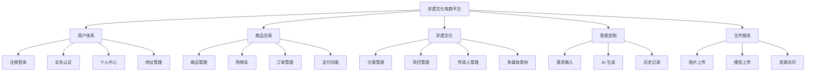

# 毕业设计开题报告

## 题目：基于 Spring Boot 的非遗文化电商平台设计与实现

---

## 一、选题背景与意义

### 1.1 选题背景

非物质文化遗产（Intangible Cultural Heritage）是人类文明的重要组成部分，承载着民族的历史记忆和文化基因。随着全球化和现代化进程的加速，许多珍贵的非遗技艺面临失传风险，如何有效保护和传承非遗文化成为亟待解决的社会问题。

传统非遗产品普遍存在以下痛点：
1. **传播渠道有限**：多数非遗产品依赖线下展示和销售，覆盖面窄，难以触达年轻消费群体
2. **文化认知度低**：消费者对非遗项目的历史渊源、工艺特点缺乏了解，影响购买意愿
3. **商业化程度不足**：非遗传承人擅长技艺但缺乏商业运营能力，产品市场化水平较低
4. **个性化需求难以满足**：传统非遗产品样式单一，难以满足现代消费者个性化定制需求

近年来，电子商务技术的快速发展为非遗文化传播和产品交易提供了新的解决方案。通过构建专业的非遗文化电商平台，可以实现：
- 打破地域限制，扩大非遗文化影响力
- 整合文化展示与商品交易，提升用户体验
- 引入智能定制技术，满足个性化需求
- 建立数字化档案，助力非遗保护与传承

### 1.2 选题意义

#### 理论意义
1. **丰富文化遗产数字化保护理论**：探索电商技术与非遗文化融合的新模式，为文化遗产数字化保护提供新思路
2. **拓展电子商务应用边界**：将传统文化元素融入电商平台设计，丰富电子商务理论体系
3. **促进跨学科研究**：融合计算机科学、文化学、市场营销等多学科知识，推动交叉学科发展

#### 实践意义
1. **助力非遗文化传承**：通过数字化展示和在线传播，提升非遗文化的社会认知度和影响力
2. **赋能非遗产业发展**：为非遗传承人和商家提供专业化销售平台，拓宽收入来源，激发传承活力
3. **满足消费升级需求**：为消费者提供兼具文化内涵和个性化的产品选择，满足精神文化消费需求
4. **推动乡村振兴战略**：许多非遗项目分布在农村地区，电商平台可带动地方经济发展，助力乡村振兴

---

## 二、国内外研究现状

### 2.1 国外研究现状

发达国家在文化遗产数字化保护与商业化方面起步较早，已形成较为成熟的模式：

#### 2.1.1 文化遗产数字化保护
- **欧盟数字图书馆计划（Europeana）**：整合欧洲各国文化遗产资源，建立统一的数字文化平台，提供在线浏览和检索服务
- **美国史密森学会数字典藏**：运用 3D 扫描、VR/AR 等技术对文物和非遗项目进行数字化记录，支持虚拟参观和互动体验
- **日本"酷日本"战略**：通过动漫、游戏等现代文化载体传播传统技艺，实现文化输出与商业价值双赢

#### 2.1.2 手工艺品电商平台
- **Etsy**：全球知名手工艺品电商平台，聚集大量独立设计师和手工艺人，强调原创性和独特性
- **Novica**：与国家地理合作，连接全球传统工匠与消费者，提供公平贸易环境
- **Folksy**：英国本土手工艺品平台，注重本土文化保护和传承

#### 2.1.3 智能定制技术应用
- **Shapeways**：3D 打印定制平台，用户可参与产品设计过程
- **Zazzle**：个性化定制电商平台，支持用户上传图案或添加文字
- **Adobe Sensei**：运用 AI 技术辅助创意设计，降低设计门槛

### 2.2 国内研究现状

#### 2.2.1 政策支持环境
- **国家层面**：《关于实施中华优秀传统文化传承发展工程的意见》《"十四五"非物质文化遗产保护规划》等政策文件相继出台
- **文旅部推进**：开展"非遗 + 电商""非遗 + 旅游"等融合发展试点，鼓励创新传承方式
- **地方政府响应**：各地建立非遗数字化保护平台，如浙江省非遗数字博物馆、广东省非遗云平台

#### 2.2.2 电商平台实践
- **淘宝"非遗频道"**：2019 年上线，汇聚全国非遗项目和传承人，提供展示、销售、直播等功能
- **京东"非遗馆"**：联合各地非遗保护机构，打造线上线下融合的非遗文化体验空间
- **抖音"非遗合伙人计划"**：通过短视频和直播传播非遗文化，带动相关产品销售
- **拼多多"非遗新消费"**：探索"农户 + 电商 + 非遗"模式，助力乡村非遗产业发展

#### 2.2.3 学术研究进展
- **数字化保护技术**：运用三维建模、动作捕捉、全息投影等技术记录非遗技艺流程
- **文化传播研究**：探讨新媒体环境下非遗文化传播策略和效果评估
- **商业模式创新**：研究"非遗 + 电商""非遗 + 文创""非遗 + 研学"等融合发展模式
- **用户体验设计**：关注电商平台中文化元素的呈现方式和用户交互体验

### 2.3 现有研究的不足

尽管国内外在非遗数字化保护和电商化方面取得一定成果，但仍存在以下问题：

1. **文化与商业割裂**：多数平台侧重商品交易，忽视文化内涵的深度挖掘和传播
2. **同质化严重**：平台功能趋同，缺乏针对非遗特色的差异化设计
3. **智能化水平不高**：个性化定制功能薄弱，未能充分利用 AI 等新技术
4. **用户体验待优化**：文化展示形式单一，互动性和沉浸感不足
5. **多角色协同不足**：管理员、商家、传承人、消费者之间的协作机制不完善

### 2.4 本系统的创新点

针对上述问题，本系统拟在以下方面进行创新：

1. **"文化 + 商业"深度融合**：将非遗文化展示与商品交易有机结合，每个商品关联对应的非遗项目信息
2. **智能定制服务**：引入腾讯混元 AI 大模型，支持文生图、图生图的个性化定制功能
3. **多角色协同机制**：设计管理员、商家、普通用户三类角色，满足不同用户需求
4. **沉浸式文化体验**：运用 3D 模型展示、多媒体素材等手段，提升用户文化体验
5. **全流程溯源体系**：为商品生成溯源码，展示产品从制作到销售的全过程

---

## 三、研究目标与主要内容

### 3.1 研究目标

本课题旨在设计并实现一个功能完善、体验优良、特色鲜明的非遗文化电商平台，具体目标包括：

1. **构建完整的电商交易体系**：实现商品管理、购物车、订单、支付等核心功能
2. **打造非遗文化展示窗口**：建立非遗项目数据库，提供分类展示、详情介绍、多媒体展示等功能
3. **提供智能定制服务**：接入 AI 图像生成技术，支持用户个性化定制需求
4. **实现多角色权限管理**：基于 JWT 的身份认证和基于角色的访问控制
5. **优化用户体验**：设计响应式界面，支持中英文切换、日夜模式切换等功能

### 3.2 主要研究内容

#### 3.2.1 用户与权限管理模块

**功能描述**：管理系统用户身份和权限，确保系统安全运行。

**核心功能**：
- 用户注册与登录：支持账号密码注册，用户名唯一性校验
- JWT 身份认证：登录成功后颁发 Token，后续请求携带 Token 进行身份验证
- 多角色管理：区分管理员（ADMIN）、商家（MERCHANT）、普通用户（USER）三种角色
- 实名认证：通过证件号验证用户身份，认证成功后方可进行特定操作（如商家发布商品）
- 个人中心：用户可查看和修改个人信息、头像、密码等
- 收货地址管理：支持添加、编辑、删除收货地址，设置默认地址

**技术要点**：
- Spring Security + JWT 实现无状态认证
- BCrypt 密码加密存储
- 拦截器实现接口权限校验
- 前端路由守卫控制页面访问权限

#### 3.2.2 商品与商城模块

**功能描述**：实现商品的发布、管理、展示和搜索功能。

**核心功能**：
- 商品发布：商家可上传商品信息，包括名称、描述、价格、图片、3D 模型等
- 商品管理：支持商品的增删改查、上下架操作
- 商品展示：首页推荐商品、商品列表分页展示、商品详情页
- 商品搜索：按名称、商家名称搜索，按非遗类别筛选
- 商品溯源：为商品生成溯源码，展示产品来源信息
- 3D 展示：集成 Three.js 或 model-viewer 组件，支持商品 360°旋转查看

**数据模型**：
- `product`：商品主表，存储商品基本信息
- `product_image`：商品图片表，支持多图轮播
- 字段包括：商品名称、描述、价格、商家 ID、溯源码、3D 模型 URL、状态等

**技术要点**：
- MyBatis-Plus 实现 CRUD 操作
- 文件上传接口支持图片和 3D 模型文件
- 前端使用 `<model-viewer>` 组件加载 glb/gltf 格式模型
- 分页查询优化性能

#### 3.2.3 交易链路模块

**功能描述**：实现购物、下单、支付等完整交易流程。

**核心功能**：
- 购物车：添加商品、修改数量、选中/取消选中、删除商品
- 订单管理：创建订单、查看订单列表、订单详情、订单状态跟踪
- 支付功能：模拟支付流程，记录支付信息
- 收货地址：结算时选择或新增收货地址

**数据模型**：
- `cart_item`：购物车项表
- `orders`：订单主表
- `order_item`：订单明细表
- `payment`：支付记录表
- `user_address`：收货地址表

**技术要点**：
- 事务管理保证数据一致性
- 订单状态机设计
- 防止超卖机制
- 金额计算精度控制（使用 BigDecimal）

#### 3.2.4 非遗文化模块

**功能描述**：系统性展示非遗文化内容，实现文化传播与商品销售的结合。

**核心功能**：
- 非遗分类管理：建立非遗项目分类体系（如剪纸、蜡染、陶瓷等）
- 非遗项目管理：维护非遗项目详细信息，包括介绍、申报单位、保护单位等
- 多媒体展示：上传和管理展示图、工艺流程图、工艺视频等素材
- 传承人管理：记录传承人基本信息和简介
- 项目与传承人关联：建立项目和传承人的多对多关系
- 前台展示：非遗列表页、项目详情页、传承人详情页

**数据模型**：
- `heritage_category`：非遗分类表
- `heritage_project`：非遗项目主表
- `heritage_project_media`：项目多媒体表
- `heritage_inheritor`：传承人表
- `heritage_project_inheritor`：项目 - 传承人关系表

**技术要点**：
- 树形结构分类管理
- 一对多、多对多关系处理
- 富文本或 Markdown 支持项目详情
- 图片懒加载优化性能

#### 3.2.5 智能定制模块

**功能描述**：引入 AI 技术，为用户提供个性化定制服务。

**核心功能**：
- 定制需求输入：用户选择非遗类型、风格特征、使用场景，填写文字描述
- 参考图上传：支持上传图片作为参考（可选）
- AI 图像生成：调用腾讯云 AIART 接口，根据提示词和参考图生成设计图
- 历史记录：保存用户生成记录，方便查看和对比
- 结果展示：展示生成的图片，支持下载或分享

**数据模型**：
- `ai_image_record`：AI 生成记录表，存储用户 ID、原图 URL、提示词、生成结果 URL 等

**技术要点**：
- 封装腾讯云 AIART API
- 异步任务处理（避免长时间等待）
- 图片存储与 CDN 加速
- 限流和配额管理

#### 3.2.6 文件管理模块

**功能描述**：提供文件上传、存储和访问服务。

**核心功能**：
- 图片上传：支持头像、商品图片、非遗素材等上传
- 3D 模型上传：支持 glb、gltf 格式文件上传
- 文件存储：本地存储或云存储
- 静态资源映射：配置虚拟路径映射，使上传文件可通过 HTTP 访问

**技术要点**：
- Spring MVC 文件上传配置
- 文件大小和类型限制
- UUID 生成唯一文件名防止冲突
- 跨域访问配置

### 3.3 系统功能架构图



---

## 四、研究方法与技术路线

### 4.1 研究方法

#### 4.1.1 文献调研法
- 查阅国内外关于非遗数字化保护、电子商务、智能定制等相关文献
- 分析现有电商平台的优缺点，总结成功经验
- 研究 Spring Boot、Vue.js 等技术的最佳实践

#### 4.1.2 需求分析法
- 通过问卷调查、用户访谈等方式收集潜在用户需求
- 分析非遗传承人、商家、消费者的不同需求
- 编写需求规格说明书，明确功能和非功能需求

#### 4.1.3 系统设计法
- 采用模块化设计思想，将系统划分为相对独立的子模块
- 使用 UML 建模工具绘制用例图、类图、时序图等
- 设计数据库概念结构和逻辑结构

#### 4.1.4 原型开发法
- 快速构建系统原型，验证关键技术和功能可行性
- 迭代开发，逐步完善系统功能
- 通过用户反馈不断优化改进

#### 4.1.5 实验测试法
- 设计测试用例，进行单元测试、集成测试、系统测试
- 进行性能测试，评估系统并发处理能力
- 收集用户体验数据，评估系统易用性

### 4.2 技术路线

#### 4.2.1 总体技术架构

系统采用前后端分离架构，基于 RESTful API 进行通信：

```
┌─────────────┐      ┌──────────────┐      ┌─────────────┐
│   用户层    │      │   应用层     │      │   数据层    │
│  Browser    │◄────►│ Spring Boot  │◄────►│   MySQL     │
│  Vue.js     │ HTTP │   + JWT      │ JDBC │   Redis     │
└─────────────┘      └──────────────┘      └─────────────┘
```

#### 4.2.2 后端技术栈

| 技术 | 选型 | 说明 |
|------|------|------|
| 框架 | Spring Boot 3.2.0 | 简化配置，快速开发 |
| 安全 | Spring Security + JWT | 身份认证和权限控制 |
| ORM | MyBatis-Plus 3.5.5 | 简化数据库操作 |
| 数据库 | MySQL 8.0.33 | 关系型数据存储 |
| 缓存 | Redis | 缓存热点数据（可选） |
| API 文档 | Knife4j 4.3.0 | OpenAPI 3 接口文档 |
| 工具库 | Hutool 5.8.23 | Java 工具类库 |
| AI 服务 | 腾讯云 AIART | AI 图像生成服务 |
| JDK | Java 17 | LTS 版本 |

#### 4.2.3 前端技术栈

| 技术 | 选型 | 说明 |
|------|------|------|
| 框架 | Vue 3 | 渐进式 JavaScript 框架 |
| UI 库 | Element Plus 2.4.4 | Vue 3 组件库 |
| 路由 | Vue Router 4 | 单页应用路由 |
| 状态管理 | Pinia 2.1.7 | Vue 3 状态管理库 |
| HTTP | Axios 1.6.2 | HTTP 客户端 |
| 国际化 | Vue I18n 9.14.5 | 多语言支持 |
| 3D 渲染 | Three.js / model-viewer | 3D 模型展示 |
| 构建工具 | Vite 5.0.10 | 现代化前端构建工具 |
| CSS 预处理 | Sass | 样式编写 |

#### 4.2.4 开发工具与环境

- **IDE**：IntelliJ IDEA（后端）、Visual Studio Code（前端）
- **版本控制**：Git + GitHub
- **数据库管理**：MySQL Workbench / Navicat
- **API 调试**：Postman / Apifox
- **项目管理**：Maven（后端）、npm（前端）

### 4.3 关键技术解决方案

#### 4.3.1 JWT 无状态认证

**问题**：传统 Session 认证在分布式场景下存在会话共享问题。

**解决方案**：
1. 用户登录成功后，服务端生成包含用户信息的 JWT Token
2. Token 返回给前端，前端存储在 localStorage 或 sessionStorage
3. 后续请求在 Authorization Header 中携带 Token
4. 后端通过拦截器解析 Token，验证用户身份
5. Token 设置合理过期时间，支持刷新机制

**核心代码结构**：
```java
// JWT 工具类
JwtUtil.createToken(username, role)
JwtUtil.verifyToken(token)

// 安全配置
SecurityFilterChain.filterChain()
    .addFilterBefore(jwtAuthenticationFilter)
    .authorizeHttpRequests(auth -> auth
        .requestMatchers("/api/auth/**").permitAll()
        .requestMatchers("/api/admin/**").hasRole("ADMIN")
        .anyRequest().authenticated()
    )
```

#### 4.3.2 文件上传与存储

**问题**：支持多种文件类型上传和安全存储。

**解决方案**：
1. 配置 MultipartResolver 支持文件上传
2. 设置文件大小限制（如图片 5MB，3D 模型 50MB）
3. 文件类型白名单校验（jpg/png/glbf/gltf）
4. UUID 生成唯一文件名，防止覆盖和路径遍历攻击
5. 本地存储：uploads 目录，配置静态资源映射
6. 数据库记录文件 URL 信息

**配置示例**：
```yaml
# application.yml
spring:
  servlet:
    multipart:
      max-file-size: 50MB
      max-request-size: 50MB
  
# 自定义配置
file:
  upload-dir: uploads/
  resource-path: /uploads/**
  local-path: file:${user.dir}/uploads/
```

#### 4.3.3 3D 模型展示

**问题**：在前端展示商品的 3D 模型，支持旋转和缩放。

**解决方案**：
1. 使用 Google 的 `<model-viewer>` Web Component
2. 后端支持 glb/gltf 格式文件上传
3. 前端组件配置：
```vue
<template>
  <model-viewer 
    :src="modelUrl"
    auto-rotate
    camera-controls
    shadow-intensity="1"
    style="width: 100%; height: 400px;">
  </model-viewer>
</template>
```

#### 4.3.4 AI 图像生成集成

**问题**：接入第三方 AI 服务，实现智能定制功能。

**解决方案**：
1. 申请腾讯云 AIART 服务 API 密钥
2. 封装 AI 服务接口，屏蔽底层实现细节
3. 异步任务处理，避免阻塞主线程
4. 保存生成记录到数据库
5. 前端轮询或使用 WebSocket 获取生成结果

**服务封装**：
```java
@Service
public class AiImageServiceImpl implements AiImageService {
    @Autowired
    private AiTencentCloudProperties properties;
    
    public String generateImage(String prompt, String originalImageUrl) {
        // 1. 构造请求参数
        // 2. 调用腾讯云 API
        // 3. 解析返回结果
        // 4. 保存图片 URL
        // 5. 返回生成结果
    }
}
```

#### 4.3.5 跨域问题解决

**问题**：前后端分离部署时的跨域访问限制。

**解决方案**：
1. 后端配置 CORS（Cross-Origin Resource Sharing）
2. 允许指定源（前端地址）访问
3. 设置允许的 HTTP 方法和 Headers

**配置示例**：
```java
@Configuration
public class CorsConfig implements WebMvcConfigurer {
    @Override
    public void addCorsMappings(CorsRegistry registry) {
        registry.addMapping("/api/**")
            .allowedOrigins("http://localhost:3030")
            .allowedMethods("GET", "POST", "PUT", "DELETE")
            .allowedHeaders("*")
            .allowCredentials(true);
    }
}
```

#### 4.3.6 数据库设计规范

**设计原则**：
1. 遵循第三范式，减少数据冗余
2. 主键统一使用 BIGINT 自增 ID
3. 必备字段：create_time、update_time（使用自动填充）
4. 敏感信息加密存储（如密码使用 BCrypt）
5. 合理设计索引，提升查询性能

**示例表结构**：
```sql
CREATE TABLE `product` (
  `id` BIGINT PRIMARY KEY AUTO_INCREMENT COMMENT '商品 ID',
  `name` VARCHAR(100) NOT NULL COMMENT '商品名称',
  `description` TEXT NOT NULL COMMENT '商品描述',
  `price` DECIMAL(10,2) NOT NULL COMMENT '商品价格',
  `merchant_id` BIGINT NOT NULL COMMENT '商家用户 ID',
  `status` TINYINT DEFAULT 1 COMMENT '状态：1-上架，0-下架',
  `create_time` DATETIME DEFAULT CURRENT_TIMESTAMP,
  `update_time` DATETIME DEFAULT CURRENT_TIMESTAMP ON UPDATE CURRENT_TIMESTAMP,
  KEY `idx_merchant_id` (`merchant_id`),
  KEY `idx_status` (`status`)
) ENGINE=InnoDB DEFAULT CHARSET=utf8mb4 COMMENT='商品表';
```

---

## 五、预期成果与创新点

### 5.1 预期成果

#### 5.1.1 系统成果
完成一个功能完善、运行稳定的非遗文化电商平台，具体包括：
- 完整的源代码（后端 + 前端）
- 数据库设计和初始化脚本
- 系统部署文档和使用手册
- API 接口文档（Knife4j 在线文档）

#### 5.1.2 功能成果
实现以下核心功能：
1. **用户系统**：注册登录、实名认证、个人中心、地址管理
2. **商品系统**：商品发布、商品展示、3D 查看、搜索筛选
3. **交易系统**：购物车、订单管理、支付功能
4. **文化系统**：非遗分类、项目展示、传承人介绍、多媒体素材
5. **定制系统**：AI 智能定制、历史记录管理
6. **管理系统**：用户管理、商品管理、非遗内容管理

#### 5.1.3 性能指标
- 页面响应时间 < 2 秒
- 支持至少 50 个并发用户
- 数据库查询响应时间 < 500ms
- 文件上传成功率 > 99%
- AI 生成请求成功率 > 95%

#### 5.1.4 文档成果
- 毕业设计论文一份
- 开题报告、需求分析、系统设计等过程文档
- 用户使用手册和技术维护文档
- 演示视频和 PPT

### 5.2 创新点

#### 5.2.1 业务模式创新
**"文化展示 + 商品交易 + 智能定制"三位一体**

传统电商平台侧重交易，文化网站侧重展示，两者割裂。本系统将：
- 每个商品关联对应的非遗项目信息
- 用户在购买商品时可了解背后的文化故事
- 通过智能定制让用户参与产品设计
- 形成"了解文化 → 产生兴趣 → 购买产品 → 定制专属"的完整闭环

#### 5.2.2 技术创新
**AI 驱动的个性化定制服务**

引入腾讯混元 AI 大模型，实现：
- 文生图：根据用户文字描述生成设计图
- 图生图：基于参考图进行风格迁移或再创作
- 多风格选择：传统、现代、国潮等多种艺术风格
- 降低设计门槛：普通用户也能参与产品设计

相比传统定制需要专业设计师，本系统通过 AI 技术大幅降低成本，提升效率。

#### 5.2.3 用户体验创新
**沉浸式文化体验**

运用多种技术手段提升用户体验：
- 3D 模型展示：商品 360°旋转查看，细节清晰可见
- 多媒体素材：图片、视频结合，生动展示工艺流程
- 响应式设计：适配 PC 端和移动端，提供一致体验
- 国际化支持：中英文切换，方便国际传播
- 日夜模式：根据用户偏好或时间自动切换主题

#### 5.2.4 管理创新
**多角色协同机制**

设计三类用户角色，满足不同需求：
- **管理员**：全局管理，包括用户管理、非遗内容维护
- **商家**：商品发布和管理，订单处理
- **普通用户**：浏览商品、下单购买、智能定制

通过权限控制，各角色各司其职，形成良性生态。

#### 5.2.5 数据创新
**全流程溯源体系**

为每个商品生成溯源码，记录：
- 原材料来源
- 制作工艺和流程
- 制作人信息
- 质检信息
- 物流信息

消费者扫码即可查看产品全生命周期信息，增强信任感。

---

## 六、进度安排

### 6.1 总体时间安排

| 阶段 | 时间范围 | 主要任务 | 预期产出 |
|------|----------|----------|----------|
| 第一阶段 | 第 1-2 周 | 选题调研、文献查阅 | 开题报告、外文翻译 |
| 第二阶段 | 第 3-4 周 | 需求分析、系统设计 | 需求规格说明书、系统设计文档 |
| 第三阶段 | 第 5-8 周 | 技术预研、环境搭建、核心模块开发 | 技术验证 Demo、开发环境 |
| 第四阶段 | 第 9-12 周 | 功能模块迭代开发 | 系统主要功能实现 |
| 第五阶段 | 第 13-14 周 | 系统测试、性能优化 | 测试报告、优化后的系统 |
| 第六阶段 | 第 15-16 周 | 论文撰写、答辩准备 | 毕业论文、答辩 PPT |

### 6.2 详细进度计划

#### 第一阶段：准备阶段（第 1-2 周）

**主要任务**：
1. 确定选题方向，明确研究目标
2. 查阅相关文献资料（不少于 15 篇，其中外文文献不少于 5 篇）
3. 了解非遗文化保护政策和电商发展趋势
4. 完成开题报告撰写
5. 完成外文文献翻译（不少于 3000 单词）

**具体安排**：
- 第 1 周：
  - 周一~周三：确定选题，收集资料
  - 周四~周五：阅读核心文献，整理笔记
  - 周末：撰写开题报告初稿
  
- 第 2 周：
  - 周一~周二：完善开题报告
  - 周三~周四：外文文献翻译
  - 周五：提交开题报告和翻译稿
  - 周末：准备开题答辩 PPT

**预期成果**：
- ✅ 开题报告一份
- ✅ 外文翻译一篇
- ✅ 参考文献列表
- ✅ 开题答辩 PPT

#### 第二阶段：分析与设计（第 3-4 周）

**主要任务**：
1. 进行详细的需求分析
2. 完成系统总体设计
3. 完成数据库设计
4. 编写需求规格说明书和系统设计文档

**具体安排**：
- 第 3 周：需求分析
  - 周一~周二：用户调研，收集需求
  - 周三~周四：编写用例文档
  - 周五：绘制用例图、活动图
  - 周末：完善需求规格说明书

- 第 4 周：系统设计
  - 周一~周二：系统架构设计，技术选型
  - 周三：数据库概念设计和逻辑设计
  - 周四：绘制 ER 图、类图
  - 周五：编写系统设计文档
  - 周末：复习和补充设计文档

**预期成果**：
- ✅ 需求规格说明书
- ✅ 系统设计文档
- ✅ 数据库设计文档
- ✅ UML 图（用例图、类图、ER 图等）

#### 第三阶段：技术预研与环境搭建（第 5-8 周）

**主要任务**：
1. 学习 Spring Boot、Vue.js 等核心技术
2. 搭建开发环境和测试环境
3. 完成数据库初始化和基础配置
4. 实现技术验证 Demo

**具体安排**：
- 第 5 周：技术学习
  - 周一~周三：Spring Boot 入门和实战
  - 周四~周五：Vue.js 前端开发
  - 周末：MyBatis-Plus、JWT 等组件学习

- 第 6 周：环境搭建
  - 周一：安装 JDK、Maven、Node.js
  - 周二：安装 MySQL、Redis
  - 周三：配置 Git，创建 GitHub 仓库
  - 周四：初始化后端项目结构
  - 周五：初始化前端项目结构
  - 周末：数据库建表和初始数据导入

- 第 7-8 周：技术验证
  - 实现 JWT 认证 Demo
  - 实现文件上传 Demo
  - 实现 3D 模型展示 Demo
  - 测试腾讯云 AI API

**预期成果**：
- ✅ 开发环境搭建完成
- ✅ 数据库初始化完成
- ✅ 技术验证 Demo
- ✅ 项目开发计划

#### 第四阶段：功能开发（第 9-12 周）

**主要任务**：
按照模块划分，迭代开发系统功能。

**具体安排**：

- 第 9 周：用户与权限模块
  - 周一~周二：用户注册登录接口
  - 周三~周四：JWT 认证和权限控制
  - 周五：实名认证功能
  - 周末：个人中心、地址管理

- 第 10 周：商品与商城模块
  - 周一~周二：商品 CRUD 接口
  - 周三：文件上传（图片、3D 模型）
  - 周四：商品列表和搜索
  - 周五：商品详情页
  - 周末：3D 模型展示集成

- 第 11 周：交易链路模块
  - 周一~周二：购物车功能
  - 周三~周四：订单创建和管理
  - 周五：支付功能模拟
  - 周末：订单状态跟踪

- 第 12 周：非遗文化模块
  - 周一~周二：非遗分类和项目管理
  - 周三：多媒体素材管理
  - 周四：传承人管理
  - 周五：项目与传承人关联
  - 周末：前台展示页面

**预期成果**：
- ✅ 用户模块完整功能
- ✅ 商品模块完整功能
- ✅ 交易模块完整功能
- ✅ 非遗文化模块完整功能

#### 第五阶段：智能定制与系统优化（第 13-14 周）

**主要任务**：
1. 实现智能定制模块
2. 系统集成测试
3. 性能优化
4. Bug 修复

**具体安排**：
- 第 13 周：智能定制模块
  - 周一~周二：封装腾讯云 AI API
  - 周三：AI 生图接口实现
  - 周四：历史记录功能
  - 周五：前端定制页面
  - 周末：联调测试

- 第 14 周：测试与优化
  - 周一~周二：单元测试和集成测试
  - 周三：性能测试（压力测试）
  - 周四：根据测试结果优化
  - 周五：Bug 修复
  - 周末：系统稳定性测试

**预期成果**：
- ✅ 智能定制功能
- ✅ 测试报告和用例
- ✅ 性能优化报告
- ✅ 稳定的系统版本

#### 第六阶段：论文撰写与答辩（第 15-16 周）

**主要任务**：
1. 撰写毕业论文
2. 准备答辩材料
3. 毕业答辩

**具体安排**：
- 第 15 周：论文撰写
  - 周一~周二：论文大纲和目录
  - 周三~周五：正文撰写（引言、需求分析、系统设计）
  - 周末：正文撰写（系统实现、测试、总结）

- 第 16 周：答辩准备
  - 周一~周二：论文修改和查重
  - 周三：制作答辩 PPT
  - 周四：准备演示视频
  - 周五：模拟答辩
  - 周末：正式答辩

**预期成果**：
- ✅ 毕业论文终稿
- ✅ 答辩 PPT
- ✅ 系统演示视频
- ✅ 所有过程文档

### 6.3 里程碑节点

| 序号 | 时间节点 | 里程碑事件 | 交付物 |
|------|----------|------------|--------|
| 1 | 第 2 周末 | 开题完成 | 开题报告、外文翻译 |
| 2 | 第 4 周末 | 设计完成 | 需求规格说明书、系统设计文档 |
| 3 | 第 8 周末 | 环境搭建完成 | 可运行的基础框架 |
| 4 | 第 12 周末 | 主体功能完成 | 系统主要功能模块 |
| 5 | 第 14 周末 | 系统完成 | 完整可运行的系统 |
| 6 | 第 16 周末 | 论文完成 | 毕业论文、答辩材料 |

---

## 七、可行性分析

### 7.1 技术可行性

#### 7.1.1 技术成熟度
- **Spring Boot**：经过多年发展，已成为 Java Web 开发的事实标准，社区活跃，文档丰富
- **Vue.js**：主流前端框架之一，学习曲线平缓，生态系统完善
- **MyBatis-Plus**：国产优秀 ORM 框架，简化数据库操作，文档齐全
- **JWT**：成熟的认证方案，广泛应用于微服务和前后端分离架构
- **腾讯云 AIART**：腾讯云官方 AI 服务，提供稳定 API 和完善文档

#### 7.1.2 技术难度评估
| 技术点 | 难度等级 | 评估说明 |
|--------|----------|----------|
| Spring Boot 后端开发 | ⭐⭐ | 技术成熟，资料丰富，难度较低 |
| Vue.js 前端开发 | ⭐⭐ | 组件化开发，Element Plus 提供丰富组件 |
| JWT 认证 | ⭐⭐ | 有成熟的最佳实践可循 |
| 文件上传 | ⭐⭐ | Spring MVC 原生支持，配置简单 |
| 3D 模型展示 | ⭐⭐⭐ | 需要学习 Three.js 或 model-viewer，但有现成组件 |
| AI API 集成 | ⭐⭐⭐ | 需要理解 API 文档，处理异步任务 |
| 数据库设计 | ⭐⭐⭐ | 需要合理规划表结构和关系 |

**综合评估**：系统所涉及的技术均为成熟技术，大部分有官方文档和社区教程支持。虽然部分技术（如 3D 展示、AI 集成）需要额外学习，但整体难度可控，在本科能力范围内。

#### 7.1.3 技术风险与应对
| 风险 | 可能性 | 影响程度 | 应对措施 |
|------|--------|----------|----------|
| AI 服务不稳定 | 中 | 高 | 预留降级方案，支持手动上传设计图 |
| 3D 模型加载慢 | 中 | 中 | 压缩模型文件，使用 CDN 加速 |
| 并发性能不足 | 低 | 中 | 引入 Redis 缓存，优化数据库查询 |
| 文件上传失败 | 低 | 中 | 增加重试机制，提供详细的错误提示 |

### 7.2 经济可行性

#### 7.2.1 开发成本
- **人力成本**：个人独立完成，无额外人力支出
- **硬件成本**：使用个人电脑，无需额外购置设备
- **软件成本**：
  - 开发工具：IntelliJ IDEA Community（免费）、VS Code（免费）
  - 数据库：MySQL Community（免费）
  - 其他软件：均为开源或免费版本

#### 7.2.2 运营成本（假设部署上线）
| 项目 | 费用 | 说明 |
|------|------|------|
| 服务器 | ¥100-300/月 | 云服务器（2 核 4G） |
| 域名 | ¥60/年 | .com 或.cn 域名 |
| 云存储 | ¥50-100/月 | OSS/COS存储图片等资源 |
| AI 服务 | ¥200-500/月 | 腾讯云 AIART 按量计费 |
| **合计** | **¥410-960/月** | 初期可控制在¥500/月以内 |

#### 7.2.3 收益预测（假设商业化运营）
- **商品销售分成**：商家销售额的 3%-5%
- **定制服务收费**：AI 生成收取少量费用（如¥1-5/次）
- **广告收入**：首页推荐位、搜索排名等
- **会员服务**：付费会员享受更多权益

**盈亏平衡点**：假设平均利润率 10%，月销售额达到¥5000 即可覆盖运营成本。

#### 7.2.4 经济可行性结论
系统开发成本低，主要为时间投入；运营成本可控，初期可通过免费资源降低成本；具备商业化潜力，可通过多种方式实现盈利。从经济角度看可行。

### 7.3 操作可行性

#### 7.3.1 用户界面友好性
- 采用 Element Plus 组件库，界面美观统一
- 响应式设计，适配 PC 和移动端
- 操作流程简洁，符合常见电商习惯
- 提供操作提示和帮助文档

#### 7.3.2 管理便捷性
- 后台管理系统功能完善
- 批量操作支持（如批量上架、下架）
- 数据统计和报表功能
- 日志记录便于问题排查

#### 7.3.3 维护便利性
- 模块化设计，便于定位和维护
- 代码规范统一，注释清晰
- 版本控制（Git）管理代码变更
- 自动化部署（CI/CD）减少人工操作

#### 7.3.4 推广可行性
- 支持社交媒体分享
- SEO 优化（服务端渲染、语义化标签）
- 多语言支持（中英文）便于国际传播
- 与文化机构、非遗保护组织合作推广

### 7.4 法律与社会可行性

#### 7.4.1 法律合规性
- **网络安全法**：系统采取必要的安全措施（如密码加密、JWT 认证）
- **数据安全法**：用户数据加密存储，隐私保护
- **消费者权益保护法**：明示商品信息，保障消费者知情权
- **电子商务法**：遵守电商平台相关规定

#### 7.4.2 知识产权保护
- 非遗项目信息来源于公开资料或授权
- 商品图片、描述等原创内容受版权保护
- 用户上传内容声明版权归属
- 系统代码申请软件著作权

#### 7.4.3 社会效益
- **文化传承**：促进非遗文化传播和保护
- **就业促进**：为非遗传承人和手工艺者提供增收渠道
- **乡村振兴**：带动农村地区的非遗产业发展
- **教育价值**：提升公众对非遗文化的认知和理解

#### 7.4.4 伦理考量
- 尊重非遗传承人的知识产权和劳动成果
- 不歪曲、不恶搞非遗文化内容
- 确保 AI 生成内容健康向上，符合社会主义核心价值观
- 保护用户隐私，不滥用用户数据

### 7.5 综合可行性结论

通过以上分析，本系统在技术、经济、操作、法律和社会等方面均具备可行性：

1. **技术可行**：采用成熟技术栈，难度可控，风险可管理
2. **经济可行**：开发和运营成本低，具备商业化潜力
3. **操作可行**：界面友好，易于管理和维护
4. **法律可行**：符合相关法律法规，社会效益良好

因此，本系统的开发和实施是可行的，建议按计划推进。

---

## 八、参考文献

### 8.1 中文文献

[1] 王选，张华。非物质文化遗产数字化保护与传承研究 [J]. 文化遗产，2022(3): 45-52.

[2] 李明，刘伟。基于 Spring Boot 的电商平台设计与实现 [J]. 计算机工程与应用，2023, 59(8): 112-118.

[3] 陈思。非遗文创产品的电商化运营模式研究 [D]. 北京：中央美术学院，2022.

[4] 赵敏。传统文化类电商平台用户体验设计研究 [J]. 包装工程，2023, 44(10): 234-240.

[5] 孙强，周杰。基于 Vue.js 的前后端分离架构设计与实现 [J]. 软件导刊，2022, 21(5): 89-93.

[6] 吴刚。人工智能在文化创意产业的应用研究 [J]. 计算机应用研究，2023, 40(6): 1678-1683.

[7] 郑丽。非物质文化遗产的活态传承与电商赋能 [J]. 民俗研究，2022(4): 78-85.

[8] 黄志强。基于 JWT 的微服务认证授权机制研究与实现 [J]. 信息技术与信息化，2023(2): 156-159.

[9] 林峰。3D 可视化技术在电商产品展示中的应用 [J]. 计算机仿真，2022, 39(11): 345-349.

[10] 徐静。乡村振兴背景下非遗产业发展路径研究 [J]. 农业经济，2023(5): 123-125.

### 8.2 外文文献

[11] Smith J, Johnson L. Digital Heritage Preservation Using Modern Web Technologies[C]//Proceedings of the International Conference on Cultural Heritage and Technology. 2022: 156-163.

[12] Brown A, Wilson K. E-commerce Platform Design for Traditional Crafts[J]. Journal of Electronic Commerce Research, 2023, 24(2): 89-105.

[13] Garcia M, Martinez R. Integration of AI in Custom Product Design Systems[J]. Expert Systems with Applications, 2023, 215: 119-132.

[14] Lee S, Kim H. A Study on the User Experience of Cultural Heritage E-commerce Platforms[J]. International Journal of Human-Computer Interaction, 2022, 38(15): 1456-1468.

[15] Chen W, Wang Y. Spring Boot in Action: Building Scalable Web Applications[M]. Beijing: Publishing House of Electronics Industry, 2022.

### 8.3 技术标准与规范

[16] 中华人民共和国文化和旅游部。"十四五"非物质文化遗产保护规划 [Z]. 2021.

[17] 国家市场监督管理总局。电子商务平台服务质量要求：GB/T 39004-2020[S]. 北京：中国标准出版社，2020.

[18] 工业和信息化部。信息安全技术 网络安全等级保护基本要求：GB/T 22239-2019[S]. 北京：中国标准出版社，2019.

### 8.4 网络资源

[19] Spring Boot 官方文档 [EB/OL]. https://spring.io/projects/spring-boot, 2023.

[20] Vue.js 官方文档 [EB/OL]. https://cn.vuejs.org/, 2023.

[21] 腾讯云 AIART 产品文档 [EB/OL]. https://cloud.tencent.com/document/product/1293, 2023.

[22] Element Plus 组件库文档 [EB/OL]. https://element-plus.org/zh-CN/, 2023.

[23] MyBatis-Plus 官方文档 [EB/OL]. https://baomidou.com/, 2023.

---

## 九、致谢

在本开题报告的撰写过程中，我得到了许多人的帮助和支持，在此表示衷心的感谢：

首先，感谢我的指导老师 XXX 教授。X 老师在选题方向、研究方法等方面给予了悉心指导，提出了许多宝贵的意见和建议。老师严谨的治学态度和敬业精神让我受益匪浅。

其次，感谢学院的各位授课老师。他们在大学期间传授的专业知识为本课题的研究奠定了坚实的基础。

同时，感谢我的同学们，他们在需求调研过程中提供了很多有价值的反馈和建议，帮助我更好地理解和把握用户需求。

最后，感谢我的家人，他们一直以来的理解、支持和鼓励是我前进的动力。

由于本人水平有限，报告中难免存在不足之处，恳请各位老师和同学批评指正。

---

**学生签名：** ____________  
**日期：** 2026 年____月____日  

**指导教师签名：** ____________  
**日期：** 2026 年____月____日
